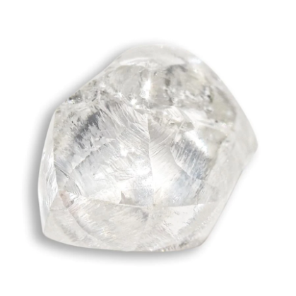

## Timeless Waystone

`📜 Item`

> (Scientific Name: *Isynthillicus Cyrciniae*)

Also known as the "Pathfinder Stone", this ancient gemstone is created at the [center-point](../refs/timeless_desert.md) of the lands of Zeithalt by the continuous pressure given by the physical and mystical force above and below the land.

The stone emanates a bright white light when first seen that will make the beholder temporarily immune or lengthen any illusionary and temporal effects, depending on the will of the holder. Although the quality of the stone may affect how strong the effectivity would be.

These stones, though, are very rare due to it taking hundreds of years to form and being very difficult to find as the [Desert](../refs/timeless_desert.md) where they are made are famous for being a place where you can easily get lost or lose your way, leading to many adventurers never coming back.

----------
[⬅️ Back to index](../refs/index.md#22a0_s)