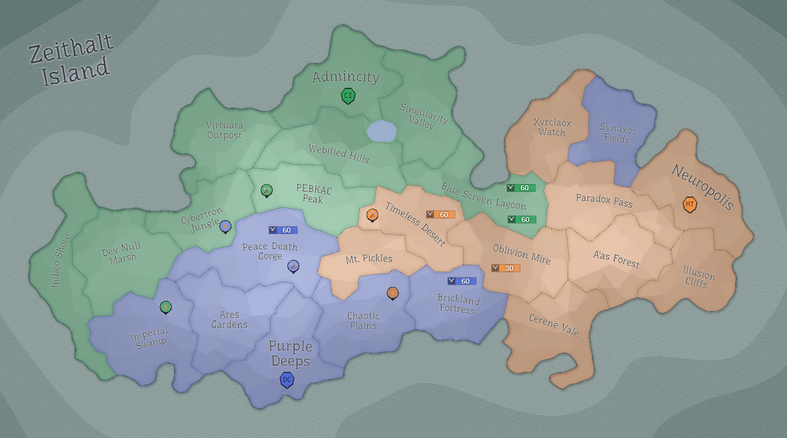

## Eon 359 - The Battle of Corrupted Forest

`⚔️ Battle` won by [MindTech Institute](../refs/mindtech_institute.md) (combined faction forces)

[A’as Forest](../refs/aas_forest.md) is successfully defended by the combined forces of three factions.

Honorable mention - MTs battle commander [Revalx](../refs/revalx.md), for doing impressive work in organising the people of all factions.

Other notable events include:
- Record low participation from [Delta Collective](../refs/delta_collective.md);
- MindTech Institute not using their [Garrisons](../refs/garrisons.md) nor [Corrupted Mines](../refs/cr_mines.md) to help the defence;
- it’s a _very_ close call again, the outcome of the battle decided in the very last moments.

Reports say that [Cybernetics Inc](../refs/cybernetics_inc.md) and  were able to gather enough corrupted matter and complete (separately) their own [CR Research](../refs/cr_artefacts.md) projects.

----------
[⬅️ Back to index](../timeline/index.md)