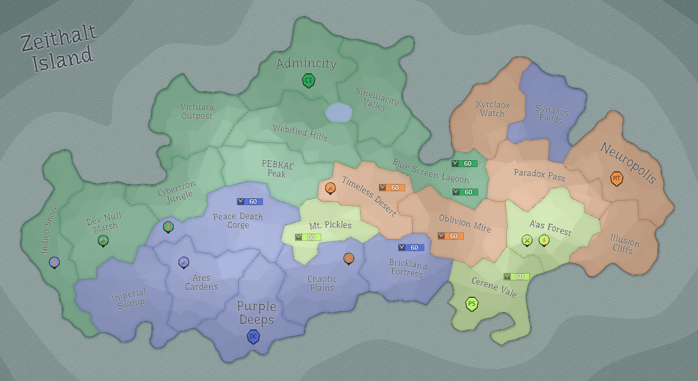

## Eon 369 - Protectores Silva is founded

`⌛ Event`

[Protectores Silva](../refs/protectores_silva.md) - a new faction emerges on Zeithalt Island.

Brave sellsword warriors [Mimb](../refs/mimb.md), [Ozimud](../refs/ozimud.md) and _Gabrio_, joined by CI member *Gabriel Santiago* and led by a prominent MT official [Ogrodnik](../refs/ogrodnik.md) formed a new faction.

They reached a peaceful agreement of lands gift from [MindTech Institute](../refs/mindtech_institute.md), and established their capital in [Cerene Vale](../refs/cerene_vale.md) - their newly found homeland.

The founding statement from this new faction to the people of Zeithalt is:

> *Zeithalt is changing, under threat from unnatural disturbances and behavior. We must protect her and live in balance with nature to thrive long-term.*

----------
[⬅️ Back to index](../timeline/index.md)