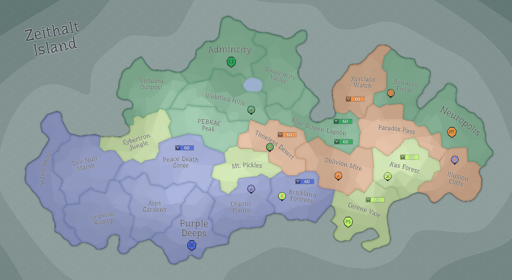

## Eon 386 - DC and CI exchange lands 2 for 2

`⌛ Event`

[Delta Collective](../refs/delta_collective.md) and [Cybernetics Inc](../refs/cybernetics_inc.md) reach an agreement to exchange lands:
- [Neuropolis](../refs/neuropolis.md) and [Synaxos Fields](../refs/synaxos_fields.md) (captured by Deltans) go to [Cybernetics Inc](../refs/cybernetics_inc.md);
- [Indigo Shore](../refs/indigo_shore.md) and [Dev Null Marsh](../refs/dev_null_marsh.md) got to [Delta Collective](../refs/delta_collective.md).

----------
[⬅️ Back to index](../timeline/index.md)