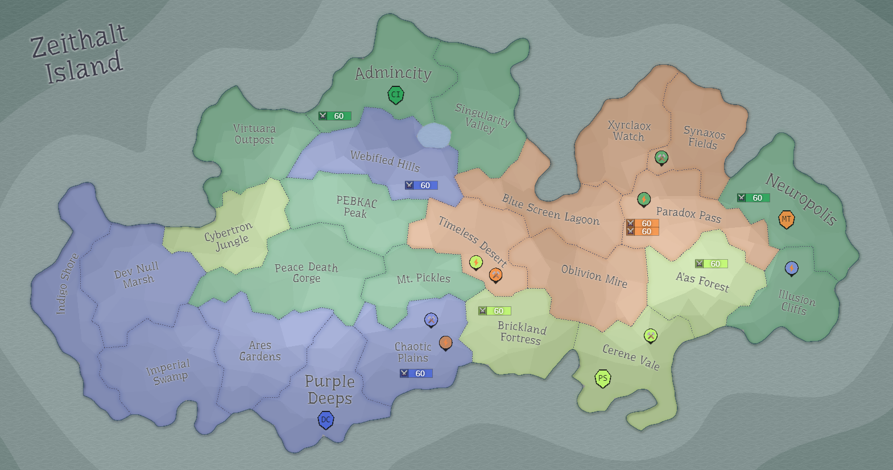

## Eon 419 - 3-way land exchange between CI, MT and PS

`⌛ Event`

[Cybernetics Inc](../refs/cybernetics_inc.md), [MindTech Institute](../refs/mindtech_institute.md) and [Protectores Silva](../refs/protectores_silva.md) exchange lands in a three-way agreement:
 - [Brickland Fortress](../refs/brickland_fortress.md) is now under control of [Protectores Silva](../refs/protectores_silva.md);
 - [Mt. Pickles](../refs/mt_pickles.md) is now under control of [Cybernetics Inc](../refs/cybernetics_inc.md);
 - [Synaxos Fields](../refs/synaxos_fields.md) is now under control of [MindTech Institute](../refs/mindtech_institute.md).

----------
[⬅️ Back to index](../timeline/index.md)