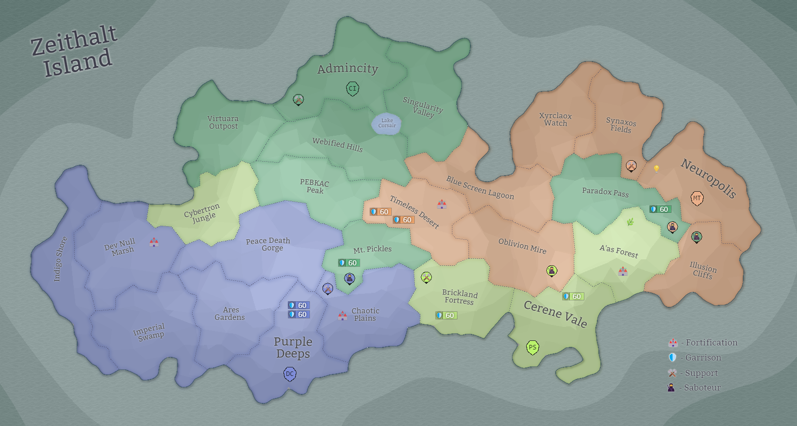

## Eon 462 - The 2nd Siege of Neuropolis

`⚔️ Battle` won by [MindTech Institute](../refs/mindtech_institute.md)

Quite surprisingly, in this battle [Delta Collective](../refs/delta_collective.md) - known for their chaotic and warring spirit - seemingly decided to follow [Protectores Silva](../refs/protectores_silva.md) steps, as both these faction stayed neutral.

[Cybernetics Inc](../refs/cybernetics_inc.md) defending effort was good, but well outmatched by [MindTech Institute](../refs/mindtech_institute.md) attacking power.

Important thing to note is that during this battle the deal between [Cybers](../refs/cybers.md) and [Minds](../refs/minds.md) to trade [Paradox Pass](../refs/paradox_pass.md) (becomes CI land) for [Illusion Cliffs](../refs/illusion_cliffs.md) (goes to MT) was uncovered, raising more questions from other factions.

----------
[⬅️ Back to index](../timeline/index.md)