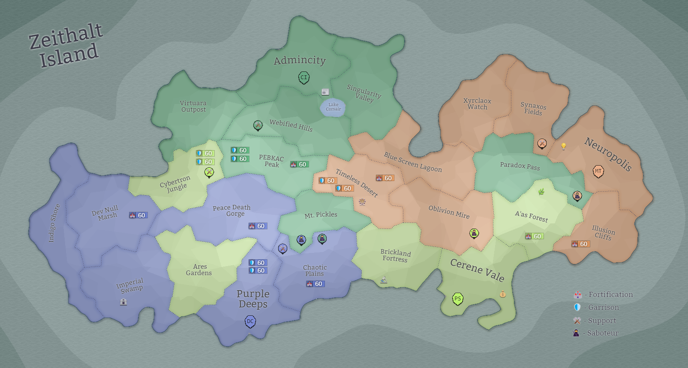

## Eon 469 - The Corrupted Battle of PEBKAC Peak

`⚔️ Battle` won by [Cybernetics Inc](../refs/cybernetics_inc.md) (combined faction forces)

All major factions of Zeithalt once again were able to show great unity in fighting-off the [Corruption](../refs/corruption.md) and pulled together a massive effort, narrowly winning against the ever-growing threat.

The eons leading up to the battle showed unprecedented collaborations between [Cybernetics Inc](../refs/cybernetics_inc.md) and [Protectores Silva](../refs/protectores_silva.md). Factions temporarily traded lands and provided each other help in preparation for the  surge.

During the battle, [MindTech Institute](../refs/mindtech_institute.md) fought on par with [Protectores Silva](../refs/protectores_silva.md), while [Delta Collective](../refs/delta_collective.md) were lagging a bit behind (though many attribute this to the battle starting at nighttime in Deltan time zone).

Due to the success in The Corrupted Battle of [PEBKAC Peak](../refs/pebkac_peak.md) factions CR research projects move forward, giving more understanding on the nature of [Corruption](../refs/corruption.md).

----------
[⬅️ Back to Timeline](../timeline/#eon0469)