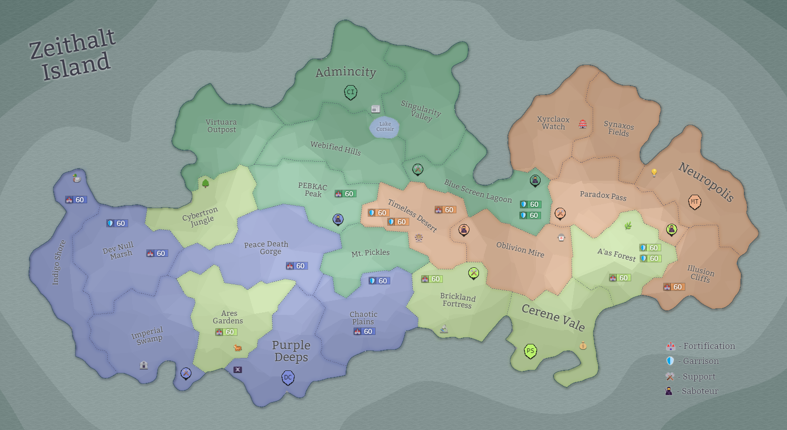

## Eon 492 - CI and MT exchange lands

`⌛ Event`

[Cybernetics Inc](../refs/cybernetics_inc.md) and [MindTech Institute](../refs/mindtech_institute.md)  exchange lands upon their mutual agreement:
- [Blue Screen Lagoon](../refs/blue_screen_lagoon.md) is now under control of [Cybernetics Inc](../refs/cybernetics_inc.md);
- [Oblivion Mire](../refs/oblivion_mire.md) is now under control of [MindTech Institute](../refs/mindtech_institute.md).

With this exchange the factions also release a joint statement that they have completed the process of returning the lands to their original owners.

Will this mean an era of prosperity and peace for the two factions? Or will it be just a short break before the next conflict?

----------
[⬅️ Back to index](../timeline/index.md)