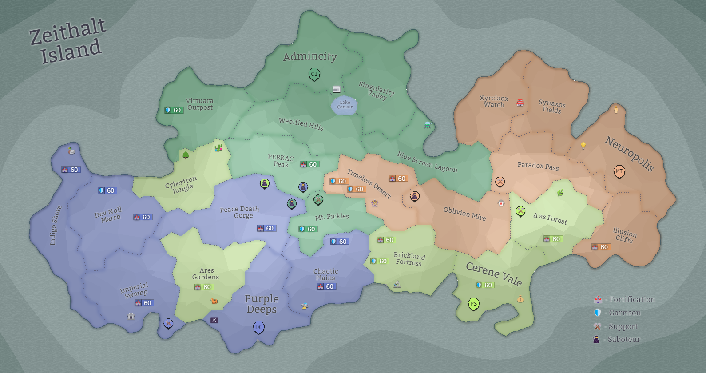

## Eon 501 - The Failed Landing near Virtuara Outpost

`⚔️ Battle` won by [Cybernetics Inc](../refs/cybernetics_inc.md)

Attack by sea and at an unusual time - [Delta Collective](../refs/delta_collective.md) clearly hoped for swift and surprising attack…

However, [Cybers](../refs/cybers.md) were prepared for that: defences were ready, troops anticipated the attack.

Notable that in this battle [Protectores Silva](../refs/protectores_silva.md) broke their long-time habit of being neutral and sided with [Cybers](../refs/cybers.md) in this battle.

[MindTech Institute](../refs/mindtech_institute.md) stayed neutral, making it a 1 vs 2 attack, with no land support.

As a result - [Cybernetics Inc](../refs/cybernetics_inc.md) successfully fends off the [Deltan](../refs/deltans.md) threat and wins _The Failed Landing near Virtuara Outpost_.

----------
[⬅️ Back to Timeline](../timeline/#eon0501)