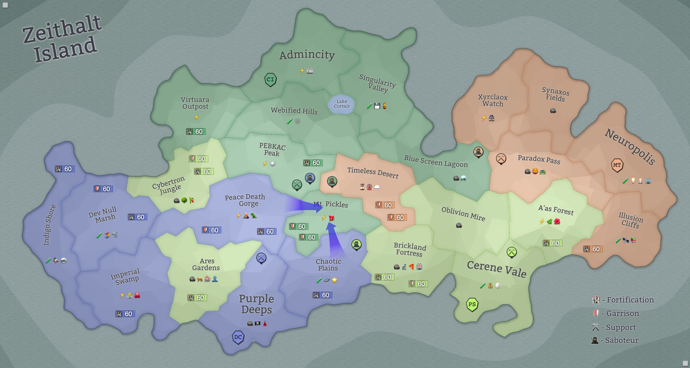

## Eon 563 - The 5th Battle of Mt. Pickles

`⚔️ Battle` won by [Cybernetics Inc](../refs/cybernetics_inc.md)

[Delta Collective](../refs/delta_collective.md) launches an invasion in [Mt. Pickles](../refs/mt_pickles.md) region - a land that has been peaceful for many eons, but forces of [Cybernetics Inc](../refs/cybernetics_inc.md) and [Protectores Silva](../refs/protectores_silva.md) are able to stop the _Deltan_ army in its tracks.

[MindTech Institute](../refs/mindtech_institute.md) stayed neutral in the first half of the battle, but later joined the full-scale attack on [Cybers](../refs/cybers.md).

This is the first battle on record where both sides of the conflict launched special operations to undermine each other and get tactical advantage in the battle.

Remarkable trivia - _Mt. Pickles_ has now seen more battles than any other region on Zeithalt, but the previous battle happened here almost 200 eons ago.

----------
[⬅️ Back to index](../timeline/index.md)