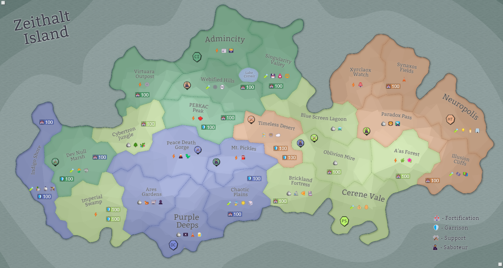

## Eon 715 - The Unfriendly Battle of Blue Screen Lagoon

`⚔️ Battle` won by [Protectores Silva](../refs/protectores_silva.md)

_Protectores Silva_ attacks [MindTech Institute](../refs/mindtech_institute.md) and captures [Blue Screen Lagoon](../refs/blue_screen_lagoon.md).

This battle seemingly caught _MindTech Institute_ off guard as their performance in the battle was “poor” at best.

Initially meeting a strong defensive action form [Delta Collective](../refs/delta_collective.md), _Protectores Silva_ backed up by _Cybers_ and the [Fighters Guild](../refs/fighters_guild.md) persisted as the battle lasted into the night where its fate was decided.

Due to previously friendly relations between _Minds_ and _Silvans_, this battle was named _The Unfriendly Battle of Blue Screen Lagoon_. 

----------
[⬅️ Back to index](../timeline/index.md)