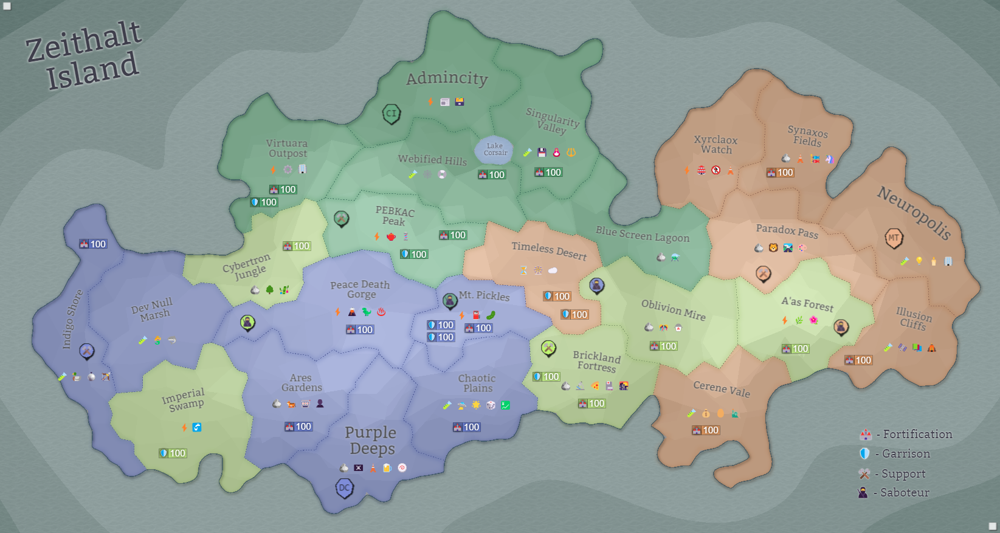

## Eon 759 - The Festive Battle on the Marshes

`⚔️ Battle` won by [Delta Collective](../refs/delta_collective.md)

During the holidays celebrated across the Island, but not in the Deltan lands, the [Delta Collective](../refs/delta_collective.md) launch enormous and unexpected attack on [Cybernetics Inc](../refs/cybernetics_inc.md) in [Dev Null Marsh](../refs/dev_null_marsh.md).

The [Cybers](../refs/cybers.md) are caught completely off guard. 

Their defences in the region are crippled by the very first strike, and even their allies [Silvans](../refs/silvans.md) - being worn down and demoralized by [their own recent losses](../timeline/eon0749.md) -  are unable to gather an army to come to the aid.

As the result, [Deltans](../refs/deltans.md) glide through this battle with almost no resistance and reclaim the land that once belonged to them.

The second-best army on the battlefield was surprisingly the [MindTech Institute](../refs/mindtech_institute.md), who were able to put up a good effort towards DC victory, despite [the turbulent times their faction goes through](../timeline/eon0755.md).

The fact that this battle happened during the holiday season granted it a special name - _The Festive Battle on the Marshes_.

----------
[⬅️ Back to index](../timeline/index.md)