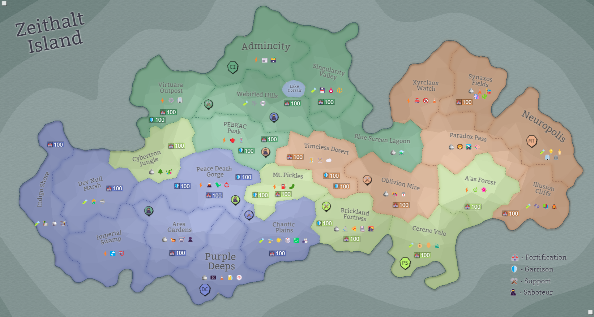

## Eon 768 - Hesitant Battle of Peace Death Gorge

`⚔️ Battle` won by [Delta Collective](../refs/delta_collective.md)

Without question, this battle turned out to be quite predictable and uneventful.

First off, [Cybernetics Inc](../refs/cybernetics_inc.md) could only attack one Deltan land - [Peace Death Gorge](../refs/peace_death_gorge.md).

For that reason, all Deltan forces were concentrated in that region, giving Deltans the great advantage that they managed to keep for the entirety of the battle.

All allies were predictable too - same as for many battles prior, [MindTech Institute](../refs/mindtech_institute.md) were on _Deltans_ side, while [Protectores Silva](../refs/protectores_silva.md) supported [Cybers'](../refs/cybers.md) attack. 

However, what granted the battle its name - is the hesitance and drama CI reportedly had with rumored preparation for attacking the [Timeless Desert](../refs/timeless_desert.md) - and the attack on it being called off at the last moment with Cybers changing their minds about it several times.

It's said, that what made them to change their minds in the end was the promised creation of a new faction in the Timeless Desert, and that the battle there could've undermined their peaceful separation process from [MindTech Institute](../refs/mindtech_institute.md).

However, there were no official statements about this from any faction neither during nor after the battle.

----------
[⬅️ Back to Timeline](../timeline/#eon0768)