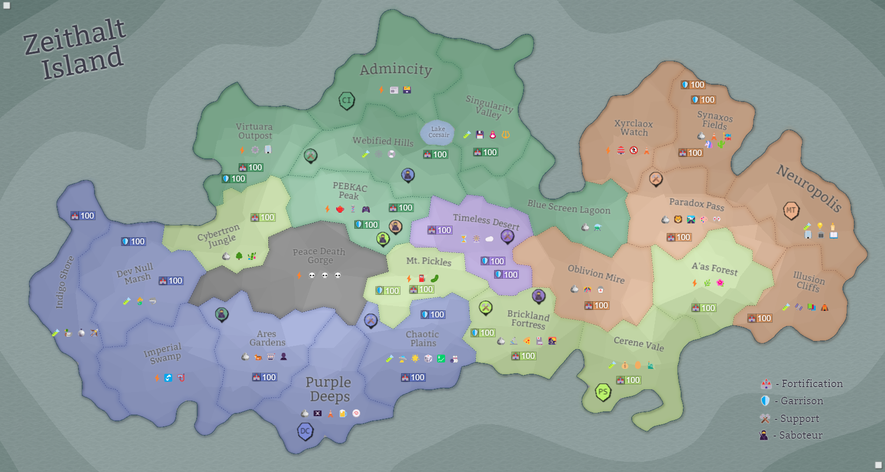

## Eon 793 - The Mourning of Peace Death Gorge

`⚔️ Battle` won by [Corruption](../refs/corruption.md)

Despite all the preparation and the effort, a long period of factions being able to contain the thread of _Corruption_ has ended.

[Peace Death Gorge](../refs/peace_death_gorge.md) is uninhabitable, and the [Deltans](../refs/deltans.md) are forced to evacuate the population.

Many people suffered exposure to _Corruption_ and are being hastily transported to the [CURE](../refs/cure.md) facilities for treatment.

Due to continuous suppression of _Corruption_, this [fallout](../refs/cr_fallout.md) seems to be much more violent and factions are not able to initiate the Containment phase of [CR Restoration Project](../refs/cr_restoration_project.md) for a long time. 

As, sadly, became a routine procedure - [Bank of Zeithalt](../refs/bank_of_zeithalt.md) reinstates its restrictive policies on the Island's economy.

----------
[⬅️ Back to index](../timeline/index.md)