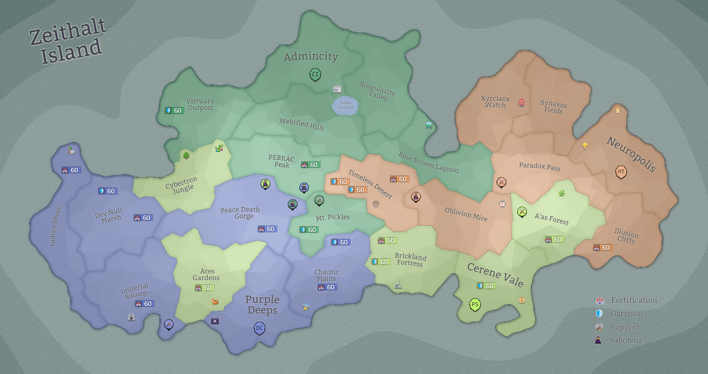

## Eon 818 - Blitz Battle of the A'as Forest

`⚔️ Battle` won by [MindTech Institute](../refs/mindtech_institute.md)

It was a quick and decisive battle in here the attacking MindTech forces were ahead of their opposition by a colossal margin.

First of all, Minds prepared greatly for this battle, and attacked [A'as Forest](../refs/aas_forest.md) from three sides simultaneously, almost trapping the opposing [Silvan](../refs/protectores_silva.md) and [Cybernetics'](../refs/cybernetics_inc.md) troops in the process.

Secondly, _Minds_ were able to secure contracts with both [Fighters' Guild](../refs/fighters_guild.md) and [Cloudy Operatives](../refs/cloudy_operatives.md) to further increase their numbers.

Lastly, [Delta Collective](../refs/delta_collective.md) - who are currently considered to have the strongest army on the Island - once again proved to be a reliable ally and provided them with the necessary support.

As a result, the battle was decided in a matter of hours - the attackers had vastly superior force, and the battle was finished quickly.

## Eon 810 - Grinding Battle of Peace Death Gorge

`⚔️ Battle` won by [Delta Collective](../refs/delta_collective.md)

In this battle, factions (especially Deltans) fought for every inch of the land in the [Peace Death Gorge](../refs/peace_death_gorge.md) to reclaim it.

The Delta Collective had done a lot of preparations and had a lot of experience in the area, so they were able to get the early lean which only grew as the battle moved forward.

In fact, the force with which the Deltans fought here made the other factions' efforts pale in comparison - the Delta Collective is estimated to have gathered a bigger army than all four other factions _combined_.

Such an immense force was not only able to secure this land, but also made the people across the Island talk about the current balance of power and its meaning for future battles. 

## Eon 802 - Military Exercise in the Dev Null Marsh

`⚔️ Battle` won by [Delta Collective](../refs/delta_collective.md)

Factions are conducting a military exercise in the [Dev Null Marsh](../refs/dev_null_marsh.md) in the wake of the upcoming [CR Restoration Project](../refs/cr_restoration_project.md) in nearby [Peace Death Gorge](../refs/peace_death_gorge.md) and to prepare for future Corruption outbreaks. 

The [Delta Collective](../refs/delta_collective.md) wins the exercise, showing the best coordination and tactics.

Shortly after the exercise, the factions complete back-to-back all three necessary _CR Restoration Project_ stages and the land is announced to be free from [corruption](../refs/corruption.md).

With that, the full restoration is far from over as such notable places as [Volcanic Jacuzzi](../refs/volcanic_jacuzzi.md) and [Jurassic Part](../refs/jurassic_park.md) were heavily damaged and still in need of attention.

## Eon 793 - The Mourning of Peace Death Gorge

`⚔️ Battle` won by [Corruption](../refs/corruption.md)

Despite all the preparation and the effort, a long period of factions being able to contain the thread of _Corruption_ has ended.

[Peace Death Gorge](../refs/peace_death_gorge.md) is uninhabitable, and the [Deltans](../refs/deltans.md) are forced to evacuate the population.

Many people suffered exposure to _Corruption_ and are being hastily transported to the [CURE](../refs/cure.md) facilities for treatment.

Due to continuous suppression of _Corruption_, this [fallout](../refs/cr_fallout.md) seems to be much more violent and factions are not able to initiate the Containment phase of [CR Restoration Project](../refs/cr_restoration_project.md) for a long time. 

As, sadly, became a routine procedure - [Bank of Zeithalt](../refs/bank_of_zeithalt.md) reinstates its restrictive policies on the Island's economy.

## Eon 779 - Cloudy Operative is founded

`⌛ Event`

After eons of preparations, the founders of the [Cloudy Operatives](../refs/cloudy_operatives.md) finally finish the process of establishing their new faction.

The faction is founded by the three former [MindTech Institute](../refs/mindtech_institute.md) Masters - [Bumps](../refs/bumps.md), [Shaxx](../refs/shaxx.md) and [CrAEX](../refs/craex.md), joined by a Silvan [You](../refs/you.md) and a sellswords [Eldar](../refs/eldar.md) and [Revalx](../refs/revalx.md).

The new faction is able to negotiate a deal with MindTech regarding the [Timeless Desert](../refs/timeless_desert.md) and now has it under their control.

The goal of the Cloudy Operatives is claimed to be the focus on the development of the Desert and its [resources](../refs/temporal_resources.md), as well as trade and economic prosperity. 

In their founding accords, the new faction vows not to take interest in any lands outside the Desert with the goal of achieving neutrality with other factions.

## Eon 778 - The 3rd Outbreak in Synaxos Fields

`⚔️ Battle` won by [MindTech Institute](../refs/mindtech_institute.md) (combined faction forces)

After the previous war and the tension it caused between the factions, the defense of [Synaxos Fields](../refs/synaxos_fields.md) promised to be hard. 

There even were rumors of intentional sabotage against MindTech Institute efforts.

The fact that the faction had been suppressing [Corruption](../refs/corruption.md) for several battles in a row did not help either.

However, the factions were able to gather a strong united force to aid MindTech Institute in the defense and avoid the global disaster.

## Eon 768 - Hesitant Battle of Peace Death Gorge

`⚔️ Battle` won by [Delta Collective](../refs/delta_collective.md)

Without question, this battle turned out to be quite predictable and uneventful.

First off, [Cybernetics Inc](../refs/cybernetics_inc.md) could only attack one Deltan land - [Peace Death Gorge](../refs/peace_death_gorge.md).

For that reason, all Deltan forces were concentrated in that region, giving Deltans the great advantage that they managed to keep for the entirety of the battle.

All allies were predictable too - same as for many battles prior, [MindTech Institute](../refs/mindtech_institute.md) were on _Deltans_ side, while [Protectores Silva](../refs/protectores_silva.md) supported [Cybers'](../refs/cybers.md) attack. 

However, what granted the battle its name - is the hesitance and drama CI reportedly had with rumored preparation for attacking the [Timeless Desert](../refs/timeless_desert.md) - and the attack on it being called off at the last moment with Cybers changing their minds about it several times.

It's said, that what made them to change their minds in the end was the promised creation of a new faction in the Timeless Desert, and that the battle there could've undermined their peaceful separation process from [MindTech Institute](../refs/mindtech_institute.md).

However, there were no official statements about this from any faction neither during nor after the battle.

## Eon 766 - PS rebuilds capital in Cerene Vale

`⌛ Event`

Following the [Burning of Cerene Vale](../timeline/eon0749.md), the subsequent [changes](../timeline/eon0755.md) in [MindTech Institute](../refs/mindtech_institute.md) and the [exchange of lands](../timeline/eon0761.md), [Protectores Silva](../refs/protectores_silva.md) begin rebuilding their capital in Cerene Vale.

With that, comes a logical conclusion of the MT-PS war.

The result of this war seems to be [Protectores Silva](../refs/protectores_silva.md) losing a couple of their lands and having to rebuild their capital.

[Cybernetics Inc](../refs/cybernetics_inc.md), lost Dev Null Marsh back to Deltans.

[MindTech Institute](../refs/mindtech_institute.md) were able to reclaim one of their lands at a high cost of losing vast amounts of resources and ended up with a new government to navigate the political situation they put themselves in.

[Delta Collective](../refs/delta_collective.md) are the main benefactors of the war after reclaiming Ares Garden and squeezing out Silvans from the Imperial Swamp without major changes in their inner and outer politics.

But is it really the end of the war? Or is it just the beginning of a new chapter?

## Eon 762 - DC and PS exchange lands

`📅 Event`

[Delta Collective](../refs/delta_collective.md) and [Protectores Silva](../refs/protectores_silva.md) exchange lands upon their mutual agreement:
- [Imperial Swamp](../refs/imperial_swamp.md) is now under control of [Delta Collective](../refs/delta_collective.md);
- [Mt. Pickles](../refs/mt_pickles.md) is now under control of [Protectores Silva](../refs/protectores_silva.md).

## Eon 761 - MT and PS exchange lands

`📅 Event`

[MindTech Institute](../refs/mindtech_institute.md) and [Protectores Silva](../refs/protectores_silva.md) exchange lands upon their mutual agreement:
- [Cerene Vale](../refs/cerene_vale.md) is now under control of [Protectores Silva](../refs/protectores_silva.md);
- [Oblivion Mire](../refs/oblivion_mire.md) is now under control of [MindTech Institute](../refs/mindtech_institute.md).

## Eon 759 - The Festive Battle on the Marshes

`⚔️ Battle` won by [Delta Collective](../refs/delta_collective.md)

During the holidays celebrated across the Island, but not in the Deltan lands, the [Delta Collective](../refs/delta_collective.md) launch enormous and unexpected attack on [Cybernetics Inc](../refs/cybernetics_inc.md) in [Dev Null Marsh](../refs/dev_null_marsh.md).

The [Cybers](../refs/cybers.md) are caught completely off guard. 

Their defences in the region are crippled by the very first strike, and even their allies [Silvans](../refs/silvans.md) - being worn down and demoralized by [their own recent losses](../timeline/eon0749.md) -  are unable to gather an army to come to the aid.

As the result, [Deltans](../refs/deltans.md) glide through this battle with almost no resistance and reclaim the land that once belonged to them.

The second-best army on the battlefield was surprisingly the [MindTech Institute](../refs/mindtech_institute.md), who were able to put up a good effort towards DC victory, despite [the turbulent times their faction goes through](../timeline/eon0755.md).

The fact that this battle happened during the holiday season granted it a special name - _The Festive Battle on the Marshes_.

## Eon 755 - Council of Minds is restored in MT

`⌛ Event`

Following the blatant and brutal [Burning of Cerene Vale](../timeline/eon0749.md), the [Loki](../refs/loki.md)'s fall and simultaneous restoration of democratic institutes in MindTech begin.

At the same time as democratic and inclusive elections are announces in [MindTech Institute](../refs/mindtech_institute.md), the former tyrant leader is detained and held captive in [Prefrenial Prefect](../refs/prefrenial_prefect.md), awaiting a trial. 

The elections result in a landslide victory for [CuriousDino](../refs/curious_dino.md), who immediately assumes office as the MT Head of State and reestablishes the [Council of Minds](../refs/council_of_minds.md) as the governing body of MindTech. 

Following eons become very busy for the newfound government: the new government structure is approved by the absolute majority of the Council; several cross-faction proposals are put forward and voted on; Loki is transferred to [Protectores Silva](../refs/protectores_silva.md) for trial.

While from the outside of the faction these changes are barely noticeable and the faction still struggles to find understanding from other factions, the internal changes seem to be drastic and ambitious. 

Which begs the ultimate question - will it start a new, more peaceful era for MindTech, or will it collapse back into the war and destruction yet again?

## Eon 749 - The Burning of Cerene Vale

`⚔️ Battle` won by [MindTech Institute](../refs/mindtech_institute.md)

A devastating loss for [Protectores Silva](../refs/protectores_silva.md) results in them having to flee their own capital, as it goes up in flames from the approaching [Minds](../refs/minds.md) army attacks.

The MT dictator [Loki](../refs/loki.md) stops at nothing to get his revenge on the [Protectors](../refs/protectores_silva.md) for what he calls a betrayal.

It's a second ever successful siege of a capital, and the first one where the attacking army decides to burn the city to the ground. 

Historians will remember this event as the _Burning of Cerene Vale_, and estimate that it might bear the same significance for the whole island as [Siege of Neuropolis (eon 384)](../timeline/eon0384.md) and the [Disaster of Synaxos Fields (eon 508)](../timeline/eon0508.md).

When the ash settles and the smoke clears, will the [Minds](../refs/minds.md) army march on to their next target? 

Or will the [Silvans](../refs/silvans.md) be able to regroup and fight back?

Whichever way it goes, at the moment it seems the only way forward is through even more bloodshed and destruction. 

## Eon 740 - The Battle Of Corrupted Mountain

`⚔️ Battle` won by [Delta Collective](../refs/delta_collective.md) (combined faction forces)

As it happened many times previously, the existential threat of [Corruption](../refs/corruption.md) is able to unite factions - even if temporarily - to fend off the greater danger.

We see it happen again this time - despite an ongoing war between the [Minds](../refs/minds.md) and [Deltans](../refs/deltans) on one side and [Silvans](../refs/silvans.md) with [Cybers](../refs/cybers.md) on the other.

It was a long an enduring battle through the night, however the factions were able to hold their ground and push back the [Corruption](../refs/corruption.md).

Notably, [Delta Collective](../refs/delta_collective.md) had the strongest army on the battlefield, being almost equal to the combined forces of three other factions.

## Eon 733 - The Frantic Battle over A'as Forest

`⚔️ Battle` won by [Protectores Silva](../refs/protectores_silva.md)

This battle was long anticipated by both sides, but [Loki](../refs/loki.md) took his time to strike at an unexpected time and in an unexpected place... 

However, [Protectores Silva](../refs/protectores_silva.md) were ready for that: they had their defenses distributed equally over their lands, and [A'as Forest](../refs/aas_forest.md) had formidable defenses.

With [Cybers](../refs/cybers.md), [Silvan](../refs/silvans.md) and the [Fighters Guild](../refs/fighters_guild.md) on one side, and [Deltans](../refs/deltans.md) with [Minds](../refs/minds.md) on the other, this battle was going to be a close one.

Despite quickly losing the initiative and all the chaos that ensued, [Protectores Silva](../refs/protectores_silva.md) managed to keep their heads cool and with a considerable effort and unforeseen amount of resources were able to fend off the attack.

## Eon 730 - PS give Blue Screen Lagoon to CI

`⌛ Event`

[Protectores Silva](../refs/protectores_silva.md) gives control over [Blue Screen Lagoon](../refs/blue_screen_lagoon.md) to [Cybernetics Inc](../refs/cybernetics_inc.md) upon their mutual agreement.

## Eon 723 - 2nd Sabotage in the Desert

`⚔️ Battle` won by [MindTech Institute](../refs/mindtech_institute.md)

After failing to secure a contract with [Fighters Guild](../refs/fighters_guild.md), [Cybers](../refs/cybers.md) return to their previous tactic of sabotaging the [Timeless Desert](../refs/timeless_desert.md).

This tactic proves useful again, as the Cybers are able to trigger [CR Mines](../refs/cr_mines.md) and interrupt [Temporal Resource](../refs/temporal_resources.md) production in the region.

However, the battle itself was heavily dominated by [Deltan](../refs/deltans.md) forces helping MT defend, while Cybers and Silvans mostly conserved their forces for the upcoming MT retribution.

## Eon 715 - The Unfriendly Battle of Blue Screen Lagoon

`⚔️ Battle` won by [Protectores Silva](../refs/protectores_silva.md)

_Protectores Silva_ attacks [MindTech Institute](../refs/mindtech_institute.md) and captures [Blue Screen Lagoon](../refs/blue_screen_lagoon.md).

This battle seemingly caught _MindTech Institute_ off guard as their performance in the battle was “poor” at best.

Initially meeting a strong defensive action form [Delta Collective](../refs/delta_collective.md), _Protectores Silva_ backed up by _Cybers_ and the [Fighters Guild](../refs/fighters_guild.md) persisted as the battle lasted into the night where its fate was decided.

Due to previously friendly relations between _Minds_ and _Silvans_, this battle was named _The Unfriendly Battle of Blue Screen Lagoon_. 

## Eon 706 - The Fall of Ares Garden

`⚔️ Battle` won by [Delta Collective](../refs/delta_collective.md)

_Delta Collective_ attacks [Protectores Silva](../refs/protectores_silva.md) to seize control over the [Ares Gardens](../refs/ares_gardens.md) in a battle known as _The Fall of Ares Garden_.

This battle has two remarkable traits:
- it’s the first ever direct attack by any faction on _Protectores Silva_;
- it’s the first appearance of [Fighters Guild](../refs/fighters_guild.md) in a cross-factional battle.

[Sellswords](../refs/sellswords.md) in this battle dealt more damage than both [Cybernetics Inc](../refs/cybernetics_inc.md) or [MindTech Institute](../refs/mindtech_institute.md), clearly establishing a new powerful player on the Zeithalt map.

However, their efforts were not enough to help _Silvans_ win this battle.

## Eon 697 - The Corruption Outbreak in Synaxos Fields

`⚔️ Battle` won by [MindTech Institute](../refs/mindtech_institute.md) (combined faction forces)

[Corruption Outbreak](../refs/corruption.md) in [Synaxos Fields](../refs/synaxos_fields.md) happens, but factions being alert to the danger win by a good margin.

_Zeithalt historian took a break during this time, so there’s little or no written history of this event._

## Eon 687 - The Crash Landing on Indigo Shore

`⚔️ Battle` won by [Delta Collective](../refs/delta_collective.md)

[Cybernetics Inc](../refs/cybernetics_inc.md) decides to retaliate on [Delta Collective](../refs/delta_collective.md) with an unexpected attack on [Indigo Shore](../refs/indigo_shore.md) but fails to capture in the battle known as _Crash Landing on Indigo Shore_.

_Zeithalt historian took a break during this time, so there’s little or no written history of this event._

## Eon 679 - The Defense of Dev Null Marsh

`⚔️ Battle` won by [Cybernetics Inc](../refs/cybernetics_inc.md)

[Delta Collective](../refs/delta_collective.md) attacks [Dev Null Marsh](../refs/dev_null_marsh.md), starting a battle known as _Defense of Dev Null Marsh_.

It was practically won by a clever use of _Special Tactics_ and [resources](../refs/resources.md) by [Cybernetics Inc](../refs/cybernetics_inc.md).

_Zeithalt historian took a break during this time, so there’s little or no written history of this event._

## Eon 666 - The Spooky Battle of Chaotic Plains

`⚔️ Battle` won by [Delta Collective](../refs/delta_collective.md) (combined faction forces)

[Corruption](../refs/corruption.md) strikes [Chaotic Plains](../refs/chaotic_plains.md) causing a _Spooky Battle of Chaotic Plains_, which, however was closely won by collective factions’ effort.

_Zeithalt historian took a break during this time, so there’s little or no written history of this event._

## Eon 656 - The Sabotage in the Desert

`⚔️ Battle` won by [MindTech Institute](../refs/mindtech_institute.md)

[Cybernetics Inc](../refs/cybernetics_inc.md) launches an attack on [Timeless Desert](../refs/timeless_desert.md)’s infrastructure in a battle known as _Sabotage in the Desert_.

As declared by the [Cybers](../refs/cybers.md), the goal of this attack wasn't to conquer the _Desert_, but rather to interrupt its production and weaken its defences.

The initial blow alone achieved both of these objectives. [Corrupted Mines](../refs/cr_mines.md) were triggered in the area, and the first attacks indeed disrupted [Temporal Resource](../refs/temporal_resources.md) production for several eons.

Afterward, the pace of the attacking activity slowed significantly, and the _MindTech Institute_ in a coalition with [Deltan](../refs/delta_collective.md) forces was able to secure victory in the battle, while [Protectores Silva](../refs/protectores_silva.md) remained mostly neutral.

It's difficult to determine a clear "winner" in this battle, as both sides claim to have achieved their goals on the battlefield. What remains certain is that, even after seven battles, the _Desert_ still stands unconquered.

## Eon 646 - The Unstable Battle of Blue Screen Lagoon

`⚔️ Battle` won by [MindTech Institute](../refs/mindtech_institute.md)

[MindTech Institute](../refs/mindtech_institute.md) attacks and wins [Blue Screen Lagoon](../refs/blue_screen_lagoon.md) in a battle known as _Unstable Battle of Blue Screen Lagoon_.

A streak of unsuccessful battles for [Cybers](../refs/cybers.md) continues once again, with [Minds](../refs/minds.md) attacking and capturing the _Lagoon_. 

Despite the help from [Protectores Silva](../refs/protectores_silva.md) and having the upper hand for most of the battle, combined effort of _Deltans_ and _Minds_ prevailed in this battle.

## Eon 636 - The Peculiar Battle of Mt. Pickles

`⚔️ Battle` won by [Delta Collective](../refs/delta_collective.md)

[Delta Collective](../refs/delta_collective.md) attacks and wins [Mt. Pickles](../refs/mt_pickles.md) in a battle known as _Peculiar Battle on Mt. Pickles_.

What gave the battle its name, is the fact that the battle seemingly stopped several times and changes into friendly conversations and even picnics between participants.

However, after some time, the fighters remembered their differences and the battle would resume.

In this battle [Cybernetics Inc](../refs/cybernetics_inc.md) were on the defensive side (helped by their allies [Protectores Silva](../refs/protectores_silva.md)), while [Deltans](../refs/deltans.md) lead the assault with help from the [MindTech Institute](../refs/mindtech_institute.md).

## Eon 626 - The Enduring Defense of Webified Hills

`⚔️ Battle` won by [Cybernetics Inc](../refs/cybernetics_inc.md) (combines faction forces)

Factions collectively stand strong against [Corruption](../refs/corruption.md) in the _Enduring Defence of Webified Hills_.

This time the _Corruption_ wasn’t spreading particularly fast, but the battle was difficult and long.

Once again factions were able to come together and collectively defeat the threat.

## Eon 619 - The Reclamation of Imperial Swamp

`⚔️ Battle` won by [Protectores Silva](../refs/protectores_silva.md)

[Protectores Silva](../refs/protectores_silva.md) attacks and claims [Imperial Swamp](../refs/imperial_swamp.md) in a battle known as _Reclamation of the Imperial Swamp_.

After a devastating loss to [Corruption](../refs/corruption.md) and the following [restoration projects](../refs/cr_restoration_project.md) the _Imperial Swamp_ stood as unoccupied and CR-free land - a chance seen and seized by the _Protectores Silva_.

Prompted by [Silvans](../refs/silvans.md), the rush to capture the _Imperial Swamp_ started, but having used the [Corrupted Shards](../refs/cr_shards.md), the _Silvans_ were ahead of others the entire battle and secured the victory.

## Eon 617 - CI and DC exchange lands

`⌛ Event`

[Cybernetics Inc](../refs/cybernetics_inc.md) and [Delta Collective](../refs/delta_collective.md) exchange lands upon their mutual agreement:
- [Dev Null Marsh](../refs/dev_null_marsh.md) is now under control of [Cybernetics Inc](../refs/cybernetics_inc.md);
- [Peace Death Gorge](../refs/peace_death_gorge.md) is now under control of [Delta Collective](../refs/delta_collective.md).

## Eon 611 - A Picnic near The Purple Deeps

`⚔️ Battle` won by [Delta Collective](../refs/delta_collective.md)

As a late night settles in the _Deltan_ lands, joint forces of [Cybernetics Inc](../refs/cybernetics_inc.md) and [Protectores Silva](../refs/protectores_silva.md) lay a siege to the Deltan capital of [Purple Deeps](../refs/purple_deeps.md).

Interestingly, most _Deltan_ forces were absent or asleep at that time, so their allies from [MindTech Institute](../refs/mindtech_institute.md) had to fend off the first attacks.

In the initial hours heavy fighting breaks out, almost bringing down Deeps’ defences to an equal fight, but in an unexplainable turn of events the fighting stops in its tracks and all factions take a break for several hours.

This sudden break granted the battle its name - _A Picnic near The Purple Deeps_.

Later on, the battle resumes, but by that time full power of _Deltan_ forces were awake, joined by increased numbers of the [Minds](../refs/minds.md)… as a result, defenders had a comfortable lead till the very end of the battle.

## Eon 596 - The Fall of Imperial Swamp

`⚔️ Battle` won by [Corruption](../refs/corruption.md)

Some say after previous easy victory over _Corruption_ the factions became too reckless. Others say heavy suppression of the _Corruption_ last time caused it being overcharged this time, resulting in uncontrollable violent outburst…

Either way, the collective effort of factions wasn’t enough and [Imperial Swamp](../refs/imperial_swamp.md) falls - the land is currently uninhabitable and man-made structures, such as [Altar of Ctulhu](../refs/altar_of_ctulhu.md) and [Money Factory](../refs/money_factory.md), are destroyed.

[Bank of Zeithalt](../refs/bank_of_zeithalt.md) has declared the Island-wide state of emergency until the necessary [CR Restoration Project](../refs/cr_restoration_project.md) stages are completed to contain the threat.

## Eon 582 - The Advance on Peace Death Gorge

`⚔️ Battle` won by [Cybernetics Inc](../refs/cybernetics_inc.md)

In an unexpected strategic move, [Cybernetics Inc](../refs/cybernetics_inc.md) were able to make [Deltans](../refs/deltans.md) expect an attack on [Dev Null Marsh](../refs/dev_null_marsh.md) and divert all their defences there, while the actual advance happened in [Peace Death Gorge](../refs/peace_death_gorge.md).

Due to careful planning and good execution, joint forces of [Cybers](../refs/cybers.md) and [Silvans](../refs/silvans.md) were able to dominate the battlefield and win this battle.

## Eon 573 - The Battle of Corrupted Valley

`⚔️ Battle` won by [Cybernetics Inc](../refs/cybernetics_inc.md) (combined faction forces)

Factions are able to put aside their differences and arguments to fend off [Corruption](../refs/corruption.md) in the [Singularity Valley](../refs/singularity_valley.md).

[Cybernetics Inc](../refs/cybernetics_inc.md) in coordination with other factions did a very good job preparing for the battle - [Corrupted Mines](../refs/cr_mines.md) were installed, defenses strengthened, fortifications built… it all paid off in the end.

As expected after two violent _Corruption_ outbursts, it seems to have released some of its pressure and this battle proved to be easier.

On the other hand, it means the next battle will be harder.

## Eon 563 - The 5th Battle of Mt. Pickles

`⚔️ Battle` won by [Cybernetics Inc](../refs/cybernetics_inc.md)

[Delta Collective](../refs/delta_collective.md) launches an invasion in [Mt. Pickles](../refs/mt_pickles.md) region - a land that has been peaceful for many eons, but forces of [Cybernetics Inc](../refs/cybernetics_inc.md) and [Protectores Silva](../refs/protectores_silva.md) are able to stop the _Deltan_ army in its tracks.

[MindTech Institute](../refs/mindtech_institute.md) stayed neutral in the first half of the battle, but later joined the full-scale attack on [Cybers](../refs/cybers.md).

This is the first battle on record where both sides of the conflict launched special operations to undermine each other and get tactical advantage in the battle.

Remarkable trivia - _Mt. Pickles_ has now seen more battles than any other region on Zeithalt, but the previous battle happened here almost 200 eons ago.

## Eon 560 - CI gives Oblivion Mire to PS

`⌛ Event`

[Cybernetics Inc](../refs/cybernetics_inc.md) and [Protectores Silva](../refs/protectores_silva.md) transfer land ownership upon their mutual agreement:
- [Oblivion Mire](../refs/oblivion_mire.md) is now under control of [Protectores Silva](../refs/protectores_silva.md).

## Eon 554 - The Race for Oblivion Mire

`⚔️ Battle` won by [Cybernetics Inc](../refs/cybernetics_inc.md)

[Cybers](../refs/cybers.md) attack and then subsequently win the quick battle to claim [Oblivion Mire](../refs/oblivion_mire.md).

This is the first case on record of any faction using [Corrupted Shards](../refs/cr_shards.md) to get an advantage in the battle.

The fast-paced nature of this battle gave it the title _The Race for Oblivion Mire_.

## Eon 545 - Military exercise in Cerene Vale

`⚔️ Battle` won by [Protectores Silva](../refs/protectores_silva.md) (military exercise)

[MindTech Institute](../refs/mindtech_institute.md) attacks [Protectores Silva](../refs/protectores_silva.md) in [Cerene Vale](../refs/cerene_vale.md) in a joint military exercise.

## Eon 540 - Restoration of Oblivion Mire

`⌛ Event`

Peaceful collaboration between factions made response to corruption swift and timely - [Restoration Project](../refs/cr_restoration_project.md) is completed in [Oblivion Mire](../refs/oblivion_mire.md).

While these lands will forever remain scarred by the disaster and every man-made structure was destroyed while the event unfolded, _Oblivion_ now stands clear from [Corruption](../refs/corruption.md).

Since all population was evacuated previously from _Oblivion Mire_, it is currently a free land, not belonging to any faction.

The immediate danger is gone, but Zeithalt will remember _The Dark Night on the Mire_ and the lessons it taught us.

## Eon 536 - The Dark Night on the Mire

`⚔️ Battle` won by [Corruption](../refs/corruption.md)

[Oblivion Mire](../refs/oblivion_mire.md) is uninhabitable as factions fail to contain _Corruption_.

[Bank of Zeithalt](../refs/bank_of_zeithalt.md) reinstates its policies that were in order during the previous [Corruption Fallout](../refs/cr_fallout.md) to minimize the damages to the Island’s economy.

Many people suffered exposure to _Corruption_ - luckily with recent developments we know that full recovery is possible, although it will take time to heal.

Most of [Oblivion Mire](../refs/oblivion_mire.md) is currently in uninhabitable state, many places just dangerous to be in due to _Corruption Fallout_.

As the last devastating news to the Islanders, renown [Valhalla Bar](../refs/valhalla_bar.md) is now also destroyed.

This night will be remembered as _The Dark Night on the Mire_.

## Eon 527 - CI and DC exchange lands

`⌛ Event`

[Cybernetics Inc](../refs/cybernetics_inc.md) and [Delta Collective](../refs/delta_collective.md) exchange lands upon their mutual agreement:
- [Singularity Valley](../refs/singularity_valley.md) is now back under control of [Cybernetics Inc](../refs/cybernetics_inc.md);
- [Chaotic Plains](../refs/chaotic_plains.md) is now back under control of [Delta Collective](../refs/delta_collective.md).

## Eon 526 - The Recapture of Synaxos Fields

`⚔️ Battle` won by [MindTech Institute](../refs/mindtech_institute.md)

This was quite an unusual battle - for the first time in more than 270 eons that passed since the end of [Age of Conquest](../refs/age_of_conquest.md), all faction fought capture a free land.

[Cybers](../refs/cybers.md) and [Deltans](../refs/deltans.md) did not provide a remarkable presence on the battlefield, while [Silvans](../refs/silvans.md) saw this battle as an extension of clearing out the [Synaxos Fields](../refs/synaxos_fields.md) of the [Corruption](../refs/corruption.md) and provided much more noticeable support.

[MindTech Institute](../refs/mindtech_institute.md) had by far the most power in this battle, successfully completing _The Recapture Of Synaxos Fields_.

## Eon 519 - CI and DC exchange lands

`⌛ Event`

[Cybernetics Inc](../refs/cybernetics_inc.md) and [Delta Collective](../refs/delta_collective.md) exchange lands upon their mutual agreement:
- [Singularity Valley](../refs/singularity_valley.md) is now under control of [Delta Collective](../refs/delta_collective.md);
- [Chaotic Plains](../refs/chaotic_plains.md) is now under control of [Cybernetics Inc](../refs/cybernetics_inc.md).

## Eon 518 - Restoration of Synaxos Fields

`⌛ Event`

After spending enormous amounts of resources and doing extensive research factions collectively complete @[CR Restoration Project](../refs/cr_restoration_project.md) in [Synaxos Fields](../refs/synaxos_fields.md).

While these lands will forever remain scarred by the disaster and every man-made structure was destroyed while the event unfolded, Synaxos now stands clear from [Corruption](../refs/corruption.md).

Since all population was evacuated previously from [Synaxos Fields](../refs/synaxos_fields.md), it is currently a free land, not belonging to any faction.

Many on the Island are wondering of this means a future peaceful collaboration to restore  to former glory…. or a threat of a new bloody conflict for controlling the land is looming over it. 

## Eon 517 - PS passes their attack turn

`⌛ Event`

[Protectores Silva](../refs/protectores_silva.md) decides to pass their attack turn, releasing the following statement:

> *We're that happy all factions are working together on the restoration of [Synaxos Fields](../refs/synaxos_fields.md).*

## Eon 515 - The Sleepy Siege of Cerene Vale

`⚔️ Battle` won by [Protectores Silva](../refs/protectores_silva.md)

It was quite an uneventful battle where [Protectores Silva](../refs/protectores_silva.md) were prepared and [Delta Collective](../refs/delta_collective.md) clearly did a bad job planning out this battle.

[Cybernetics Inc](../refs/cybernetics_inc.md) and [MindTech Institute](../refs/mindtech_institute.md) stayed neutral, while [Deltans](../refs/deltans.md) quickly realised that mistakes were made and that the battle cannot be won.

The slow and frankly quite boring nature of this unsuccessful siege has granted the battle its name - _The Sleepy Siege of Cerene Vale_.

## Eon 508 - The Disaster of Synaxos Fields

`⚔️ Battle` won by [Corruption](../refs/corruption.md)

[Synaxos Fields](../refs/synaxos_fields.md) is a dead wasteland as factions fail to contain [Corruption](../refs/corruption.md) surge.

Several new [Bank of Zeithalt](../refs/bank_of_zeithalt.md) policies are in order following an attempt to save the economy of the Island.

Many people suffered exposure to [Corruption](../refs/corruption.md) - fate of those with severe cases is unknown at the moment of writing.

Most of [Synaxos Fields](../refs/synaxos_fields.md) is currently in uninhabitable state, many places just dangerous to be in due to [Corruption Fallout](../refs/cr_fallout.md).

For sure, factions will study the phenomenon in the coming eons to see if at least something is recoverable, but for now _Synaxos Fields_ is considered to be a dead land.

## Eon 506 - Rebellion in the Desert

`⚔️ Battle` won by [MindTech Institute](../refs/mindtech_institute.md)

[MindTech Institute](../refs/mindtech_institute.md) restore the order in the [Timeless Desert](../refs/timeless_desert.md)

The [Rebels](../refs/rebels.md) are driven away and into hideouts after the unsuccessful attempt to install themselves as a new governing power in the desert.

Unfortunately for [Rebels](../refs/rebels.md) they did not find the support of other factions to put up a good enough defence against [MindTech Institute](../refs/mindtech_institute.md).

[Delta Collective](../refs/delta_collective.md) and [Cybernetics Inc](../refs/cybernetics_inc.md) mostly stayed neutral, while [Protectores Silva](../refs/protectores_silva.md) joined the efforts to quell the rebellion. 

## Eon 505 - Rebels take over Timeless Desert

`⌛ Event`

[Rebels](../refs/rebels.md) take over [Timeless Desert](../refs/timeless_desert.md), battle ensues where [MindTech Institute](../refs/mindtech_institute.md) tries to recapture it!

Rebellion group lead by [Sellswords](../refs/sellswords.md): _Just No_name_, _TheDuckie_, [Eldar](../refs/eldar.md) with the help of two inside men in [MindTech Institute](../refs/mindtech_institute.md) - [CuriousDino](../refs/curious_dino.md) and _timmyrueben_ capture several administrative buildings and attempt to take [Timeless Desert](../refs/timeless_desert.md) under their control.

Immediately the fighting starts, [Minds](../refs/minds.md) attack back and try to drive rebels away from their lands.

## Eon 502 - The Island is getting ready for the next Corruption surge

`⌛ Event`

[MindTech Institute](../refs/mindtech_institute.md)‘s Chamber of Corruption Research detects that the next [Corruption](../refs/corruption.md) surge currently builds up in [Synaxos Fields](../refs/synaxos_fields.md).

[Bank of Zeithalt](../refs/bank_of_zeithalt.md) issues a message that it is well-prepared to face any outcome, including  outburst not being contained in [Synaxos Fields](../refs/synaxos_fields.md). Strict monetary restrictions will be in place if this happens in order to ensure the stability of the Island’s economy.

## Eon 501 - The Failed Landing near Virtuara Outpost

`⚔️ Battle` won by [Cybernetics Inc](../refs/cybernetics_inc.md)

Attack by sea and at an unusual time - [Delta Collective](../refs/delta_collective.md) clearly hoped for swift and surprising attack…

However, [Cybers](../refs/cybers.md) were prepared for that: defences were ready, troops anticipated the attack.

Notable that in this battle [Protectores Silva](../refs/protectores_silva.md) broke their long-time habit of being neutral and sided with [Cybers](../refs/cybers.md) in this battle.

[MindTech Institute](../refs/mindtech_institute.md) stayed neutral, making it a 1 vs 2 attack, with no land support.

As a result - [Cybernetics Inc](../refs/cybernetics_inc.md) successfully fends off the [Deltan](../refs/deltans.md) threat and wins _The Failed Landing near Virtuara Outpost_.

## Eon 492 - CI and MT exchange lands

`⌛ Event`

[Cybernetics Inc](../refs/cybernetics_inc.md) and [MindTech Institute](../refs/mindtech_institute.md)  exchange lands upon their mutual agreement:
- [Blue Screen Lagoon](../refs/blue_screen_lagoon.md) is now under control of [Cybernetics Inc](../refs/cybernetics_inc.md);
- [Oblivion Mire](../refs/oblivion_mire.md) is now under control of [MindTech Institute](../refs/mindtech_institute.md).

With this exchange the factions also release a joint statement that they have completed the process of returning the lands to their original owners.

Will this mean an era of prosperity and peace for the two factions? Or will it be just a short break before the next conflict?

## Eon 491 - The Oblivious Battle on the Mire

`⚔️ Battle` won by [Cybernetics Inc](../refs/cybernetics_inc.md)

This battle turned out to be even longer and more unremarkable than the previous one.

[Cybernetics Inc](../refs/cybernetics_inc.md) and [MindTech Institute](../refs/mindtech_institute.md) once again conducted another military exercise;
[Delta Collective](../refs/delta_collective.md) and [Protectores Silva](../refs/protectores_silva.md) were mostly neutral, presumably once again been asked by two other faction to stay neutral.

All-in-all, nothing really special, except for the hilarious fact that members of MT’s government (presumably being intoxicated by the fumes of [Oblivion Mire](../refs/oblivion_mire.md)) forgot to issue an official message about place and time of the attack to their troops.

This resulted in some of their forces attacking in the middle of the night, while others embarrassingly overslept the first half of the battle.

Such forgetfulness of MT officials granted this battle its title - _The Oblivious Battle on the Mire_ 

## Eon 487 - CI and MT exchange lands

`⌛ Event`

[Cybernetics Inc](../refs/cybernetics_inc.md) and [MindTech Institute](../refs/mindtech_institute.md) exchange lands upon their mutual agreement:
- [Paradox Pass](../refs/paradox_pass.md) is now under control of [MindTech Institute](../refs/mindtech_institute.md);
- [Oblivion Mire](../refs/oblivion_mire.md) is now under control of [Cybernetics Inc](../refs/cybernetics_inc.md).

## Eon 481 - PS passes their attack turn

`⌛ Event`

[Protectores Silva](../refs/protectores_silva.md) passes their attack turn again.

## Eon 480 - CI gives Xyrclaox Watch back to MT

`⌛ Event`

[Cybernetics Inc](../refs/cybernetics_inc.md) cedes control over [Xyrclaox Watch](../refs/xyrclaox_watch.md) back to
[MindTech Institute](../refs/mindtech_institute.md) upon their mutual agreement.

## Eon 479 - The Crawling Battle of Xyrclaox Watch

`⚔️ Battle` won by [Cybernetics Inc](../refs/cybernetics_inc.md)

[The Watch’s](../refs/xyrclaox_watch.md) defenses prepared by [MindTech Institute](../refs/mindtech_institute.md) are good and attackers have to come from a narrow path to the lands… This offensive was never going to be easy.

With [Protectores Silva](../refs/protectores_silva.md) and [Delta Collective](../refs/delta_collective.md) staying near perfectly neutral, this battle dragged on even more…

Since the beginning of the battle, [Cybernetics Inc](../refs/cybernetics_inc.md) slowly but surely were closing the gap between them and the [Mind](../refs/minds.md), until in a final push they were able to secure the victory.

The careful, slow and intense nature of the battle has granted it its name - _The Crawling Battle of [Xyrclaox Watch](../refs/xyrclaox_watch.md)_.

## Eon 469 - The Corrupted Battle of PEBKAC Peak

`⚔️ Battle` won by [Cybernetics Inc](../refs/cybernetics_inc.md) (combined faction forces)

All major factions of Zeithalt once again were able to show great unity in fighting-off the [Corruption](../refs/corruption.md) and pulled together a massive effort, narrowly winning against the ever-growing threat.

The eons leading up to the battle showed unprecedented collaborations between [Cybernetics Inc](../refs/cybernetics_inc.md) and [Protectores Silva](../refs/protectores_silva.md). Factions temporarily traded lands and provided each other help in preparation for the  surge.

During the battle, [MindTech Institute](../refs/mindtech_institute.md) fought on par with [Protectores Silva](../refs/protectores_silva.md), while [Delta Collective](../refs/delta_collective.md) were lagging a bit behind (though many attribute this to the battle starting at nighttime in Deltan time zone).

Due to the success in The Corrupted Battle of [PEBKAC Peak](../refs/pebkac_peak.md) factions CR research projects move forward, giving more understanding on the nature of [Corruption](../refs/corruption.md).

## Eon 466 - CI and PS prepare for CR Battle

`⌛ Event`

As the whole Island is waiting for the next, potentially deadly, [Corruption](../refs/corruption.md) strike, [Cybernetics Inc](../refs/cybernetics_inc.md) and [Protectores Silva](../refs/protectores_silva.md) are preparing for the upcoming battle.

They temporarily administrate each other's lands in [Brickland Fortress](../refs/brickland_fortress.md) and [PEBKAC Peak](../refs/pebkac_peak.md), respectively.

Notable events that happened during the short time faction held each other’s lands:
- CI built a 🔬 Modern CR Research Facility in [Brickland Fortress](../refs/brickland_fortress.md);
- PS built fortifications in [PEBKAC Peak](../refs/pebkac_peak.md).

## Eon 463 - DC gives Ares Gardens to PS

`⌛ Event`

[Delta Collective](../refs/delta_collective.md) gives control over [Ares Gardens](../refs/ares_gardens.md) to [Protectores Silva](../refs/protectores_silva.md) upon their mutual agreement.

## Eon 462 - The 2nd Siege of Neuropolis

`⚔️ Battle` won by [MindTech Institute](../refs/mindtech_institute.md)

Quite surprisingly, in this battle [Delta Collective](../refs/delta_collective.md) - known for their chaotic and warring spirit - seemingly decided to follow [Protectores Silva](../refs/protectores_silva.md) steps, as both these faction stayed neutral.

[Cybernetics Inc](../refs/cybernetics_inc.md) defending effort was good, but well outmatched by [MindTech Institute](../refs/mindtech_institute.md) attacking power.

Important thing to note is that during this battle the deal between [Cybers](../refs/cybers.md) and [Minds](../refs/minds.md) to trade [Paradox Pass](../refs/paradox_pass.md) (becomes CI land) for [Illusion Cliffs](../refs/illusion_cliffs.md) (goes to MT) was uncovered, raising more questions from other factions.

## Eon 452 - Technological advancement - Taxes and Land Income

`⌛ Event`

In the time between battles [Bank of Zeithalt](../refs/bank_of_zeithalt.md) introduces taxes - land income and battle tax:
- battle tax is imposed upon faction members as a way to fill up faction treasuries;
- land income is collected by factions from the lands under their control.

Factions immediately started investing into their own economy by building land improvements that earn more income:
- [Cybernetics Inc](../refs/cybernetics_inc.md) builds `💡SmartHome Tech` in [Neuropolis](../refs/neuropolis.md);
- [Protectores Silva](../refs/protectores_silva.md) builds `🌿 Photosynthetic Power Station` in [A’as Forest](../refs/aas_forest.md).

## Eon 451 - The Blitz Battle of Peace Death Gorge

`⚔️ Battle` won by [Delta Collective](../refs/delta_collective.md)

[Delta Collective](../refs/delta_collective.md) gather considerable power of own men and hired sellswords to organize a successful blitz attack on [Peace Death Gorge](../refs/peace_death_gorge.md), reclaiming this land back under control.

Both [Cybernetics Inc](../refs/cybernetics_inc.md) (defending side) and [Protectores Silva](../refs/protectores_silva.md) (staying neutral, as usual) keep very low profiles, having almost no effect on the outcome of the battle.

[MindTech Institute](../refs/mindtech_institute.md) quite unexpectedly joins the offensive. It’s unclear if their intervention was an effort to help the [Deltans](../refs/deltans.md), or an attempt of hijacking their attack. Either way, [Minds](../refs/minds.md) power was not enough to contest the confident win by [Delta Collective](../refs/delta_collective.md).

## Eon 441 - The Lakeside Battle of Webified Hills

`⚔️ Battle` won by [Cybernetics Inc](../refs/cybernetics_inc.md)

In a stunning and unexpected attack near the [Lake Corsair](../refs/lake_corsair.md), [Cybers](../refs/cybers.md) reclaim their lands in _The Lakeside Battle of [Webified Hills](../refs/webified_hills.md)_.

[Delta Collective](../refs/delta_collective.md) valiantly attempts to defend the territory but are ultimately unsuccessful due to bad preparation - they clearly were expecting an attack somewhere else, having almost no defense setup in the [Hills](../refs/webified_hills.md).

Notable that [MindTech Institute](../refs/mindtech_institute.md) strongly supported the Cybers’ attack, however some of their members and paid sell-swords did hits helping [Deltan](../refs/deltans.md) defenses too.

[Protectores Silva](../refs/protectores_silva.md) stayed true to their resolve of being a neutral force, hitting equally for both sides to earn some gold.

## Eon 435 - PS passes their attack turn

`⌛ Event`

[Protectores Silva](../refs/protectores_silva.md) passes their attack turn again.

## Eon 432 - The Battle of Corrupted Marshes

`⚔️ Battle` won by [Delta Collective](../refs/delta_collective.md) (combined faction forces)

In this battle factions once again stood strong against the [Corruption](../refs/corruption.md), winning with quite a margin.

However, this battles was not without surprises - [Deltans](../refs/deltans.md) forces were considerable more powerful than other factions, while [MindTech Institute](../refs/mindtech_institute.md) performance was so underwhelming, that [Protectores Silva](../refs/protectores_silva.md) was the second best.

## Eon 425 - PS passes their attack turn

`⌛ Event`

[Protectores Silva](../refs/protectores_silva.md) passes their attack turn with the following message to other factions:

> *PS is happy we see no reason to attack another faction. We're busy with our restorative efforts on Zeithalt and hope all other factions will help us in our important work.*

## Eon 423 - The Foolish Battle of Timeless Desert

`⚔️ Battle` won by [MindTech Institute](../refs/mindtech_institute.md)

In this daring attack [Delta Collective](../refs/delta_collective.md) severely miscalculated and misinterpreted the current situation and launched unsupported attack on [Timeless Desert](../refs/timeless_desert.md).

Met by the defense of all 3 other factions, this attack was destined to fail from the beginning, given this battle its title - _The Foolish Battle of Timeless Desert_.

## Eon 419 - 3-way land exchange between CI, MT and PS

`⌛ Event`

[Cybernetics Inc](../refs/cybernetics_inc.md), [MindTech Institute](../refs/mindtech_institute.md) and [Protectores Silva](../refs/protectores_silva.md) exchange lands in a three-way agreement:
 - [Brickland Fortress](../refs/brickland_fortress.md) is now under control of [Protectores Silva](../refs/protectores_silva.md);
 - [Mt. Pickles](../refs/mt_pickles.md) is now under control of [Cybernetics Inc](../refs/cybernetics_inc.md);
 - [Synaxos Fields](../refs/synaxos_fields.md) is now under control of [MindTech Institute](../refs/mindtech_institute.md).

## Eon 418 - CI and DC exchange lands

`⌛ Event`

[Cybernetics Inc](../refs/cybernetics_inc.md) and [Delta Collective](../refs/delta_collective.md) exchange lands upon their mutual agreement:
- [Peace Death Gorge](../refs/peace_death_gorge.md) is now under control of [Cybernetics Inc](../refs/cybernetics_inc.md);
- [Webified Hills](../refs/webified_hills.md) are now under control of [Delta Collective](../refs/delta_collective.md).

## Eon 413 - The Battle of Legoland Fortress

`⚔️ Battle` won by [MindTech Institute](../refs/mindtech_institute.md)

This battle is dubbed “of Legoland Fortress” my some MT members because after two failed attempts, on the third try the [fortress](../refs/brickland_fortress.md) finally crumbled.

This battle questionably marks the end of [Cybernetics Inc](../refs/cybernetics_inc.md) and [Delta Collective](../refs/delta_collective.md) partnership, as [Deltans](../refs/deltans.md) are left unsatisfied by [Cybers](../refs/cybers.md) underwhelming participation in battle.

On the other hand, only a fraction of Cybers supported MT in this battle, what probably left [Minds](../refs/minds.md) unimpressed too.

The tensions are rising, alliances are shaking. It seems only [Protectores Silva](../refs/protectores_silva.md) manages to not worsen it’s position in this battle, by keeping low profile - a position, understandable for a small and so far a peaceful faction.

## Eon 407 - CI and MT exchange lands

`⌛ Event`

[Cybernetics Inc](../refs/cybernetics_inc.md) and [MindTech Institute](../refs/mindtech_institute.md) exchange lands upon their mutual agreement:
- [Blue Screen Lagoon](../refs/blue_screen_lagoon.md) is now under control of [MindTech Institute](../refs/mindtech_institute.md);
- [Illusion Cliffs](../refs/illusion_cliffs.md) are now under control of [Cybernetics Inc](../refs/cybernetics_inc.md). 

## Eon 402 - The Night Battle of Paradox Pass

`⚔️ Battle` won by [MindTech Institute](../refs/mindtech_institute.md)

[Minds](../refs/minds.md) were able to defend their lands in this battle, with the help of [Protectores Silva](../refs/protectores_silva.md) (and some [Deltan](../refs/deltans.md) involvement in the end of the battle).

Worth noting that both MT garrisons were located in the area, greatly helping with defences - as if Minds wildly gambled or been informed of the attack.

This battle happened at night time for most of the participants and took longer than usual to finish, granting its name - The Night Battle of [Paradox Pass](../refs/paradox_pass.md).

## Eon 391 - 2nd Battle of Corrupted Desert

`⚔️ Battle` won by [MindTech Institute](../refs/mindtech_institute.md) (combined faction forces)

The participation was high and battle ended rather quickly.

Due to various factors and the recent spike in activity and commitment, this battle against the [Corruption](../refs/corruption.md) was less intense than the last one and many think it was won much easier this time.

Does it mean that the next time the [Corruption](../refs/corruption.md) will strike harder?

## Eon 386 - DC and CI exchange lands 2 for 2

`⌛ Event`

[Delta Collective](../refs/delta_collective.md) and [Cybernetics Inc](../refs/cybernetics_inc.md) reach an agreement to exchange lands:
- [Neuropolis](../refs/neuropolis.md) and [Synaxos Fields](../refs/synaxos_fields.md) (captured by Deltans) go to [Cybernetics Inc](../refs/cybernetics_inc.md);
- [Indigo Shore](../refs/indigo_shore.md) and [Dev Null Marsh](../refs/dev_null_marsh.md) got to [Delta Collective](../refs/delta_collective.md).

## Eon 384 - The Siege of Neuropolis

`⚔️ Battle` won by [Delta Collective](../refs/delta_collective.md)

In a dramatic battle, alliance of [Deltans](../refs/deltans.md) with [Cybers](../refs/cybers.md) gathered together a great force both in battle and in financial effort, and successfully conquered the heart of [MindTech Institute](../refs/mindtech_institute.md) -  their capital city [Neuropolis](../refs/neuropolis.md).

Historians noticed that [Protectores Silva](../refs/protectores_silva.md) did not immediately rushed to the aid, but joined after a few attacks - either due to the surprising nature of the attack, or they were negotiating something the [Minds](../refs/minds.md)…

This epic battle will be remembered in chronicles as _The Siege of Neuropolis_, first ever attack and successful capture of a faction’s capital.

When faced with a choice whether to keep the city or let Neuropolis burn to the ground, Delta Collective decided to save the city.

All the fires remaining after battle were promptly put out, the immediate restoration of city walls began, Deltan officials started the effort to restore peaceful life in the city.

## Eon 375 - The 4h Battle of Mt. Pickles

`⚔️ Battle` won by [Protectores Silva](../refs/protectores_silva.md) (military exercise)

With the help of [Cybernetics Inc](../refs/cybernetics_inc.md) and [Delta Collective](../refs/delta_collective.md), the [Silvans](../refs/silvans.md) were able to defend their lands the MT attack.

However, [MindTech Institute](../refs/mindtech_institute.md) sent out message to let other factions know that this was a joint military exercise with [Protectores Silva](../refs/protectores_silva.md) and their faction is committed to their claimed goal of pursuing peace on the Zeithalt.

## Eon 370 - CI gives Cybertron Jungle to PS

`⌛ Event`

[Cybernetics Inc](../refs/cybernetics_inc.md) gives control over [Cybertron Jungle](../refs/cybertron_jungle.md) to [Protectores Silva](../refs/protectores_silva.md) upon their mutual agreement with a following public statement:

> *We are entrusting the restoration of these lands to PS after the damages from the corruption*

## Eon 369 - Protectores Silva is founded

`⌛ Event`

[Protectores Silva](../refs/protectores_silva.md) - a new faction emerges on Zeithalt Island.

Brave sellsword warriors [Mimb](../refs/mimb.md), [Ozimud](../refs/ozimud.md) and _Gabrio_, joined by CI member *Gabriel Santiago* and led by a prominent MT official [Ogrodnik](../refs/ogrodnik.md) formed a new faction.

They reached a peaceful agreement of lands gift from [MindTech Institute](../refs/mindtech_institute.md), and established their capital in [Cerene Vale](../refs/cerene_vale.md) - their newly found homeland.

The founding statement from this new faction to the people of Zeithalt is:

> *Zeithalt is changing, under threat from unnatural disturbances and behavior. We must protect her and live in balance with nature to thrive long-term.*

## Eon 368 - CI gives Imperial Swamp back to DC

`⌛ Event`

[Cybernetics Inc](../refs/cybernetics_inc.md) gives back [Imperial Swamp](../refs/imperial_swamp.md) to [Delta Collective](../refs/delta_collective.md) with the following message:

> *After the battle CI operatives spent the entire night combing through the swamp, removed all invasive species that had been over flourishing added some scientific research probes and now remove themselves.*

## Eon 367 - The Fishy Battle of Imperial Swamp

`⚔️ Battle` won by [Cybernetics Inc](../refs/cybernetics_inc.md)

Cybernetics Inc attacks the [Deltans](../refs/deltans.md) and wins The Fishy Battle Of [Imperial Swamp](../refs/imperial_swamp.md).

A notable achievement for Cybers - it is their first victory in a battle against factions, allowing them to repeat the MT’s record of holding 10 lands at the same time.

[MindTech Institute](../refs/mindtech_institute.md) mostly stayed out of it, adhering to their new policy of peacekeeping, although some MT players in pursuit of gold and fame were active during the battle.

## Eon 359 - The Battle of Corrupted Forest

`⚔️ Battle` won by [MindTech Institute](../refs/mindtech_institute.md) (combined faction forces)

[A’as Forest](../refs/aas_forest.md) is successfully defended by the combined forces of three factions.

Honorable mention - MTs battle commander [Revalx](../refs/revalx.md), for doing impressive work in organising the people of all factions.

Other notable events include:
- Record low participation from [Delta Collective](../refs/delta_collective.md);
- MindTech Institute not using their [Garrisons](../refs/garrisons.md) nor [Corrupted Mines](../refs/cr_mines.md) to help the defence;
- it’s a _very_ close call again, the outcome of the battle decided in the very last moments.

Reports say that [Cybernetics Inc](../refs/cybernetics_inc.md) and  were able to gather enough corrupted matter and complete (separately) their own [CR Research](../refs/cr_artefacts.md) projects.

## Eon 353 - Corruption research in full swing

`⌛ Event`

Predictions about [Corruption](../refs/corruption.md) targets are no longer based on rumours and prophecies.

Due to ongoing peace, factions have set up an extensive network of control stations and research facilities all over the island.

Based on the observations done by [MindTech Institute](../refs/mindtech_institute.md) scientists, it is reported that the first signs of approaching [Corruption](../refs/corruption.md) are appearing in [A’as Forest](../refs/aas_forest.md).
## Eon 352 - DC calls off an attack

`⌛ Event`

After two other factions skipped their turns in hopes to preserve peace, [Delta Collective](../refs/delta_collective.md) decided to join this effort and too will not attack at this time.

## Eon 351 - CI and DC exchange lands

`⌛ Event`

Upon mutual agreement between [Cybernetics Inc](../refs/cybernetics_inc.md) and [Delta Collective](../refs/delta_collective.md) the following exchange of territories happens:
- Control over [Synaxos Fields](../refs/synaxos_fields.md) is transferred to [Deltans](../refs/deltans.md);
- Control over [Dev Null Marsh](../refs/dev_null_marsh.md) is transferred to [Cybers](../refs/cybers.md).
  

## Eon 349 - MT support the effort for peace

`⌛ Event`

⏳ The [MindTech Institute](../refs/mindtech_institute.md) passes their attack turn with the following message:

> The Institute's Minds welcome this idea of the Cybernetics brothers and answer to the call for peace in similar manner.
> 
> We wish to not participate in combat during this cycle and pass out turn as well. Instead, we use this time to help the restoration works of the damaged circuits in the Cybertron Jungle and to further improve and evolve our own lands and minds alike.
> 
> Let the island of Zeithalt enter a new era, let it prosper in peace and harmony!

## Eon 347 - CI calls for peace

`⌛ Event`

Still working on repairs and seeing so much destruction around them from the recent corruption strike, [Cybernetics Inc](../refs/cybernetics_inc.md) made a call for the idea of peace within the Island. 

CI have taken that first step themselves and chose not to engage in a new battle.
## Eon 345 - The Battle of Corrupted Jungle

`⚔️ Battle` won by [Cybernetics Inc](../refs/cybernetics_inc.md) (combined faction forces)

In this very close battle after several hours of fighting everyone was on edge till the very last minute. Though great cooperation the factions have once again defeated the [Corruption](../refs/corruption.md) threat.

It is believed, however, that some [Delta Collective](../refs/delta_collective.md) have intentionally not participated in the hope that [Cybertron Jungle](../refs/cybertron_jungle.md) would fall. It’s just a suspicion, but this idea can be poisonous for future politics on the island.

During the battle [MindTech Institute](../refs/mindtech_institute.md) members were able to gather enough corrupted matter to synthesize [Corrupted Mines](../refs/cr_mines.md) - powerful defensive weapon, first of its kind on Zeithalt.

## Eon 341 - MT gives Indigo Shore to CI

`⌛ Event`

[MindTech Institute](../refs/mindtech_institute.md) gives control over [Indigo Shore](../refs/indigo_shore.md)  to [Cybernetics Inc](../refs/cybernetics_inc.md) upon their mutual agreement.

## Eon 339 - CR Outburst is predicted to happen in Cybertron

`⌛ Event`

he preachers across Zeithalt once again speak of the dangers [Corruption](../refs/corruption.md) brings to the Island… this time [Cybertron Jungle](../refs/cybertron_jungle.md) is said to be affected.
## Eon 338 - The 3rd Battle of Mt. Pickles

`⚔️ Battle` won by [MindTech Institute](../refs/mindtech_institute.md)

The [Cybernetics Inc](../refs/cybernetics_inc.md) and MindTech Institute alliance stands strong, bringing more benefits to the mind faction. Notably, [Delta Collective](../refs/delta_collective.md) was able to put up the great fight, gathering more points than the [Minds](../refs/minds.md).

During this battle your fellow historian mostly slept and been busy with stuff, so this battle bears no special name. It’s just known as The 3rd Battle of Mt. Pickles.

Two times in a row [Cybers](../refs/cybers.md) help the Minds win new lands from [Deltans](../refs/deltans.md)… which brings us to the question - what’s in it for Cybernetics Inc?

With the upcoming [Corruption](../refs/corruption.md) battle, we will see if the factions are able to unite under new circumstances or if the political quarrels mean more to them than the fate of the Zeithalt Island…

## Eon 330 - The Confusing Battle of Indigo Shore

`⚔️ Battle` won by [MindTech Institute](../refs/mindtech_institute.md)

The most notable events are [Cybernetics Inc](../refs/cybernetics_inc.md) joining forces with MindTech Institute to attack [Delta Collective](../refs/delta_collective.md) after a long period of 6 battle when DC and CI where united. 

Quite confusing for DC who were quick to call it a betrayal.

Also, in the epic meme moment [Loki](../refs/loki.md) got confused and defended in the middle of his faction’s attack. This brought massive embarrassment to him as he was also a King of the Server at the time and everyone paid attention to his actions.

All this confusion granted the battle its name - The Confusing Battle of [Indigo Shore](../refs/indigo_shore.md).

## Eon 321 - The Long Battle of Dev Null Marsh

`⚔️ Battle` won by [Delta Collective](../refs/delta_collective.md)

The [Delta Collective](../refs/delta_collective.md) attacks [MindTech Institute](../refs/mindtech_institute.md)'s [Dev Null Marsh](../refs/dev_null_marsh.md) and wins the battle.

This battle lasts unexpectedly longer than usual, granting its name - The Long Battle Of Dev Null Marsh.

## Eon 314 - The Battle of Corrupted Desert

`⚔️ Battle` won by [MindTech Institute](../refs/mindtech_institute.md) (combined faction forces)

The factions were able to put aside their quarrels and differences to fight off the greater threat. 

Defense is successful and [Timeless Desert](../refs/timeless_desert.md) stays under MindTech Institute's control.

[HexAgon](../refs/hexagon.md), MT leader at the time and the greatest warrior of this battle, finds a unique artifact - [Corrupted gemstone](../refs/cr_gemstone.md).

## Eon 310 - Unknown treat appears on the Island

`⌛ Event`

Rumors of unknown threat start spreading across Zeithalt Island.

This date marks the begging of what would become the [Corruption](../refs/corruption.md) research.
## Eon 306 - The Boring Battle

`⚔️ Battle` won by [Delta Collective](../refs/delta_collective.md)

[MindTech Institute](../refs/mindtech_institute.md) attacks [Brickland Fortress](../refs/brickland_fortress.md), however the battle ends early as the Minds realise that they cannot win this battle.

All sides of the conflict just agree to cut it short it and give the victory to Delta Collective, who keep their lands.

Due to this unusual even the battle is known as The Boring Battle.

## Eon 301 - DC give Synaxos Fields to CI

`⌛ Event`

[Delta Collective](../refs/deltan_language.md) gives control over [Synaxos Fields](../refs/synaxos_fields.md) to [Cybernetics Inc](../refs/cybernetics_inc.md) upon their mutual agreement.

## Eon 298 - Battle of Synaxos Fields

`⚔️ Battle` won by [Delta Collective](../refs/delta_collective.md)

Deltans join [Cybernetics Inc](../refs/cybernetics_inc.md) attack on [MT](../refs/mindtech_institute.md)'s [Synaxos Fields](../refs/synaxos_fields.md), overtake them and win the battle.

## Eon 295 - Technological advancement - Support and Sabotage

`⌛ Event`

[Support](../refs/support.md) and [Saboteur](../refs/saboteur.md) units appear on the Zeithalt map.

## Eon 291 - Delta Collective renames several of their lands

`⌛ Event`

The reformation of Delta Collective continues with the renaming of the following lands:

- Landatteral Swamp becomes [Imperial Swamp](../refs/imperial_swamp.md)
- Alt. Columbia Plains become [Chaotic Plains](../refs/chaotic_plains.md)
- Lumberyard Gorge becomes [Peace Death Gorge](../refs/peace_death_gorge.md) 

## Eon 290 - The 2nd Battle of Mt. Pickles

`⚔️ Battle` won by [Delta Collective](../refs/delta_collective.md)

With newfound strength, Delta Collective attacks [Mt. Pickles](../refs/mt_pickles.md) and reclaims it from [MindTech Institute](../refs/mindtech_institute.md)'s control.

## Eon 280 - Battle of Brickland Fortress

`⚔️ Battle` won by [Delta Collective](../refs/delta_collective.md)

Having won all previous battles, [MindTech Institute](../refs/mindtech_institute.md) is now believed the most powerful faction on the Island. They attack [Delta Collective](../refs/delta_collective.md)'s [Brickland Fortress](../refs/brickland_fortress.md) hoping to catch DC in their weakest moment.

However, the influx of new warriors in Delta Collective and their ability to negotiate an alliance with [Cybernetics Inc](../refs/cybernetics_inc.md) despite recent Deltan attack helps to change the tides and win the battle.

## Eon 275 - Uprising in the Delta Collective

`⌛ Event`

A bunch of people team up to seize control of the [Delta Collective](../refs/delta_collective.md).

The faction starts speaking [Deltan language](../refs/deltan_language.md) instead of the [Common language](../refs/common_language.md) spoken universally by the whole Zeithalt. 

[GreenOtter](../refs/greenotter.md) is deposed from being a leader of Delta Collective and is exiled from the faction.

## Eon 273 - Technological advancement

`⌛ Event`

[Garrisons](../refs/garrisons.md) appear on the Zeithalt map.

## Eon 272 - The 2nd Battle of Timeless Desert

`⚔️ Battle` won by [MindTech Institute](../refs/mindtech_institute.md)

In the retribution for previous MT actions, the [Cybers](../refs/cybers.md) attack [Timeless Desert](../refs/timeless_desert.md) and almost win the battle.

It all comes down to the very last minutes of the battle, and could've ended either way, but in the end the [Minds](../refs/minds.md) prevail and narrowly avoid losing their sacred land. 

## Eon 266 - Battle of Dev Null Marsh

`⚔️ Battle` won by [MindTech Institute](../refs/mindtech_institute.md)

This battle starts as a [Deltan](../refs/deltans.md) attack on [Cybernetics Inc](../refs/cybernetics_inc.md)'s [Dev Null Marsh](../refs/dev_null_marsh.md). 

Unexpectedly the MindTech Institute joins the attack, which causes confusion in both Cybers ranks and the Institute itself.

During the battle Minds temporarily start helping Cybers defense, but eventually switch back to the attack and win the battle.

This battle is the starting point of the mutual hatred between Cybers and Minds, that would last for hundreds of Eons to come. 

## Eon 257 - Battle of Mt. Pickles

`⚔️ Battle` won by [MindTech Institute](../refs/mindtech_institute.md)

MindTech Institute attacks [Delta Collective](../refs/delta_collective.md)'s [Mt. Pickles](../refs/mt_pickles.md) and wins the battle.

## Eon 253 - Start of the Age of Battles

`⌛ Event`

With no more free lands available, the factions will soon be forced to fight each other, starting the [Age of Battles](../refs/age_of_battles.md).
## Eon 252 - Battle of Timeless Desert

`⚔️ Battle` won by [MindTech Institute](../refs/mindtech_institute.md)

All three factions attack [Timeless Desert](../refs/timeless_desert.md) - the last free territory on the island.

MindTech institute wins this battle and claims Timeless Desert as their homeland.

This battle marks the end of the [Age of Conquest](../refs/age_of_conquest.md) and the start of the [Age of Battles](../refs/age_of_battles.md).

## Eon 247 - The Forgotten Battle

`⚔️ Battle` won by [Delta Collective](../refs/delta_collective.md)

The place of the battle has been lost in history, therefore the name of the battle.

At this point in time, one last free land remains - [Timeless Desert](../refs/timeless_desert.md).

## Eon 246 - Start of the recorded history

`⌛ Event`

This is where the earliest written source of this timeline comes from.
## Eon 1 - Start of the Age of Conquest

`⌛ Event`

Marks the start of the [Age of Conquest](../refs/age_of_conquest.md).
## Eon 0 - End of the Age of Darkness

`⌛ Event`

Marks the end of the [Age of Darkness](../refs/age_of_darkness.md).