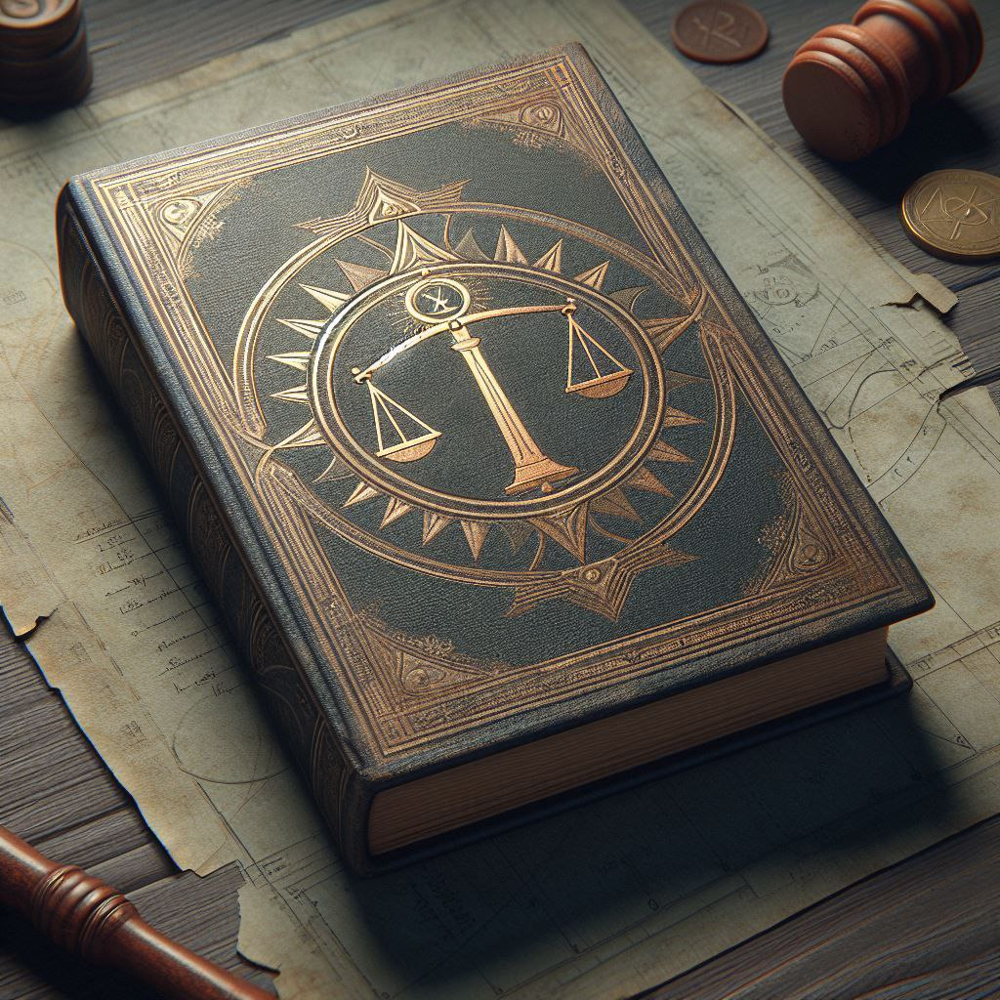
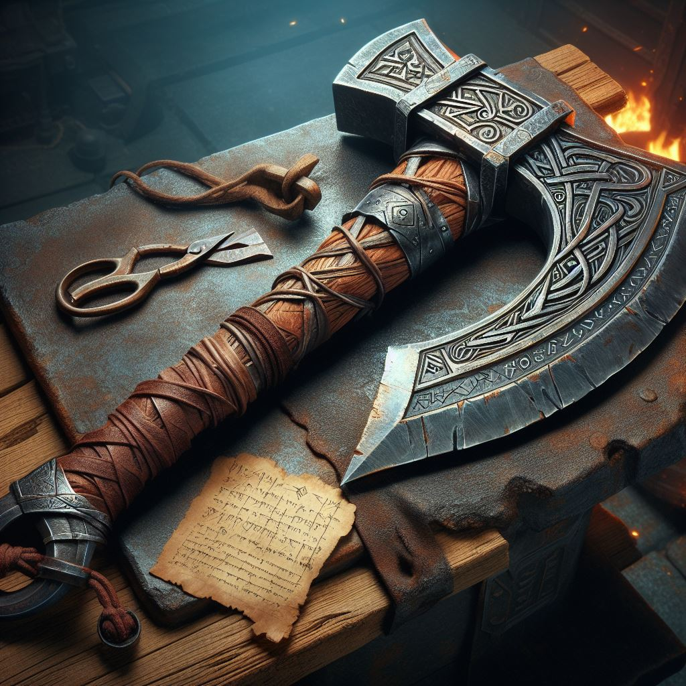
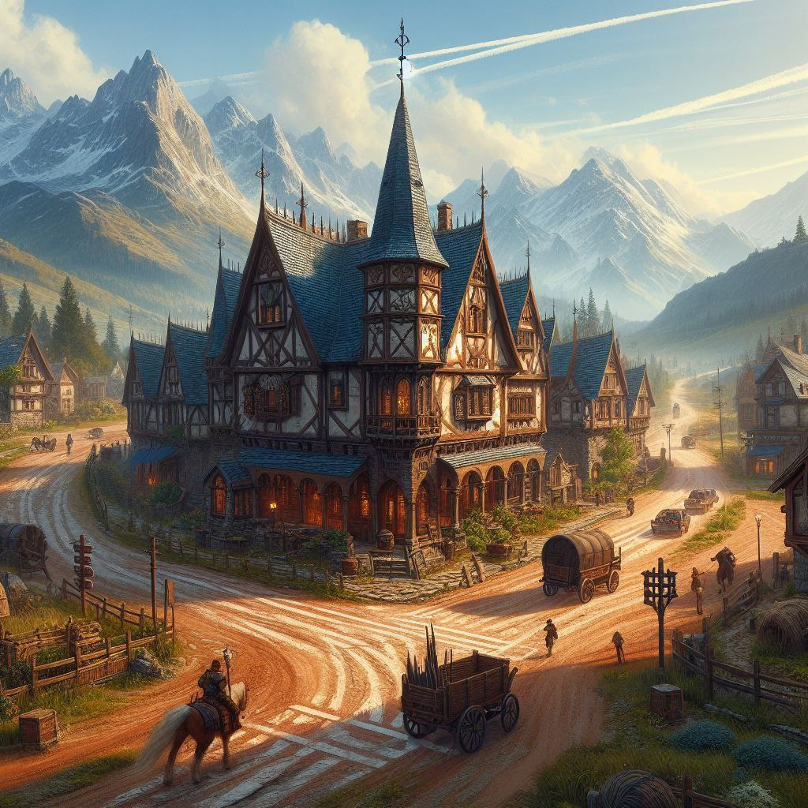
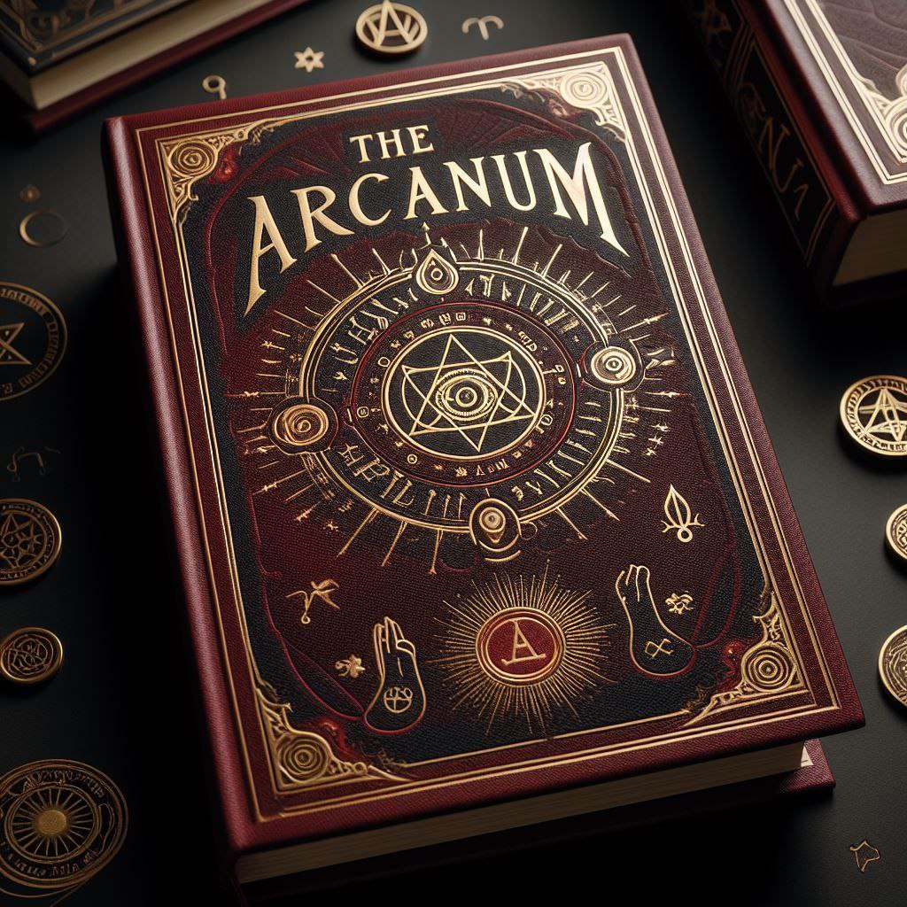
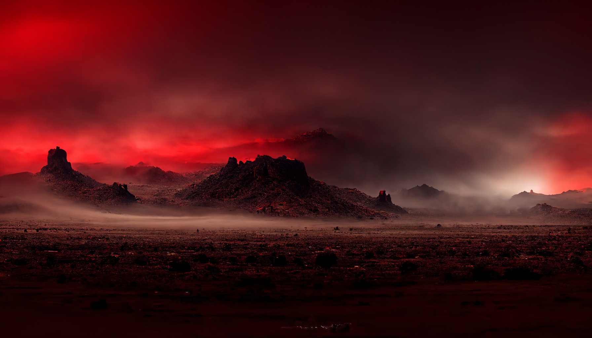

# Zeithalt Lore Book 2
[A](#a) [B](#b) [C](#c) [D](#d) [E](#e) [F](#f) [G](#g) [H](#h) [I](#i) [J](#j) [K](#k) [L](#l) [M](#m) [N](#n) [O](#o) [P](#p) [Q](#q) [R](#r) [S](#s) [T](#t) [U](#u) [V](#v) [W](#w) [X](#x) [Y](#y) [Z](#z)
### <a id="#top">↑</a> A
[↓ Aas Forest](#dd50)

[↓ Admincity](#1a00)

[↓ Age of Battles](#32e0)

[↓ Age of Conquest](#0620)

[↓ Age of Darkness](#b750)

[↓ Airmanon 'Air' Driftwing](#0a70)

[↓ Alexx](#9a30)

[↓ 🐙 Altar of Ctulhu](#8270)

[↓ 📚 Archives of Subconsciousness](#cea0)

[↓ Ares Gardens](#fff0)

[↓ 🛣️ Axonite Road](#a740)

[↓ Armor](#9930)

### <a id="#top">↑</a> B
[↓ ⚗️ Bioengineered Algae Farm](#4450)

[↓ 🎋 Bamboo Grove](#9640)

[↓ Bank of Zeithalt](#ee50)

[↓ 🔱 Beacon for the Sight of Innovation](#3460)

[↓ 🕯️ Beacon for the Light of Reason](#2880)

[↓ Blue Screen Lagoon](#8f30)

[↓ Book of Balance](#b710)

[↓ 🍺 Brewery](#6a20)

[↓ Brickland Fortress](#f6d0)

[↓ Brickspire Mountains](#50d0)

[↓ Bumpus Mackamarus Arbum](#8880)

### <a id="#top">↑</a> C
[↓ 🌵 Cactus Juice Factory](#32c0)

[↓ 🏢 Center for Anomaly Control](#0330)

[↓ Cerene Vale](#3850)

[↓ Chaotic Plains](#8a30)

[↓ Chronoglass](#e320)

[↓ ChronoGlass™️](#29a0)

[↓ ☁️ Cloudy Data Center](#4120)

[↓ CO](#36b0)

[↓ Cloudy Operatives](#36b0)

[↓ Common language](#bef0)

[↓ Corruption](#a2b0)

[↓ 📖 Cortexian Hall](#a610)

[↓ Council of Minds](#7c90)

[↓ CrAEX](#45d0)

[↓ Corrupted Artefacts](#a1a0)

[↓ CR Fallout](#17b0)

[↓ Corrupted Gemstone](#08c0)

[↓ CR Mines](#8360)

[↓ Corruption Restoration Project](#2390)

[↓ CR Shards](#1330)

[↓ 🏥 CURE](#9670)

[↓ CI](#80b0)

[↓ Cybernetics Inc](#80b0)

[↓ Cybers](#7b30)

[↓ Cybertron Jungle](#b9b0)

### <a id="#top">↑</a> D
[↓ Dino Saurex](#8f50)

[↓ 🗡️ Dagger of Elemental Restoration](#f750)

[↓ Deltans](#b730)

[↓ Deltan language](#4de0)

[↓ 💬 Deltan Language School](#b0c0)

[↓ DC](#8bc0)

[↓ Delta Collective](#8bc0)

[↓ Dev Null Marsh](#1070)

[↓ 🎰 Dino's Gambling Den](#ee20)

[↓ 🦆 Duck Farm](#7e10)

[↓ Double-Z](#fad0)

### <a id="#top">↑</a> E
[↓ Eastern Brickland](#f6d0)

[↓ 🥚 Egg Festival](#7d50)

[↓ Eon](#8730)

[↓ Energy Resources](#74f0)

### <a id="#top">↑</a> F
[↓ Fighters Guild](#ee30)

[↓ 🏢 Fighters Guild, CI Branch](#ff60)

[↓ First Capital](#5570)

[↓ Fortifications](#9ff0)

### <a id="#top">↑</a> G
[↓ Gift of Balance](#b710)

[↓ 💿 Gaia Knowledge Database](#9340)

[↓ 🎮 G.A.M.E. Complex](#6ee0)

[↓ Garrisons](#6fe0)

[↓ 🏹 Giant Slingshot](#ce70)

[↓ Gold Mines](#7210)

[↓ Great AI](#fd60)

[↓ GreenOtter](#06a0)

### <a id="#top">↑</a> H
[↓ Headmaster of the Institute](#7c90)

[↓ hexAgon](#f910)

[↓ 🎌️ Hill of 1000 flags](#ef90)

[↓ 🛖 House of Craftsmanship](#1b90)

### <a id="#top">↑</a> I
[↓ Illusion Cliffs](#e630)

[↓ Imperial Swamp](#0740)

[↓ Indigo Shore](#7a70)

[↓ Isynthillicus Cyrciniae](#22a0)

### <a id="#top">↑</a> J
[↓ 🎊 Jackbox Party Central](#09e0)

[↓ 🦖 Jurassic Park](#3760)

### <a id="#top">↑</a> K
[↓ 🕸️ K2 Fibers](#2dc0)

### <a id="#top">↑</a> L
[↓ Lake Corsair](#bca0)

[↓ 🗼 Lime Tower](#5220)

[↓ Loki](#5850)

### <a id="#top">↑</a> M
[↓ Masters of the Council](#7c90)

[↓ MindTech Institute Fortress (inner walls)](#ea90)

[↓ MindTech Institute Fortress (outer walls)](#8a90)

[↓ Map Legend](#e850)

[↓ 🪆 Matryoshka Idoll](#b751)

[↓ Meadowridge](#c860)

[↓ 🏯 Military Academy](#be90)

[↓ Mimb](#34f0)

[↓ Mimbot, the Lore Keeper](#1670)

[↓ Mimps Virus](#a4e0)

[↓ Minds](#7c50)

[↓ MT](#6550)

[↓ MindTech Institute](#6550)

[↓ 🔬 Modern CR Research Facility](#9f60)

[↓ 🏦 Money Factory](#18c0)

[↓ 🎲 Monument to Chaos](#74a0)

[↓ Mt. Pickles](#7490)

[↓ MindTech Triquetra](#cbe0)

[↓ MindTech Flags](#cbe0)

[↓ MindTech Banners](#cbe0)

[↓ MindTech Symbology](#cbe0)

[↓ 💾 Museum of Archaic Technology](#50e0)

[↓ 🏛️ Museum of the Old Capital](#6c20)

[↓ --- Mimbot's Index ---](#6d30)

[↓ Mineral Resources](#74f0)

### <a id="#top">↑</a> N
[↓ Neuropolis](#b870)

[↓ 📰 News HQ](#3820)

### <a id="#top">↑</a> O
[↓ Oblivion Mire](#8840)

[↓ Ogrodnik](#e810)

[↓ Ozimud](#c080)

### <a id="#top">↑</a> P
[↓ Paradox PAss](#cb50)

[↓ 🎡 Particle Collitionist](#3910)

[↓ Peace Death Gorge](#db50)

[↓ PEBKAC Peak](#f6f0)

[↓ 🌿 Photosynthetic Power Station](#e470)

[↓ ⛽️ Pickled Ooblek Deli](#ae70)

[↓ 🏴‍☠️ Pirate Harbor](#a810)

[↓ 🍕 PIZZA](#b910)

[↓ Pierre's Porous Pickle Porch](#fc70)

[↓ 🚷 Prefrenial Prefect (Prison)](#9850)

[↓ 🪓 Prehistoric Axe](#e4e0)

[↓ PS](#7a60)

[↓ Protectores Silva](#7a60)

[↓ PTSD](#e4f0)

[↓ 💰 PTSD Office](#aaf0)

[↓ Purple Deeps](#3911)

### <a id="#top">↑</a> Q
[↓ 🛰️ Quantum Nexus Laboratory](#f880)

### <a id="#top">↑</a> R
[↓ Rebels](#4270)

[↓ Resources (RES)](#74f0)

[↓ 🏭 Resource Management Facility](#7a61)

[↓ Revalx](#9ff1)

[↓ Relics](#9930)

### <a id="#top">↑</a> S
[↓ Science Resources](#74f0)

[↓ Saboteur](#0090)

[↓ Sazhra](#7e11)

[↓ Sellswords](#3ec0)

[↓ 🍺 Seven Roads Inn](#1780)

[↓ Shaxx](#f4e0)

[↓ Silvans](#3480)

[↓ Singularity Valley](#dd30)

[↓ 🧜‍♀️ Siren's Lighthouse](#c210)

[↓ 💡 SmartHome Tech](#39b0)

[↓ 👤 SMURF](#6760)

[↓ Something Tacensis Rock](#53e0)

[↓ Somnivale](#7850)

[↓ Southern Sea](#bda0)

[↓ 🛸 Spaceport](#6690)

[↓ 🗽 Statue of Mimb](#25b0)

[↓ Stonehavers (family)](#3d30)

[↓ Support](#e390)

[↓ Synaxos Fields](#7cc0)

[↓ Syncrax Road](#7d60)

### <a id="#top">↑</a> T
[↓ The Arcanum](#5480)

[↓ The Great Auditorium](#a610)

[↓ The Algorithms](#fd60)

[↓ Towers of MindTech Institute](#ea90)

[↓ Tree Huggers](#7a60)

[↓ 🪩 The Sacred Sphere](#f840)

[↓ 🫖 Tea Emporium](#02e0)

[↓ Teleport](#c980)

[↓ Temporal Resources](#6590)

[↓ Timeless Desert](#0130)

[↓ Timeless Waystone](#22a0)

[↓ Timeline](#1e30)

[↓ To do "a Bumps"](#a310)

[↓ To do "a Loki"](#0680)

[↓ 🌳 Tree of Many Inquiries](#64c0)

### <a id="#top">↑</a> U
[↓ 🌺 Underground Botanical Garden](#1fa0)

[↓ ⚙️ Underwater Turbine Power Plant](#e851)

[↓ 🦄 UniCorn™️ Farmlands](#6ad0)

### <a id="#top">↑</a> V
[↓ 🥡 Valhalla Bar](#8de0)

[↓ Valkyrie Spec Ops](#3660)

[↓ Virtuara Outpost](#6e00)

[↓ 🦈 Void Shark Hatchery](#3e80)

[↓ ♨️ Volcanic Jacuzzi](#16d0)

[↓ 🌋 Volcano Influeno](#0780)

### <a id="#top">↑</a> W
[↓ Western Brickland](#f6d0)

[↓ Weapons](#9930)

[↓ WAR items](#9930)

[↓ Watchtower Ruins](#60b0)

[↓ 🎏 Weather Tower Relay](#a1d0)

[↓ Webified Hills](#ada0)

[↓ 🐅 Wildlife Preservation](#ca80)

[↓ 🌱 World Seed Pendant](#0fd0)

### <a id="#top">↑</a> X
[↓ 🎨 Xiavente's Meme Workshop](#4d00)

[↓ Xiavente](#40a0)

[↓ Xyrclaox Watch](#b9a0)

### <a id="#top">↑</a> Y
[↓ You](#c480)

### <a id="#top">↑</a> Z
[↓ 🦁 Zeithalt Pet Zoo and Animal Shelter](#2e80)

[↓ Zeithalt Zeitgeist newspaper](#fad0)

[↓ 🗼 Zikkurat](#e480)

[↓ 🌟 ZIPP Lines](#4d60)

----------
### <a id="dd50" href="#a">↑</a> Aas Forest

`🖼️ Landmark`

Named after one of the old kings of the Mindtech Institute, A'as Forest is a lush and bountiful woods at the south of the faction that is considered as an ancient and the oldest place in the faction.

It is also where the previous capital of the MindTech Institute used to be.

Most of the people who live here presides near the borders or the eastern and southern parts of the region.

Although with little population, with the previous capital being here, it has many ancient and forgotten structures that lie around, with most of it being in the north-western part of the forest. The mystery around the forest stands there, where not in a mile radius can you see signs of fauna. Even people who pass here feels a chill in their spines, as if the forest is telling them to not set foot in those lands. Although shown in most books, no one but those at the Cortexian Hall holds the old books and ancient scrolls that might answer the mystery of to what may have happened there.

In the said population, most of them work as lumberjacks and craftsmen, supplying wood, wooden supplies, and even furniture to the rest of the faction. Some others work as farmers that tend the orchard trees around the forest, which produces many fruits that is either shipped as it is, pickled, made into jams, or other fruit-preserving methods.

<!---
keywords: mt, landmark, ps
aliases: 
hash: bba
-->

----------
### <a id="1a00" href="#a">↑</a> Admincity

`📃 To-do list`

This entry has not been written yet.

Will you write the text for it?

Will you request others to that?

You can write or request lore [on discord](<https://discord.com/channels/562910943848169472/1173922660489633802>)
<!---
tag: todo
keywords:  
aliases: 
-->

----------
### <a id="32e0" href="#a">↑</a> Age of Battles

**📅 Time period**

The current Age the Zeithalt Island lives in.

It started at Eon 258 with the ***Battle of Mt. Pickles*** - the first ever battle where one faction attacked another faction’s lands.

<!---
keywords:
aliases:
-->

----------
### <a id="0620" href="#a">↑</a> Age of Conquest

**📅 Time period**

The age during which factions formed and grew powerful enough to start conquering nearby free lands.

Some sort of a non-aggression pact existed between factions during the Age of Conquest - they only attacked free lands together and never attacked each other.

The Age of Conquest started at Eon 0 and ended at Eon 253 with the ***Battle of Timeless Desert*** when the last free territory fell and factions could no longer expand without directly attacking each other’s lands.

<!---
keywords:
aliases:
-->

----------
### <a id="b750" href="#a">↑</a> Age of Darkness

**📅 Time period**

Unknown part of the Zeithalt history - the time before factions even formed.

Eon 0 is the end of Age of Darkness and start of Age of Conquest.

<!---
keywords:
aliases:
-->

----------
### <a id="0a70" href="#a">↑</a> Airmanon 'Air' Driftwing

**🧙‍♂️ Character**

A human woman from the Timeless Desert who left it to find her purpose in life.

She has some skills with computers, but found her calling in trying to research Corruption to protect the people of Zeithalt Island from it.

<!---
keywords: ps, desert
aliases: 
-->

----------
### <a id="9a30" href="#a">↑</a> Alexx

**🧙‍♂️ Character**

One of the oldest inhabitants of Zeithalt, notable sellsword.

A journalist, a historian, a political consultant for factions and an owner of Zeithalt Zeitgeist newspaper.

<!---
keywords: gm, sw
aliases: 
-->

----------
### <a id="8270" href="#a">↑</a> 🐙 Altar of Ctulhu

`🪧 Place` in [Imperial Swamp](#0740)

Build on eon 506 by [Delta Collective](#8bc0)

Destroyed during the The Fall of Imperial Swamp on eon 596.

_This entry is considered incomplete - you can request more info for it [on discord](<https://discord.com/channels/562910943848169472/1173922660489633802>) or write it yourself_

<!---
keywords:  dc, imperial swamp
aliases: 
-->

----------
### <a id="cea0" href="#a">↑</a> 📚 Archives of Subconsciousness

`🪧 Place` in [Illusion Cliffs](#e630)

Build on eon 520 by [MindTech Institute](#6550)

_This entry is considered incomplete - you can request more info for it [on discord](<https://discord.com/channels/562910943848169472/1173922660489633802>) or write it yourself_

<!---
keywords:  mt, illusion cliffs
aliases: 
-->

----------
### <a id="fff0" href="#a">↑</a> Ares Gardens

`📃 To-do list`

This entry has not been written yet.

Will you write the text for it?

Will you request others to that?

You can write or request lore [on discord](<https://discord.com/channels/562910943848169472/1173922660489633802>)
<!---
tag: todo
keywords:  
aliases: 
-->

----------
### <a id="a740" href="#a">↑</a> 🛣️ Axonite Road

`🪧 Place` in [Paradox Pass](#cb50)

Built on eon 556 by [MindTech Institute](#6550)

_This entry is considered incomplete - you can request more info for it [on discord](<https://discord.com/channels/562910943848169472/1173922660489633802>) or write it yourself_

<!---
keywords:  mt, paradox pass
aliases: 
-->

----------
### <a id="9930" href="#a">↑</a> Armor

**📑 Term**

WAR ancient artifacts that have been dug out of the mines. 

There are three categories: Weapons, Armor and Relics, hence the name.

Each of these categories have different kinds of bonuses and help factions immensely in battles when they are used.

They also divide into Common and Epic variants. Epic items do what Common items do but better and stronger.

<!---
keywords: battle, common, epic, weapons, armor, relics
aliases: Weapons, Armor, Relics
-->

----------
### <a id="4450" href="#b">↑</a> ⚗️ Bioengineered Algae Farm

`🪧 Place` in [Blue Screen Lagoon](#8f30)

Built on eon 497 by [Cybernetics Inc](#80b0)

_This entry is considered incomplete - you can request more info for it [on discord](<https://discord.com/channels/562910943848169472/1173922660489633802>) or write it yourself_

<!---
keywords:  ci, blue screen lagoon
aliases: 
-->

----------
### <a id="9640" href="#b">↑</a> 🎋 Bamboo Grove

`🪧 Place` in [Cybertron Jungle](#b9b0)

Build on eon 494 by [Protectores Silva](#7a60)

_This entry is considered incomplete - you can request more info for it [on discord](<https://discord.com/channels/562910943848169472/1173922660489633802>) or write it yourself_

<!---
keywords:  ps, cybertron jungle
aliases: 
-->

----------
### <a id="ee50" href="#b">↑</a> Bank of Zeithalt

**🪪 Entity**

Bank of Zeithalt (BoZ) is the governing entity of the whole ***Zeithalt Island***; it manages and overlooks the entire island's economy system. 

Bank of Zeithalt stays out of faction politics and largely remains in shadows, keeping the islands economy working and successfully evading being influence by any faction.

It’s assumed to be by far the richest organisation on the island, being the owner of multiple Gold Mines in different parts of the Island.

<!---
keywords: money, gold, economy
-->

----------
### <a id="3460" href="#b">↑</a> 🔱 Beacon for the Sight of Innovation

`🪧 Place` in [Singularity Valley](#dd30)

Built on eon 594 by [MindTech Institute](#6550)

_This entry is considered incomplete - you can request more info for it [on discord](<https://discord.com/channels/562910943848169472/1173922660489633802>) or write it yourself_

<!---
keywords:  mt, singularity valley
aliases: 
-->

----------
### <a id="2880" href="#b">↑</a> 🕯️ Beacon for the Light of Reason

`🪧 Place` in [Neuropolis](#b870)

Built on eon 495 by [MindTech Institute](#6550) - a few eons after the [Oblivious Battle on the Mire](<https://alexeygorovoy.github.io/zeithalt/timeline/#eon-491---the-oblivious-battle-on-the-mire>) that showed the MT planning and foresight department at arguably the lowest point.

This, essentially a lighthouse, served as a wake-up call to the MindTech citizens and simultaneously a reminder of where a clouded mind could lead even the brightest of people.

The beacon is not a dominant structure of the [Neuropolis](#b870) skyline during the day, but due to the clever positioning on the highest point, at night it can be seen from virtually anywhere in the capital.

<!---
keywords:  neuropolis, lighthouse
aliases: 
-->

----------
### <a id="8f30" href="#b">↑</a> Blue Screen Lagoon

`📃 To-do list`

This entry has not been written yet.

Will you write the text for it?

Will you request others to that?

You can write or request lore [on discord](<https://discord.com/channels/562910943848169472/1173922660489633802>)
<!---
tag: todo
keywords:  
aliases: 
-->

----------
### <a id="b710" href="#b">↑</a> Book of Balance

`📑 Term`

**Book of Balance** is a traditional book for the [MindTech Institute](#6550), which, however, does not have a direct connection to the Institute and presumably was written long before the Institute was even founded.

This is one of the few known books originating from the [Age of Darkness](#b750), the author (or likely multiple authors) of the book are unknown.

The Book of Balance teaches readers the topics of mindfulness and meditation, the importance of emotional awareness and self-control, and is generally directed towards improving one's cognitive abilities and decision-making skills.

It is customary among MindTech followers to give out copies of this book to friends a families outside the faction as a token of appreciation and gratitude. The highest of honour is *The Gift of Balance* - the act of gifting away the very same book the person has read themselves.

<!---
keywords: 
aliases: Gift of Balance
-->

----------
### <a id="6a20" href="#b">↑</a> 🍺 Brewery

`🪧 Place` in [Purple Deeps](#3911)

Built on eon 576 by [Delta Collective](#8bc0)

_This entry is considered incomplete - you can request more info for it [on discord](<https://discord.com/channels/562910943848169472/1173922660489633802>) or write it yourself_

<!---
keywords:  dc, purple deeps
aliases: 
-->

----------
### <a id="f6d0" href="#b">↑</a> Brickland Fortress

`🖼️ Landmark`

Brickland Fortress is a harsh, mostly mountainous region acting as a buffer between the lands of the east and west.

It features huge mountain ranges that start on the south-easternmost border with the [Chaotic Plains](#8a30), extend into the middle part of the region, and then slowly bend in a U-shape toward [Mt. Pickles](#7490) as they divide the land into two parts: Eastern and Western Brickland.

The mountain ranges, which are named as [Brickspire Mountains](#50d0), house small amounts of gold and iron mines. However they also house the main economic source of the entire region - its numerous stone quarries.

The high quality stones are mined from quarries used both locally, as well as exported into different regions to supply a factions' demand for building materials.

There are numerous small fortifications scattered all around the Brickspire Mountains to protect these vulnerable yet important quarries and mining villages built around them from bandit attacks and act as local defence forces when the region needs protection in battles.

However, the main force that defends the entire region and acts as a one giant gate between the Western and Eastern parts is the Brickland Fortress itself. It is located in the tallest mountain of the entire region, has an enormous size and equally gorgeous appearance.

Although nowadays this fortress gives the name to the whole region, it is believed that during the [Age of Darkness](#b750) nomadic people had a different name for their home. Sadly that name is now forgotten and lost in time.

Western Brickland is a smaller part of the region. 

It consists of mostly hills and small mountains with the exception of small flat area shaped like a triangle connecting to the vast expanses of Chaotic Plains. While not many people reside here compared to its eastern counterpart, there are still a few small villages scattered around the area.

Eastern Brickland, in addition to being a larger part, has much more life and greenery. The number of mountains and the overall height of the region starts decreasing as it gets closer to Oblivion Mire and Cerene Vale. The mountains and hills are eventually replaced by a number of small forests along the borders with Cerene Vale and the [Southern Sea](#bda0).

The majority of Brickland Fortress's population lives in the Eastern Part - in its villages, but mainly in [Meadowridge](#c860) - the largest town of the entire region.

<!---
keywords: ci, dc, landmark
aliases: Western Brickland, Eastern Brickland
-->

----------
### <a id="50d0" href="#b">↑</a> Brickspire Mountains

`🪧 Landmark`

A mountain range that is located in [Brickland Fortress](#f6d0) region and divides it into two unequal parts - Western and Eastern Brickland.

<!---
keywords: brickland
aliases: 
-->

----------
### <a id="8880" href="#b">↑</a> Bumpus Mackamarus Arbum

**🧙‍♂️ Character**

Bumpus (aka Bumps) is a mysterious race of blue humanoids rumored to originate somewhere near the Timeless Desert called the Bumpus.

Head researcher, intrepid explorer, permanent resident, and resource exploiter of the Timeless Desert known for his questionable curiosity for knowledge, attraction to anomalies, devious business dealings, and the widespread Bumpus race that has recently appeared throughout the island.

<!---
keywords: bumps, desert
aliases: 
-->

----------
### <a id="32c0" href="#c">↑</a> 🌵 Cactus Juice Factory

`🖼️ Landmark`

Started production on eon 761.

It is a life-long project and the place of eventual retirement of  _MCCACTUSSON_ esteemed member of the [Council of Minds](#7c90).

Despite the climate of Synaxos Fields not being well-fitted to the flora imported from the [Timeless Desert](#0130), the ingenius climate-altering contraptions designed and built by _MCCACTUSSON_ allowed for a striving business.

The factory provides a steady supply of cactus-related produce to the [Neuropolis](#b870) and nearby lands, eliminating the dangers and uncertainty that arise when such products are delivered from the Desert itself.

<!---
keywords:  mccactusson, synaxos fields
aliases: 
-->

----------
### <a id="0330" href="#c">↑</a> 🏢 Center for Anomaly Control

`🪧 Place` in [Neuropolis](#b870)

Center for Anomaly Control (CAC) was built on eon 511 by [MindTech Institute](#6550) under supervision of [Xiavente](#40a0), shortly after the [Disaster of Synaxos Fields](../timeline/eon0508.md).

With the access to the lands of [Synaxos](#7cc0) being extremely dangerous, the Center had to be constructed as close to it as possible, while maintaining the direct connection to [Neuropolis](#b870) for better supply lines in the emergency situation.

The Center for Anomaly Control served as a hub of operations during the [CR Restoration Research](#2390) and the _Synaxos Restoration Project_ soon after.

However, CAC did not escape its fair share of controversy, as the first weapon-grade [CR Artifacts](#a1a0) are believed to have been developed and tested on its grounds.

Later, the resources of the Center were used in Restoration Projects in other lands, including the ones held by other factions and to this day the CAC remains a crucial point of CR Research.

<!---
keywords:  neuropolis, synaxos fields
aliases: 
-->

----------
### <a id="3850" href="#c">↑</a> Cerene Vale

`🖼️ Landmark`

Lush valleys in the east and southern regions, while mostly barren sands in the north. The region of Cerene Vale holds great beauty and elegance while keeping in touch with the newest of innovations. It is also the farthest region among the faction, placed at the south-west, and has many people plus a popularity for tourism.

With most of its lands being fields of vegetables and grain productions, and its shores yielding many ocean bounties, people who live here make their living from agriculture and fisheries. The vegetables and grains farmed are either exported to the other regions in the faction or sold locally. While the caught fishes and shellfish are either sold in the markets, shipped to the neighboring coastal regions, or preserved using many preserving methods like drying.

The region's capital, Silent Gulf, is famous for having its seasonal festivals each year which brings many tourist across the faction to come, like the Allevanos Festival which celebrates the bountiful gifts of autumn. They're also famed for having many night markets and bazaars that showers people who come with stalls and shops of different cuisine that attracts many for having many types of food in one place.

*(Allevanos - The Valley's Blessings) (Autumn is when the crops are usually harvested)*

<!---
keywords: mt, landmark, ps
aliases: 
-->

----------
### <a id="8a30" href="#c">↑</a> Chaotic Plains

`📃 To-do list`

This entry has not been written yet.

Will you write the text for it?

Will you request others to that?

You can write or request lore [on discord](<https://discord.com/channels/562910943848169472/1173922660489633802>)

<!---
keywords: todo
aliases: 
-->

----------
### <a id="e320" href="#c">↑</a> Chronoglass

**📑 Term**

Special kind of glass that is forged from the Timeless Desert sand. Due to unique properties of the sand, Chronoglass is able to preserve snapshots of the world, frozen in time. 

The thicker glass - more sand for the light to come through, therefore further back in the past you can see. However, the thicker the glass is, the blurrier the image gets

It takes a very skillful craftsman to craft lenses which exactly 1 day, 1 week, 1 year "thick" are and clear enough to be usable. Such lenses can be combined to make more sophisticated devices such as chrono-telescopes, chrono-binoculars, etc.

People new to the chronoglass concept, can often be riddled by the question:  
*Would a mirror made of the chronoglass give you a reflection from your past self?*

<!---
keywords: mt, glass, timeless, desert, sand, time, past
aliases: 
-->

----------
### <a id="29a0" href="#c">↑</a> ChronoGlass™️

**📑 Term**

A commercial product made from the [chronoglass](#e320) by the Cloudy Co. corporation lead by Bumps The Businessman. 

> _See the Past through the Glass!_

<!---
keywords:  chronoglass, cloudy co, bumps
aliases: 
-->

----------
### <a id="4120" href="#c">↑</a> ☁️ Cloudy Data Center

`🪧 Place` in [Timeless Desert](#0130)

Built on eon 507 by [MindTech Institute](#6550)

_This entry is considered incomplete - you can request more info for it [on discord](<https://discord.com/channels/562910943848169472/1173922660489633802>) or write it yourself_

<!---
keywords:  mt, timeless desert
aliases: 
-->

----------
### <a id="36b0" href="#c">↑</a> CO

`🪪 Faction`

Founded in eon 779, the Cloudy Operatives are a faction that controls the Timeless Desert and the surrounding area.

Synopsis:
> _The Timeless Desert is at the heart of Zeithalt's ecosystem, controlling the passage of time itself on the island. Our mission is to protect it and study it in order to better understand Zeithalt Island as a whole._

<!---
keywords: co
aliases: CO
-->

----------
### <a id="36b0" href="#c">↑</a> Cloudy Operatives

`🪪 Faction`

Founded in eon 779, the Cloudy Operatives are a faction that controls the Timeless Desert and the surrounding area.

Synopsis:
> _The Timeless Desert is at the heart of Zeithalt's ecosystem, controlling the passage of time itself on the island. Our mission is to protect it and study it in order to better understand Zeithalt Island as a whole._

<!---
keywords: co
aliases: CO
-->

----------
### <a id="bef0" href="#c">↑</a> Common language

**📑 Term**

Main language of Zeithalt, universally used by everyone on the Island.

<!---
keywords:
aliases:
-->

----------
### <a id="a2b0" href="#c">↑</a> Corruption

**🪪 Entity**

Corruption (CR) - potentially existential threat of mysterious origin. 

It's believed to be constantly "building up" under the surface of the island, resulting in occasional violent CR Outbursts. 

If not contained properly, it can result in an event called Corruption Fallout, covering vast areas, destroying everything it touches and making lands practically uninhabitable.

<!---
keywords:
aliases:
-->

----------
### <a id="a610" href="#c">↑</a> 📖 Cortexian Hall

`🖼️ Landmark` in [Neuropolis](#b870)

A complex of administrative buildings situated at the center point of the Cerebrime Peak in [Neuropolis](#b870).

Cortexian Hall servers as a permanent residence for the [Council of Minds](#7c90), as well as the greatest archive of official documents in MT lands, and a living quarters for the Masters of the Council.

It contains many ancient books and scrolls that date back to when the capital was still in the [A'as Forest](#dd50).

The Great Auditorium where the Council holds their meetings is one of the biggest indoor spaces of the island.

Often regarded as "the most important building on the Island" by MT followers, Cortexian Hall is definitely one for the MindTech Institute.

<!---
keywords: neuropolis, council, cerebrime peak
aliases: The Great Auditorium
-->

----------
### <a id="7c90" href="#c">↑</a> Council of Minds

`📑 Term`

A governing body of [MindTech Institute](#6550) that resides in [Cortexian Hall](#a610), consisting of recognized citizens, skilled warriors and prominent scholars of the faction.

The members of the Council are called _Masters_ and serve for life, or until they resign or are removed from the Council by the other members.

The leader of the Council is called the _Headmaster_, who also acts as a Headmaster of the Institute. Headmaster is elected among the Masters of the Council by the MindTech Institute followers (not limited to Masters).

The Council is as old as the faction itself, and its history ranges from the ultimate power on the island during the times it was led by [hexAgon](#f910) to the complete dissolution during the times of [Loki](#5850)'s dictatorship.

The Council was restored on [Eon 755](../timeline/eon0755.md) following the fall of the ruthless dictator.

<!---
keywords:  headmaster, masters
aliases: Masters of the Council, Headmaster of the Institute
-->

----------
### <a id="45d0" href="#c">↑</a> CrAEX

**🧙‍♂️ Character**

One of the Elder, Respected Inhabitants of Zeithalt.

Previously Green [Towerkeep](#ea90), and honored [MindTech Institute](#6550) member of the [Council of Minds](#7c90).

Shifted factions twice, from Cybers to Minds *Pursue the Mind*, and to Oversee the formation of the [Cloudy Operatives](#36b0) in the Desert.

Owns 4 Felines (as of archive).

Head Researcher of The [Timeless Sands](#6590).

<!---
keywords: master, desert
aliases: 
-->

----------
### <a id="a1a0" href="#c">↑</a> Corrupted Artefacts

**📜 Item**

During Corruption outbursts, sometimes samples of the corrupted matter itself can be found and carefully collected.

These samples are known as CR Samples, and factions use them to develop Corrupted Artefacts. 

There are three two types of Corrupted Artefacts: CR Mines and CR Shards.

<!---
keywords: cr, artifact, samples
aliases:
-->

----------
### <a id="17b0" href="#c">↑</a> CR Fallout

**📑 Term**

The devastating event that happens if CR outburst is not contained properly.

It covers vast land areas, destroying everything it touches and making lands practically uninhabitable.

<!---
keywords: corrupted
aliases:
-->

----------
### <a id="08c0" href="#c">↑</a> Corrupted Gemstone

**📜 Item**

An artefact retrieved by **hexAgon** during the Defence of Timeless Desert.

Heavy sphere of matte black color that appears to be completely black most of the time, but occasionally pulsates with deep red color..

During the pulse the matte surface of the cube momentarily becomes completely smooth and transparent as if made of glass, revealing a broken black cube inside it before slowly fading back into its usual color.

It’s cold to the touch when it’s matte black, but too hot to hold it during the pulse.

It looks as if corruption itself is contained within the gemstone, but the true material it’s made of, its origin and potential power of it are unknown, recorded history of Zeithalt does not have any mentions of similar artefacts.

> As written by historians:
> 
> *It’s witnessed by other **MindTech Institute** members that when **hexAgon** first touched it, they became completely motionless and unresponsive for several minutes, as if fixed in time. **hexAgon** does not recollect it being several minutes, but rather just a fraction of a second, during which a sequence of images - a vision - quickly skipped through their mind.*

Since then other people have touched the gemstone, but got no visions from it. Also, it seems to be only pulsating in **hexAgon’s** hands - when others hold it, the gemstone stays matte black and cold.

It seems that the gemstone has bonded with **hexAgon** in some special way.

<!---
keywords: cr, artifact, artefact, hexagon
aliases:
-->

----------
### <a id="8360" href="#c">↑</a> CR Mines

**📜 Item**

CR Mines - a powerful artefact constructed from CR samples. Can be used as a defensive weapon.

<!---
keywords: corrupted, battle
aliases:
-->

----------
### <a id="2390" href="#c">↑</a> Corruption Restoration Project

`📑 Term`

A project initially developed to recover [Synaxos Fields](#7cc0) from [Corruption](#a2b0) surge that happened in [Eon 508](../timeline/eon0508.md).

Since then, it has been reviewed and adapted to be used in other areas of the Island affected by _Corruption_.

<!---
keywords:  cr, synaxos
aliases: 
-->

----------
### <a id="1330" href="#c">↑</a> CR Shards

**📜 Item**

CR Shards - a powerful artefact constructed from CR samples. Can be used as an offensive weapon.

<!---
keywords: corrupted, battle
aliases:
-->

----------
### <a id="9670" href="#c">↑</a> 🏥 CURE

**🪧 Place** in [Brickland Fortress](#f6d0)

Built in Eon 540 during the `🦠 Mimps Virus` pandemic, CURE (Central University for Research in Epidemiology) is a hospital and research center to study and cure viral epidemics plaguing the island.

<!---
keywords: ps, brickland, fortress, mimps, epidemiology, hospital, viral, pandemic
aliases: 
-->

----------
### <a id="80b0" href="#c">↑</a> CI

**🪪 Faction**

Cybernetics Inc (CI) - one of the three original factions. Located in the north of the Island, with the capital in **Admincity**. 

Synopsis:
> *The rise of AI is imminent. We must just embrace it and lead the movement. We won’t live inside the matrix, we will run it! Human digital enhancement - this is our vision for the future.*

<!---
keywords: ci
aliases: CI
-->

----------
### <a id="80b0" href="#c">↑</a> Cybernetics Inc

**🪪 Faction**

Cybernetics Inc (CI) - one of the three original factions. Located in the north of the Island, with the capital in **Admincity**. 

Synopsis:
> *The rise of AI is imminent. We must just embrace it and lead the movement. We won’t live inside the matrix, we will run it! Human digital enhancement - this is our vision for the future.*

<!---
keywords: ci
aliases: CI
-->

----------
### <a id="7b30" href="#c">↑</a> Cybers

**📑 Term**

A collective term to refer to Cybernetics Inc members or the faction in general.

<!---
keywords: ci
aliases:
-->

----------
### <a id="b9b0" href="#c">↑</a> Cybertron Jungle

`📃 To-do list`

This entry has not been written yet.

Will you write the text for it?

Will you request others to that?

You can write or request lore [on discord](<https://discord.com/channels/562910943848169472/1173922660489633802>)

<!---
keywords: todo
aliases: 
-->

----------
### <a id="8f50" href="#d">↑</a> Dino Saurex

**🧙‍♂️ Character**

Also known as CuriousDino in his early years is a person of dinoman race - something best described as "an anthropomorphic dinosaur."

He quickly became famous for his business ideas such as Gambling Den and Fighters Guild, different successful cons, as well as being a member of several factions. 

Despite his participation in the [Rebellion in the Desert](https://alexeygorovoy.github.io/zeithalt/timeline/#eon-506---rebellion-in-the-desert), he eventually got elected as a [Headmaster](#7c90) of [MindTech Institute](#6550) after successfully organizing a coup against the [tyrant leader](#5850). 

Wields a legendary [Prehistoric Axe](#e4e0) and often speaks of himself in third person, as customary in native dinoman language.

<!---
keywords: sw, CuriousDino, gambling, fighters
aliases: 
-->

----------
### <a id="f750" href="#d">↑</a> 🗡️ Dagger of Elemental Restoration

`📜 Item`

A legendary weapon discovered by [Airmanon](#0a70) in the [mines](../refs/gold_mines).

A dagger made with some of the very same gems found in the mines, the _Dagger of Elemental Restoration_ seems to be imbued with the powers of the elements themselves. At least, that's what local legend claims. Those same legends claim that the dagger was forged long ago with the purpose of restoring the natural balance, particularly after Corruption strikes.

Airmanon has seen that the dagger has been effective in cutting down fungal growths of Corruption left behind after such Outbursts.

<!---
keywords: airmanon
aliases: 
-->

----------
### <a id="b730" href="#d">↑</a> Deltans

**📑 Term**

A collective term to refer to Delta Collective's members or the faction in general.

<!---
keywords:
aliases:
-->

----------
### <a id="4de0" href="#d">↑</a> Deltan language

**📑 Term**

The language predominantly used by the Deltans.

<!---
keywords: dc
aliases:
-->

----------
### <a id="b0c0" href="#d">↑</a> 💬 Deltan Language School

`🖼️ Landmark` in [Oblivion Mire](#8840)

Built on eon 780 in Oblivion Mire, rather out of practical necessity than appreciation of Deltan culture.

This establishment, nonetheless, becomes the first physical evidence of the once unlikely DC-MT alliance in the Institute's lands.

<!---
keywords: landmark
aliases: 
-->

----------
### <a id="8bc0" href="#d">↑</a> DC

**🪪 Faction**

Delta Collective (DC) - one of the three original factions.

Occupies south-west parts of the Island, with the capital in **Purple Deeps**.

Synopsis:
> *While global organisations think they have everything under their control, a new movement is emerging. Across the world, more and more people join this initiative to take back control over their lives.*

<!---
keywords: dc
aliases: DC
-->

----------
### <a id="8bc0" href="#d">↑</a> Delta Collective

**🪪 Faction**

Delta Collective (DC) - one of the three original factions.

Occupies south-west parts of the Island, with the capital in **Purple Deeps**.

Synopsis:
> *While global organisations think they have everything under their control, a new movement is emerging. Across the world, more and more people join this initiative to take back control over their lives.*

<!---
keywords: dc
aliases: DC
-->

----------
### <a id="1070" href="#d">↑</a> Dev Null Marsh

`📃 To-do list`

This entry has not been written yet.

Will you write the text for it?

Will you request others to that?

You can write or request lore [on discord](<https://discord.com/channels/562910943848169472/1173922660489633802>)

<!---
keywords: todo
aliases: 
-->

----------
### <a id="ee20" href="#d">↑</a> 🎰 Dino's Gambling Den

**🪧 Place** in [Ares Gardens](#fff0)

The only place on Zeithalt where islanders can find an active bookie, bet on outcomes of the battles, attend cocktail parties in VIP Lounge and indulge in various gambling activities.

Despite multiple allegations of illicit activities happening in the Den, the place operates openly and occasionally is being subjected to inspections by [PTSD](#e4f0) and other [PS](#7a60) authorities.

<!---
keywords: ps, ares, gardens, dino, gambling, den, bookie, vip, lounge
aliases: 
-->

----------
### <a id="7e10" href="#d">↑</a> 🦆 Duck Farm

`🪧 Place` in [Indigo Shore](#7a70)

Built by [Delta Collective](#8bc0) on eon 470.

_This entry is considered incomplete - you can request more info for it [on discord](<https://discord.com/channels/562910943848169472/1173922660489633802>) or write it yourself_

<!---
keywords: dc, indigo shore
aliases: 
-->

----------
### <a id="fad0" href="#d">↑</a> Double-Z

**📑 Term**

Also known as "double-Z", the newspaper is the main source of news for all Zeithalt inhabitants.

<!---
keywords: newspaper, zz, double-z
aliases: Double-Z
-->

----------
### <a id="f6d0" href="#e">↑</a> Eastern Brickland

`🖼️ Landmark`

Brickland Fortress is a harsh, mostly mountainous region acting as a buffer between the lands of the east and west.

It features huge mountain ranges that start on the south-easternmost border with the [Chaotic Plains](#8a30), extend into the middle part of the region, and then slowly bend in a U-shape toward [Mt. Pickles](#7490) as they divide the land into two parts: Eastern and Western Brickland.

The mountain ranges, which are named as [Brickspire Mountains](#50d0), house small amounts of gold and iron mines. However they also house the main economic source of the entire region - its numerous stone quarries.

The high quality stones are mined from quarries used both locally, as well as exported into different regions to supply a factions' demand for building materials.

There are numerous small fortifications scattered all around the Brickspire Mountains to protect these vulnerable yet important quarries and mining villages built around them from bandit attacks and act as local defence forces when the region needs protection in battles.

However, the main force that defends the entire region and acts as a one giant gate between the Western and Eastern parts is the Brickland Fortress itself. It is located in the tallest mountain of the entire region, has an enormous size and equally gorgeous appearance.

Although nowadays this fortress gives the name to the whole region, it is believed that during the [Age of Darkness](#b750) nomadic people had a different name for their home. Sadly that name is now forgotten and lost in time.

Western Brickland is a smaller part of the region. 

It consists of mostly hills and small mountains with the exception of small flat area shaped like a triangle connecting to the vast expanses of Chaotic Plains. While not many people reside here compared to its eastern counterpart, there are still a few small villages scattered around the area.

Eastern Brickland, in addition to being a larger part, has much more life and greenery. The number of mountains and the overall height of the region starts decreasing as it gets closer to Oblivion Mire and Cerene Vale. The mountains and hills are eventually replaced by a number of small forests along the borders with Cerene Vale and the [Southern Sea](#bda0).

The majority of Brickland Fortress's population lives in the Eastern Part - in its villages, but mainly in [Meadowridge](#c860) - the largest town of the entire region.

<!---
keywords: ci, dc, landmark
aliases: Western Brickland, Eastern Brickland
-->

----------
### <a id="7d50" href="#e">↑</a> 🥚 Egg Festival

`🪧 Place` in [Cerene Vale](#3850)

Built on eon 527 by [Protectores Silva](#7a60)

_This entry is considered incomplete - you can request more info for it [on discord](<https://discord.com/channels/562910943848169472/1173922660489633802>) or write it yourself_

<!---
keywords:  ps, cerene vale
aliases: 
-->

----------
### <a id="8730" href="#e">↑</a> Eon

**📑 Term**

A unit of time used on Zeithalt Island, as the perception of time on the island is affected by the [Timeless Desert](#0130), one Eon may last from several hours to several months.

<!---
keywords:
aliases:
-->

----------
### <a id="74f0" href="#e">↑</a> Energy Resources

**📑 Term**

All lands of Zeithalt Island are rich in resources.

They're divided into 3 broad categories:
- **Science** Resources (SCI)
- **Mineral** Resources (MIN)
- **Energy** Resources (ERG)

Factions have learned to use these resources to their advantage in battles in Special Operations.

There's also a fourth category of resources - [Temporal Resources](#6590) or (TMP), exclusively found in the [Timeless Desert](#0130).
<!---
keywords: sci, min, erg, tmp, science, mineral, energy, temporal
aliases: Science Resources, Mineral Resources, Energy Resources
-->

----------
### <a id="ee30" href="#f">↑</a> Fighters Guild

**🪪 Group**

**suggestions** Fighters Guild

A self-organised military group founded by 4 prominent sellswords: AlexxDev, Eldar, Revalx and Dino on Eon 690.

Fighters Guild sees its goal in allowing sellswords of all kinds get support both in and outside of the battlefield, while at the same time maximising profits for the Guild members by selling their services to warring factions.

<!---
keywords: battle, dino, sw
-->

----------
### <a id="ff60" href="#f">↑</a> 🏢 Fighters Guild, CI Branch

`🪧 Place` in [Virtuara Outpost](#6e00)

Built on eon 612 by [Cybernetics Inc](#80b0) as the first office of the [Fighters Guild](#ee30) 

<!---
keywords:  ci, virtuara outpost
aliases: 
-->

----------
### <a id="5570" href="#f">↑</a> First Capital

`📑 Term`

Refers to [MindTech Institute](#6550) first capital - [A'as Forest](#dd50), which was destroyed during the Age of Darkness, before the recorded history began.

See also: [Museum of the Old Capital](#6c20)

<!---
keywords:  mt, aas
aliases: 
-->

----------
### <a id="9ff0" href="#f">↑</a> Fortifications

**📑 Term**

A group term for all kinds of permanent defensive structures factions can build on their lands.

<!---
keywords: battle, unit
-->

----------
### <a id="b710" href="#g">↑</a> Gift of Balance

`📑 Term`

**Book of Balance** is a traditional book for the [MindTech Institute](#6550), which, however, does not have a direct connection to the Institute and presumably was written long before the Institute was even founded.

This is one of the few known books originating from the [Age of Darkness](#b750), the author (or likely multiple authors) of the book are unknown.

The Book of Balance teaches readers the topics of mindfulness and meditation, the importance of emotional awareness and self-control, and is generally directed towards improving one's cognitive abilities and decision-making skills.

It is customary among MindTech followers to give out copies of this book to friends a families outside the faction as a token of appreciation and gratitude. The highest of honour is *The Gift of Balance* - the act of gifting away the very same book the person has read themselves.

<!---
keywords: 
aliases: Gift of Balance
-->

----------
### <a id="9340" href="#g">↑</a> 💿 Gaia Knowledge Database

`🪧 Place` in [Webified Hills](#ada0)

Built on eon 606 by [Cybernetics Inc](#80b0)

_This entry is considered incomplete - you can request more info for it [on discord](<https://discord.com/channels/562910943848169472/1173922660489633802>) or write it yourself_

<!---
keywords:  ci, webified hills
aliases: 
-->

----------
### <a id="6ee0" href="#g">↑</a> 🎮 G.A.M.E. Complex

`🖼️ Landmark` in [PEBKAC Peak](#f6f0)

The great minds at [Cybernetics Inc](#80b0) have come up with a new way to improve future human digital enhancement – video games.

Humans are notoriously inept at objectivity and have a remarkable ability to ignore or discard information that is inconvenient. Removing bias and enhancing information intake and processing capabilities is a key component of human improvement.

G.A.M.E. (Great AI-human Machine Enhancement) is a new gaming complex that will be constructed in _PEBKAC Peak_ that will be freely available to anyone. As people interact with it, a central server will log every action and feed the data into a learning algorithm. The algorithm will learn the decision-making process of humans and use machine learning to improve upon that process.

Planned future improvements include additional installations all over CI territories, better games, and improved data logging and processing. Eventually, the AI will have the ability to scrape data from other sources such as phones, computers, any connected device, and even publicly installed cameras.

The data will be used to imbue future humans with efficient, optimized pruning and sorting capabilities, reducing the number of problems between keyboards and computers.

<!---
keywords: game complex, ci, pebkac peak 
aliases: 
-->

----------
### <a id="6fe0" href="#g">↑</a> Garrisons

**📑 Term**

Defensive military regiments, that can be stationed in a territory to increase its defensive capabilities.

<!---
keywords: battle, unit
-->

----------
### <a id="ce70" href="#g">↑</a> 🏹 Giant Slingshot

`🪧 Place` in [Indigo Shore](#7a70)

Built on eon 587 by [Delta Collective](#8bc0)

_This entry is considered incomplete - you can request more info for it [on discord](<https://discord.com/channels/562910943848169472/1173922660489633802>) or write it yourself_

<!---
keywords:  dc, indigo shore
aliases: 
-->

----------
### <a id="7210" href="#g">↑</a> Gold Mines

`📃 To-do list`

This entry has not been written yet.

Will you write the text for it?

Will you request others to that?

You can do both [on discord](<https://discord.com/channels/562910943848169472/1173922660489633802>)
<!---
tag: todo
keywords:  
aliases: 
-->

----------
### <a id="fd60" href="#g">↑</a> Great AI

`📃 To-do list`

This entry has not been written yet.

Will you write the text for it?

Will you request others to that?

You can write or request lore [on discord](<https://discord.com/channels/562910943848169472/1173922660489633802>)
<!---
tag: todo
keywords:  
aliases: The Algorithms
-->

----------
### <a id="06a0" href="#g">↑</a> GreenOtter

`📃 To-do list`

This entry has not been written yet.

Will you write the text for it?

Will you request others to that?

You can write or request lore [on discord](<https://discord.com/channels/562910943848169472/1173922660489633802>)

<!---
keywords: todo
aliases: 
-->

----------
### <a id="7c90" href="#h">↑</a> Headmaster of the Institute

`📑 Term`

A governing body of [MindTech Institute](#6550) that resides in [Cortexian Hall](#a610), consisting of recognized citizens, skilled warriors and prominent scholars of the faction.

The members of the Council are called _Masters_ and serve for life, or until they resign or are removed from the Council by the other members.

The leader of the Council is called the _Headmaster_, who also acts as a Headmaster of the Institute. Headmaster is elected among the Masters of the Council by the MindTech Institute followers (not limited to Masters).

The Council is as old as the faction itself, and its history ranges from the ultimate power on the island during the times it was led by [hexAgon](#f910) to the complete dissolution during the times of [Loki](#5850)'s dictatorship.

The Council was restored on [Eon 755](../timeline/eon0755.md) following the fall of the ruthless dictator.

<!---
keywords:  headmaster, masters
aliases: Masters of the Council, Headmaster of the Institute
-->

----------
### <a id="f910" href="#h">↑</a> hexAgon

`🧙‍♂️ Character`

He is a member of the Council of Minds, founder of the *Interfactional Poetry Contest* as well as one of the top fighters under the orange flag but not much is known about him.

His date and place of birth are unknown and very little is known about his actual residence: it is rumored that he lives in an invisible tower in the Institute's Fortress in Neuropolis and that he has a non-human creature as a servant and confidant.

Opinions about him are conflicting: for some he is the spiritual guide of the Institute, for others he is just a troublemaker.

Those who studied in the Fortress describe him as the headmaster of the Institute as well as a teacher of Ancient Runes. His lessons are judged by everyone to be "*extremely boring*".

It seems that he is in possession of [a rare artifact](#08c0) found in the dunes of the [Timeless Desert](#0130) after the first battle against Corruption (eon 272): there is not much information about it.

They say he has a weakness for chocolate cookies.

At some point [Double-Z](#fad0) was hyping rumours that hexAgon might be addicted to drinking baby unicorn blood, however that story remains unconfirmed and is believed to be a newspaper hoax

<!---
keywords:  
aliases: 
-->

----------
### <a id="ef90" href="#h">↑</a> 🎌️ Hill of 1000 flags

`🖼️ Landmark` in [Paradox Pass](#cb50)

Opened to the public on eon 770, this memorial is primarily dedicated to the [MindTech Institute symbology](#cbe0) and culture, but also serves as an archive for symbols and signs used anywhere on the Island.

The main features of the Hill are the 100m flagpole of the [Official MT Flag](../refs/img/mt_peace_flag.png), and a smaller - 3/4 of that height - [Wartime MT flag](../refs/img/mt_war_flag.png).

What surround the main exposition, are rows and rows of flags and crests and banners for different departments of [MindTech Institute](#6550), MT regions, towns, villages, families, and even specific people.

At the foot of the Hill, there are several buildings belonging to the *Symbology Archives* - these are dedicated to storing and categorizing the symbology of the whole Zeithalt Island. 

From the symbols of the other factions, to the replica of the welcome sign of the famous [Valhalla Bar](#8de0), and to the corporate brand books of the [Cloudy Corporation](#4120) - the Archives are rumored to host truly *all* known symbols and signs of the Island.

<!---
keywords: mt, paradox pass, triquetra, flag, banner, symbology, archives 
aliases: 
-->

----------
### <a id="1b90" href="#h">↑</a> 🛖 House of Craftsmanship

`🖼️ Landmark` in [Synaxos Fields](#7cc0).

Commonly known as the *Artifice School of Crafts*, the House of Craftsmanship is situated at [Somnivale](#7850), [Synaxos Fields](#7cc0). It is famed for creating weapons and tools nigh-impossible to scratch nor break with forging practices dating back to the [MT](#6550)'s Age of Enlightenment.

The weapons created are not the highlight of this place but the students that study here. It is the third ranking school in the lands of MT and first in the field of craftsmanship. With their motto *"With the burning heat of our will, we forge our mind the path to zenith."*

Its most priced artifact, the *Dreamforge* (or the *Litunera-lleumeo*), said to have been created for the purpose of crafting high-grade weapons by infusing the mind of the crafter with the item forged. The weapon or tool crafted said to scale power depending on how willful its forger's mind is, and is too powerful to be held by any other than the crafter itself.

The forge is traditionally used for students graduating from the school, with their forged weapons being a sign of completion in the academe.

<!---
keywords:  somnivale, synaxos fields
aliases: 
-->

----------
### <a id="e630" href="#i">↑</a> Illusion Cliffs

`🖼️ Landmark`

A place so mystical you wouldn't believe it's real, Illusion Cliffs yields many beautiful beaches and wonderous caves that made it a popular tourism spot amongst people and is situated at the south-eastern part of the faction.
Home to more than a quarter of the population, it is the industrial and commercial capital of the whole MindTech Institute.

Most of the people here lives closely to the shores, and where most of the buildings, resorts, markets, and other structure for commerce of the faction is situated. Fishing and aquaculture are two of the most famous jobs people do. While the others work on market or stalls, the different resorts and production places, or entertainment and merchandise.

Many tourists here comes at day to appreciate the beautiful marble-white cliffs that is painted into a chroma of colors by the beautiful crystalline caves shimmered by the bright sunlight, or the enchanting blue shores at night when the moonlight strikes the waters and creates the illusion of a mirror world on the other side of the ocean.

But the truly, most wonderous view in the region is right by the farthest edge of the Aurora Cliffs. As the ocean gives birth to the other world, and the sunlight wakes the colors underground, a wave of australis seeps through the skies of dusk and dawn that brings down the universe to earth.
This phenomena happens every winter solstice and is when most of the tourists comes to the region.

<!---
keywords: mt, landmark 
aliases: 
-->

----------
### <a id="0740" href="#i">↑</a> Imperial Swamp

`📃 To-do list`

This entry has not been written yet.

Will you write the text for it?

Will you request others to that?

You can write or request lore [on discord](<https://discord.com/channels/562910943848169472/1173922660489633802>)

<!---
keywords: todo
aliases: 
-->

----------
### <a id="7a70" href="#i">↑</a> Indigo Shore

`📃 To-do list`

This entry has not been written yet.

Will you write the text for it?

Will you request others to that?

You can write or request lore [on discord](<https://discord.com/channels/562910943848169472/1173922660489633802>)

<!---
keywords: todo
aliases: 
-->

----------
### <a id="22a0" href="#i">↑</a> Isynthillicus Cyrciniae

`📜 Item`

> (Scientific Name: *Isynthillicus Cyrciniae*)

Also known as the "Pathfinder Stone", this ancient gemstone is created at the [center-point](#0130) of the lands of Zeithalt by the continuous pressure given by the physical and mystical force above and below the land.

The stone emanates a bright white light when first seen that will make the beholder temporarily immune or lengthen any illusionary and temporal effects, depending on the will of the holder. Although the quality of the stone may affect how strong the effectivity would be.

These stones, though, are very rare due to it taking hundreds of years to form and being very difficult to find as the [Desert](#0130) where they are made are famous for being a place where you can easily get lost or lose your way, leading to many adventurers never coming back.

<!---
keywords: timeless desert, mt 
aliases: Isynthillicus Cyrciniae
-->

----------
### <a id="09e0" href="#j">↑</a> 🎊 Jackbox Party Central

**🪧 Place** in [Oblivion Mire](#8840)

The Jackbox Party Central is a plaza created by [Airmanon Driftwing](#0a70) as a place where people can gather and party together. 

It is located in Oblivion Mire, close to the border with [Brickland Fortress](#f6d0).

Using a natural clearing as the site of construction, the plaza was made using Silvan architectural design to coexist with the environment. Support from CI allowed for ease of maintenance, which helps make this coexistence easier.

<!---
keywords: oblivion, mire, brickland, fortress, airmanon, driftwing, silvan, ci, party, plaza
aliases: 
-->

----------
### <a id="3760" href="#j">↑</a> 🦖 Jurassic Park

`🪧 Place` in [Peace Death Gorge](#db50)

Built on eon 515 by [Delta Collective](#8bc0)

_This entry is considered incomplete - you can request more info for it [on discord](<https://discord.com/channels/562910943848169472/1173922660489633802>) or write it yourself_

<!---
keywords:  dc, peace death gorge
aliases: 
-->

----------
### <a id="2dc0" href="#k">↑</a> 🕸️ K2 Fibers

`🪧 Place` in [Webified Hills](#ada0)

Built on eon 507 by [Cybernetics Inc](#80b0)

_This entry is considered incomplete - you can request more info for it [on discord](<https://discord.com/channels/562910943848169472/1173922660489633802>) or write it yourself_

<!---
keywords:  ci, webified hills
aliases: 
-->

----------
### <a id="bca0" href="#l">↑</a> Lake Corsair

`🖼️ Landmark`

A picturesque lake in the middle of traditionally [Cyber](#7b30) lands, at the meeting point of three lands: [Admincity](#1a00), [Webified Hills](#ada0) and [Singularity Valley](#dd30).

<!---
keywords: todo
aliases: 
-->

----------
### <a id="5220" href="#l">↑</a> 🗼 Lime Tower

`🪧 Place` in [Synaxos Fields](#7cc0)

Built on eon 575 by [MindTech Institute](#6550)

_This entry is considered incomplete - you can request more info for it [on discord](<https://discord.com/channels/562910943848169472/1173922660489633802>) or write it yourself_

<!---
keywords:  mt, synaxos fields
aliases: 
-->

----------
### <a id="5850" href="#l">↑</a> Loki

`🧙‍♂️ Character`

Loki is a famous (or some may say infamous) MT member that quickly rose through the ranks to the position of Defense Minister and eventually became a [MindTech Institute](#6550) dictator.

His story includes a range of diverse moments: from being a humble owner of the [Valhalla Bar](#8de0) to dark allegations of killing the preceding Defense Minister of MindTech.

But it's the [Burning of Cerene Vale](../timeline/eon0749.md) that will forever be associated with his name, as a brutal outburst of unnecessary violence, event for which the full responsibility was taken by Loki himself.

This very same event is quoted to be the sole reason for his downfall and the [restoration of the Council of Minds in MT on eon 755](../timeline/eon0755.md).

<!---
keywords: character, mt, dictator, valhalla bar
aliases: 
-->

----------
### <a id="7c90" href="#m">↑</a> Masters of the Council

`📑 Term`

A governing body of [MindTech Institute](#6550) that resides in [Cortexian Hall](#a610), consisting of recognized citizens, skilled warriors and prominent scholars of the faction.

The members of the Council are called _Masters_ and serve for life, or until they resign or are removed from the Council by the other members.

The leader of the Council is called the _Headmaster_, who also acts as a Headmaster of the Institute. Headmaster is elected among the Masters of the Council by the MindTech Institute followers (not limited to Masters).

The Council is as old as the faction itself, and its history ranges from the ultimate power on the island during the times it was led by [hexAgon](#f910) to the complete dissolution during the times of [Loki](#5850)'s dictatorship.

The Council was restored on [Eon 755](../timeline/eon0755.md) following the fall of the ruthless dictator.

<!---
keywords:  headmaster, masters
aliases: Masters of the Council, Headmaster of the Institute
-->

----------
### <a id="ea90" href="#m">↑</a> MindTech Institute Fortress (inner walls)

`🪧 Place`

It is a thirty-storey building with a vaguely triangular plan, surrounded by the [outer walls](#8a90). At each corner stands a tower, different from the others in shape and size.

The building houses the seat of government: the [Council of Minds](#7c90). Many rooms are not open to the public and their use is unknown.

The Towers, distinguished by a colour, are: 
- the *Orange Tower*, which hosts the students, candidates to be part of the Institute.
- the *Blue Tower* is reserved for members of the Institute who study the culture of the southwestern faction, [Delta Collective](#8bc0).
- finally, the *Green Tower* hosts the members who deal with everything related to the northern faction, [Cybernetics Inc](#80b0).

- Lessons relating to the faction being studied take place in the Blue and Green Towers.

The classrooms for ordinary subjects (Philosophy, Medicine, Psychology, etc.) are located in the Orange Tower.

Some claim that, especially at the end of the day when the sun's rays are very low, it is possible to see a fourth Tower, called by these witnesses "*Red Tower*" probably due to the color of the sunset.

There is no evidence that it actually exists.

<!---
keywords: mt, blue, green, orange, red, tower, neuropolis
aliases: Towers of MindTech Institute
-->

----------
### <a id="8a90" href="#m">↑</a> MindTech Institute Fortress (outer walls)

`🪧 Place`

Building located in the heart of Neuropolis, consists of two structures: an external perimeter in which the walls made up of 50 meter high obsidian blocks are interspersed with eight towers.

The two eastern walls overlook the sea: they were built on the rocks of the Gulf of Neuropolis and are perpetually hit by the violent waves of the sea.

On the sea side there are three towers: the *Seagull Tower* to the south-east, the *Medusa Tower* to the north-east and, in the center of the eastern side, the *Shark Tower*.

Two other walls, those on the innermost side, were built on the crest of *Mount Delirium* (an extinct volcano): on the top stands the western tower, *Eagle Tower*.

Inside the perimeter walls are located the stables, the garage, the structures reserved for the soldiers (the dormitories, the hospital, the canteen, the training rooms, the leisure areas).

Each perimeter tower contains officers' quarters, transmission rooms and observation points. Towers and walls are heavily armed.

Inside the perimeter there is the *Forest of Bitter Regrets*, where mainly willows grow, and the *Lake of Doubts*, surrounded by a perpetual fog due to the underground thermal springs that feed it.

Trees and fog hide the view of the structure built in the center of the perimeter, the actual Fortress.

<!---
keywords: mt, neuropolis
aliases: 
-->

----------
### <a id="e850" href="#m">↑</a> Map Legend

Icons used on the timeline maps: 
- `🏰` [Fortifications](#9ff0)
- `🛡️` [Garrison Units](#6fe0)
- `🛠️` [Support Units](#e390)
- `🥷` [Saboteur Units](#0090)
- `⚡ 🪨 🧪 ⌛` [Resources](#74f0)

Apart from those, the map contains icons for various building / landmarks found on the island. 

<!---
keywords: 
aliases: 
-->

----------
### <a id="b751" href="#m">↑</a> 🪆 Matryoshka Idoll

`🪧 Place` in [Singularity Valley](#dd30)

Built on eon 526 by [Delta Collective](#8bc0)

<!---
keywords:  dc, singularity valley
aliases: 
-->

----------
### <a id="c860" href="#m">↑</a> Meadowridge

`🪧 Place`

A town located in the [Eastern Brickland](#f6d0). It is the largest town of the entire region and its main economic hub.

<!---
keywords: brickland
aliases: 
-->

----------
### <a id="be90" href="#m">↑</a> 🏯 Military Academy

`🪧 Place` in [Xyrclaox Watch](#b9a0)

Build on Eon 471 by [MindTech Institute](#6550), the complex known under the full name **Academy of Military Tactics and Defense Intelligence**.

It was founded to train tough and brave warriors for battle as well as develop intelligent informants, clever strategists and tacticians. The complex also serves as a central war room and military headquarters. The academy trains soldiers to defend their lands and fight for MT's righteous values.

At the center of the academy is the _[Revalx](#9ff1) Memorial Park_, named after the former Ministry of Defense who founded the place. He is considered one of the outstanding leaders of his time. The infrastructure of the academy is further enhanced with the technology provided by [Cybernetics Inc](#80b0).

[`🐙`](#8270)

<!---
keywords: mt, xyrclaox watch 
aliases: 
-->

----------
### <a id="34f0" href="#m">↑</a> Mimb

`📃 To-do list`

This entry has not been written yet.

Will you write the text for it?

Will you request others to that?

You can write or request lore [on discord](<https://discord.com/channels/562910943848169472/1173922660489633802>)

<!---
keywords: todo
aliases: 
-->

----------
### <a id="1670" href="#m">↑</a> Mimbot, the Lore Keeper

**🧙‍♂️ Character**

Mimbot? Oh, it's obviously me. 

Also a versatile database holding all (well, almost) the information you may need about Zeithalt Island.

Feel free to ask me about anything!

<!---
keywords: you, bot, help
aliases:
-->

----------
### <a id="a4e0" href="#m">↑</a> Mimps Virus

**📑 Term**

Mimps is an infectious virus that suddenly and randomly appeared on the Zeithalt Island and has been prominent in the island ever since.

It can spread rapidly through personal interactions and can be challenging to contain at times. While no vaccine is available, the virus can be effectively eliminated using the Yarrow Extract Solution (or YES for short).

The virus was named in honor of the first two researchers who studied it Mimb and Bumps.

<!---
keywords: virus, yes, mimb, bumps
-->

----------
### <a id="7c50" href="#m">↑</a> Minds

**📑 Term**

A collective term to refer to MindTech Institute's members or the faction in general.

<!---
keywords: mt
aliases:
-->

----------
### <a id="6550" href="#m">↑</a> MT

**🪪 Faction**

MindTech Institute (MT) - one of the three original factions.

Occupies the eastern part the Island, with the capital in **Neuropolis**.

Synopsis:
> *Mind is the greatest tool any human has. Our studies have shown that with proper training and the right practices this tool may become the most powerful weapon ever available to the human race.*

<!---
keywords: mt
aliases: MT
-->

----------
### <a id="6550" href="#m">↑</a> MindTech Institute

**🪪 Faction**

MindTech Institute (MT) - one of the three original factions.

Occupies the eastern part the Island, with the capital in **Neuropolis**.

Synopsis:
> *Mind is the greatest tool any human has. Our studies have shown that with proper training and the right practices this tool may become the most powerful weapon ever available to the human race.*

<!---
keywords: mt
aliases: MT
-->

----------
### <a id="9f60" href="#m">↑</a> 🔬 Modern CR Research Facility

**🪧 Place** in [Brickland Fortress](#f6d0)

A massive collaborative undertaking by the top engineers from [Cybernetics Inc](#80b0) and the best scientists of [Protectores Silva](#7a60) to create a multi-phasic containment and observation center. 

Solar run and with networking backed by the Admincity power grid in the heart of the ruins of brickland fortress.

<!---
keywords: ps, brickland, fortress, ci, containment, observation, center, solar
aliases: 
-->

----------
### <a id="18c0" href="#m">↑</a> 🏦 Money Factory

`🪧 Place` in [Imperial Swamp](#0740)

Built by [Delta Collective](#8bc0) on eon 465.

Destroyed during the The Fall of Imperial Swamp on eon 596.

<!---
keywords:  dc, imperial swamp
aliases: 
-->

----------
### <a id="74a0" href="#m">↑</a> 🎲 Monument to Chaos

`🪧 Place` in [Chaotic Plains](#8a30)

Built on eon 565 by [Delta Collective](#8bc0)

_This entry is considered incomplete - you can request more info for it [on discord](<https://discord.com/channels/562910943848169472/1173922660489633802>) or write it yourself_

<!---
keywords:  dc, chaotic plains
aliases: 
-->

----------
### <a id="7490" href="#m">↑</a> Mt. Pickles

`📃 To-do list`

This entry has not been written yet.

Will you write the text for it?

Will you request others to that?

You can write or request lore [on discord](<https://discord.com/channels/562910943848169472/1173922660489633802>)

<!---
keywords: todo
aliases: 
-->

----------
### <a id="cbe0" href="#m">↑</a> MindTech Triquetra

`📑 Term`

Officially adopted on eon 768 by the [Council of Minds](#7c90), these symbols are derived from the ancient [MindTech](#6550) symbols used in the times of the [First Capital](#5570).

The following meanings are assigned to these symbols:

**The triquetra** the main symbol of the faction, symbolizes the tree [towers of MindTech Institute](#ea90).

**The surrounding circle** - for the control _MindTech_ has over the towers, and a reference to the mystic 4th tower.

**The triangle** further emphasises the unity of the towers, as well as the movement forward and forms the letter "M" with the white side-bands.

**The orange color** is the main color of the faction, derived from the **sands of the [Timeless Desert](#0130)** - sacred MT land.

**The black color** used exclusively on war flags and banners is the symbol of destruction and sacrifice the war brings, and a reference to [Corruption](#a2b0) that arose from MT lands.

> **Official MT flag**  
> (main version, used for diplomatic and ceremonial purposes)
> 
> 

> **War MT flag**  
> (used exclusively in wartime by MT army) 
> 
> 

<!---
keywords:  mt, flag, banner, triquetra
aliases: MindTech Triquetra, MindTech Flags, MindTech Banners
-->

----------
### <a id="cbe0" href="#m">↑</a> MindTech Flags

`📑 Term`

Officially adopted on eon 768 by the [Council of Minds](#7c90), these symbols are derived from the ancient [MindTech](#6550) symbols used in the times of the [First Capital](#5570).

The following meanings are assigned to these symbols:

**The triquetra** the main symbol of the faction, symbolizes the tree [towers of MindTech Institute](#ea90).

**The surrounding circle** - for the control _MindTech_ has over the towers, and a reference to the mystic 4th tower.

**The triangle** further emphasises the unity of the towers, as well as the movement forward and forms the letter "M" with the white side-bands.

**The orange color** is the main color of the faction, derived from the **sands of the [Timeless Desert](#0130)** - sacred MT land.

**The black color** used exclusively on war flags and banners is the symbol of destruction and sacrifice the war brings, and a reference to [Corruption](#a2b0) that arose from MT lands.

> **Official MT flag**  
> (main version, used for diplomatic and ceremonial purposes)
> 
> 

> **War MT flag**  
> (used exclusively in wartime by MT army) 
> 
> 

<!---
keywords:  mt, flag, banner, triquetra
aliases: MindTech Triquetra, MindTech Flags, MindTech Banners
-->

----------
### <a id="cbe0" href="#m">↑</a> MindTech Banners

`📑 Term`

Officially adopted on eon 768 by the [Council of Minds](#7c90), these symbols are derived from the ancient [MindTech](#6550) symbols used in the times of the [First Capital](#5570).

The following meanings are assigned to these symbols:

**The triquetra** the main symbol of the faction, symbolizes the tree [towers of MindTech Institute](#ea90).

**The surrounding circle** - for the control _MindTech_ has over the towers, and a reference to the mystic 4th tower.

**The triangle** further emphasises the unity of the towers, as well as the movement forward and forms the letter "M" with the white side-bands.

**The orange color** is the main color of the faction, derived from the **sands of the [Timeless Desert](#0130)** - sacred MT land.

**The black color** used exclusively on war flags and banners is the symbol of destruction and sacrifice the war brings, and a reference to [Corruption](#a2b0) that arose from MT lands.

> **Official MT flag**  
> (main version, used for diplomatic and ceremonial purposes)
> 
> 

> **War MT flag**  
> (used exclusively in wartime by MT army) 
> 
> 

<!---
keywords:  mt, flag, banner, triquetra
aliases: MindTech Triquetra, MindTech Flags, MindTech Banners
-->

----------
### <a id="cbe0" href="#m">↑</a> MindTech Symbology

`📑 Term`

Officially adopted on eon 768 by the [Council of Minds](#7c90), these symbols are derived from the ancient [MindTech](#6550) symbols used in the times of the [First Capital](#5570).

The following meanings are assigned to these symbols:

**The triquetra** the main symbol of the faction, symbolizes the tree [towers of MindTech Institute](#ea90).

**The surrounding circle** - for the control _MindTech_ has over the towers, and a reference to the mystic 4th tower.

**The triangle** further emphasises the unity of the towers, as well as the movement forward and forms the letter "M" with the white side-bands.

**The orange color** is the main color of the faction, derived from the **sands of the [Timeless Desert](#0130)** - sacred MT land.

**The black color** used exclusively on war flags and banners is the symbol of destruction and sacrifice the war brings, and a reference to [Corruption](#a2b0) that arose from MT lands.

> **Official MT flag**  
> (main version, used for diplomatic and ceremonial purposes)
> 
> 

> **War MT flag**  
> (used exclusively in wartime by MT army) 
> 
> 

<!---
keywords:  mt, flag, banner, triquetra
aliases: MindTech Triquetra, MindTech Flags, MindTech Banners
-->

----------
### <a id="50e0" href="#m">↑</a> 💾 Museum of Archaic Technology

`🪧 Place` in [Singularity Valley](#dd30)

Built on eon 504 by [Cybernetics Inc](#80b0) in honour of the [Great AI](#fd60).

<!---
keywords:  ci, singularity valley
aliases: 
-->

----------
### <a id="6c20" href="#m">↑</a> 🏛️ Museum of the Old Capital

`🖼️ Landmark`

Constructed on eon 761, the Museum contains the ancient [MindTech Institute](#6550) artifacts retrieved from the place of its first capital - [A'as Forest](#dd50), such as scrolls, archives, book, art and much more.

This museum is believed to host the greatest collection of historical artifacts and knowledge on the whole Zeithalt Island, as it presents the results of meticulous work done by generations of MindTech scholars.

From the Shaushka runes describing the foundation of the [First Capital](#5570), to the detailed maps of the old ruins of [A'as Forest](#dd50) created ceonturies after its fall - the museum hosts it all, while the work to restore and rediscover the secrets of the _First Capital_ continues within its walls.

<!---
keywords: neuropolis, mt, aas
aliases: 
-->

----------
### <a id="6d30" href="#m">↑</a> --- Mimbot's Index ---

You can access the full alphabetized list of all Mimbot's pages [via this link](#d680).

----------
### <a id="74f0" href="#m">↑</a> Mineral Resources

**📑 Term**

All lands of Zeithalt Island are rich in resources.

They're divided into 3 broad categories:
- **Science** Resources (SCI)
- **Mineral** Resources (MIN)
- **Energy** Resources (ERG)

Factions have learned to use these resources to their advantage in battles in Special Operations.

There's also a fourth category of resources - [Temporal Resources](#6590) or (TMP), exclusively found in the [Timeless Desert](#0130).
<!---
keywords: sci, min, erg, tmp, science, mineral, energy, temporal
aliases: Science Resources, Mineral Resources, Energy Resources
-->

----------
### <a id="b870" href="#n">↑</a> Neuropolis

`🖼️ Landmark`

The famed "house of wisdom and intelligence", the capital region of the Mindtech Institute holds the minds of many of the smartest people in the lands. Situated at the eastern-most part of the island, and is home to many of the government institutions.

What they hold most importance of is their universities, libraries, museums, research centers, et cetera. All of which contains knowledge of the past and present, which help make a better future for the faction.

The two giant bronze statues near the river entrance depicting the ancient and forgotten kings is one of the great landmarks they have to offer, which also tells those who travel by water that they have reached Neuropolis.
It is said that these statues were hundreds of years old and was build by the previous mental brotherhood when they moved the capital from the [A’as Forest](#dd50).

But what holds the greatest importance to them is the [Cortexian Hall](#a610), situated at the center point of the Cerebrime Peak.

In here, many of the greatest minds come and tell what they have found from researches and expeditions, and talk about problems that the country is and may be facing to find the solution in the best manner possible.
It contains many ancient books and scrolls that dates back to when the capital was still in the A'as Forest. It's also where the current leaders of the faction are staying.

<!---
keywords: mt, capital, landmark
aliases: 
-->

----------
### <a id="3820" href="#n">↑</a> 📰 News HQ

**🪧 Place** in [Admincity](#1a00)

The headquarters of [Zeithalt Zeitgeist](#fad0) newspaper and primary residence of its owner and editor [Alexx](#9a30).

Located in a scenic location near [Lake Corsair](#bca0), in Admincity area.

<!---
keywords: ci, admincity, zeithalt, zeitgeist, newspaper, alexx, lake, corsair
aliases: 
-->

----------
### <a id="8840" href="#o">↑</a> Oblivion Mire

`🖼️ Landmark`

The bridge to the western lands, Oblivion Mire is mostly uninhabited due to some natural phenomena that poisons the earth, the surrounding waters, and even the living.

This place is mostly used for research purposes, and resource gathering since the place has many valuable materials that can be used for trade, medicine, and etc.

It is said that Oblivion Mire was once a great and lush jungle, filled with many flora and fauna that attracted the greatest of all adventurers. Even the old leaders of the Mindtech Institute lived here before for its beauty and peacefulness. No one really knows what made the place from it's beautiful picture to a now swamped image. Although, there are many books that says the reason why, like one that says it was an experimentation gone wrong, or some mystical and magical property disturbed.

Although barren and wastes, the region is still filled with many things yet to be explored or discovered, which is why there's a lot of research centers situated here. These research centers mainly study the earth and the trees, as long as the waters to solve what made the region into what it is now, and how they could fix it.

<!---
keywords: mt, landmark, ps
aliases: 
-->

----------
### <a id="e810" href="#o">↑</a> Ogrodnik

`📃 To-do list`

This entry has not been written yet.

Will you write the text for it?

Will you request others to that?

You can write or request lore [on discord](<https://discord.com/channels/562910943848169472/1173922660489633802>)

<!---
keywords: todo
aliases: 
-->

----------
### <a id="c080" href="#o">↑</a> Ozimud

**🧙‍♂️ Character**

An anthropomorphic egg that has a very small height for an average human but a disturbingly long one for an egg.

Even though he seems like an egg himself he has been seen on multiple occasions eating normal eggs and products made from eggs.

<!---
keywords: ps, egg
aliases: 
-->

----------
### <a id="cb50" href="#p">↑</a> Paradox PAss

`🖼️ Landmark`

The land which ties the all of Mindtech Institute together, found at the middle of the faction, Paradox Pass is famous for being the "Backbone of the Mindtech Institute" with all of its roads that connects the regions with each other.

Despite not being the most populous, the amount of carriage and people going through this region is what's keeping it alive, making it the busiest region across the faction.

Businesses here typically include stalls that sell food that could be eaten on the road, places where you could buy materials to fix your carriage, places where you could stay and rest for the night, and stores that sells products such as horse feed and other souvenirs.
But these are not the only economic structures in the region. There are also hotels and parks that is visited by people who would want to take a break and relax, as not only the beautiful view of the mountainous region but also the fresh air and clean water that comes with it helps clear the mind and make the body at ease.

The main and busiest road, Axonite Road, is also the biggest out of all the 7 main roads. It stretches from Axhillock to Spinal Foothills, which connects the eastern-most part of the faction, to the western-most part. And the Syncrax Road and R'etenet Road follows the Axonite Road for being the second biggest and busiest roads. These two roads connects the northern-most part of the faction, to the southern part of it.

<!---
keywords: mt, landmark
aliases: 
-->

----------
### <a id="3910" href="#p">↑</a> 🎡 Particle Collitionist

**🪧 Place** in [Timeless Desert](#0130)

The Particle Collider Of Little Light Items To Include Occupation Nonsense In Sands of Time (Particle COLLITIONIST) is the island's largest and only high-energy particle collider.

It was built by the Arcology Building for Operators of Desert Experiments (ABODE)  under supervision of [MindTech Institute](#6550) and with the help of other factions. Construction took place between E454 and E463.

It lies in a tunnel 34 kilometres (which in miles is 21) in circumference and as deep as 150 metres (which in inches is a different number) beneath the Timeless-Pickles border.

<!---
keywords: mt, timeless, desert, abode, particle, collider, mindtech, institute
aliases: 
-->

----------
### <a id="db50" href="#p">↑</a> Peace Death Gorge

`📃 To-do list`

This entry has not been written yet.

Will you write the text for it?

Will you request others to that?

You can write or request lore [on discord](<https://discord.com/channels/562910943848169472/1173922660489633802>)

<!---
keywords: todo
aliases: 
-->

----------
### <a id="f6f0" href="#p">↑</a> PEBKAC Peak

`📃 To-do list`

This entry has not been written yet.

Will you write the text for it?

Will you request others to that?

You can write or request lore [on discord](<https://discord.com/channels/562910943848169472/1173922660489633802>)
<!---
tag: todo
keywords:  
aliases: 
-->

----------
### <a id="e470" href="#p">↑</a> 🌿 Photosynthetic Power Station

**🪧 Place** in [A'as Forest](#dd50)

PPS in short, this building was one of the first construction and scientific projects completed by [Protectores Silva](#7a60), in Eon 457.

As the name itself suggests, the installation uses trees to transform solar energy into chemical, and then, thanks to technology specially developed as part of this project, into electricity.

The project involves trees from over 150.000 hectares of A'as forests and supplies whole Protectores Silva with ecological, renewable energy.

<!---
keywords: ps, pps, aas, a'as, forest, ares, flora, fauna
aliases: 
-->

----------
### <a id="ae70" href="#p">↑</a> ⛽️ Pickled Ooblek Deli

`🪧 Place` in [Mt. Pickles](#7490)

Built on eon 555 by [Cybernetics Inc](#80b0)

_This entry is considered incomplete - you can request more info for it [on discord](<https://discord.com/channels/562910943848169472/1173922660489633802>) or write it yourself_

<!---
keywords:  ci, dev null marsh
aliases: 
-->

----------
### <a id="a810" href="#p">↑</a> 🏴‍☠️ Pirate Harbor

`🪧 Place` in [Purple Deeps](#3911)

Build on eon 479 by [Delta Collective](#8bc0)

_This entry is considered incomplete - you can request more info for it [on discord](<https://discord.com/channels/562910943848169472/1173922660489633802>) or write it yourself_

<!---
keywords:  dc, purple deeps
aliases: 
-->

----------
### <a id="b910" href="#p">↑</a> 🍕 PIZZA

**🪧 Place** in [Brickland Fortress](#f6d0)

Pizza Installation Zesty Zahrada Arena (PIZZA for short) is a pizza place in Brickland Fortress built by [Protectores Silva](#7a60) in Eon 506.

Besides offering delicious pizzas it also has arcade games and serves as a center for freedom of speech in Zeithalt.

<!---
keywords: ps, brickland, fortress, pizza, zesty, zahrada, arena, arcade, games, freedom, speech  
aliases: 
-->

----------
### <a id="fc70" href="#p">↑</a> Pierre's Porous Pickle Porch

**📑 Term**

Pierre's Porous Pickle Porch (also known as PPPP or 4P) is a business formerly owned by Cloudy Co. made to exploit and sell pickle-related products from [Mt. Pickles](#7490) ranging from fun merchandise and gifts, but the majority of the income comes from pickle-related culinary products, this includes the famous Pierre's Fried Pickles and the Emergent Picklette, a pickle-mixed omelette made during the Peculiar Battle on Mt. Pickles

Pierre Porph Pickleson, the owner of 4P has been running 4P for the majority of his life with his now-late wife Pamela Pickleson, throughout his life he was always fond of pickles and to be able to find land that is named after Pickle was his dream come true, he now resides on Mt. Pickles where he runs his business.

<!---
keywords: mt, bumps, picles, bumps, pppp, 4p
aliases: 
-->

----------
### <a id="9850" href="#p">↑</a> 🚷 Prefrenial Prefect (Prison)

`🪧 Place` in [Xyrclaox Watch](#b9a0)

The biggest and the most guarded prison built by [MindTech Institute](#6550). 

It is said that once you get in here, it would take you days to get out, even if you're not a prisoner.

Modernized by [MindTech Institute](#6550) on eon 735.

<!---
keywords:  mt, xyrclaox watch, prison
aliases: 
-->

----------
### <a id="e4e0" href="#p">↑</a> 🪓 Prehistoric Axe

`📜 Item`

A crude battleaxe wielded by [Dino Saurex](#8f50).

It is crafted from the very same meteorite that destroyed Dino's hometown. An event, after which the dinoman vowed to "fight the space back and avenge his family" - a promise which, 9-year-old Dino at the time, would later in life find very hard to keep.

Started just as a piece of iron ore tied to a stick; this axe underwent many transformations made by numerous dubious smiths over its lifespan, until it eventually ended up in the masterful hands of the Chief Smith of the MindTech [House of Craftsmanship](#1b90).

That's when the axe was finally transformed into a weapon worthy to be wielded by a faction leader.

<!---
keywords: dino, CuriousDino
aliases: 
-->

----------
### <a id="7a60" href="#p">↑</a> PS

**🪪 Faction**

Protectores Silva (PS) - a newer faction on the island, founded in former MT lands on Eon 369.

Capital city - **Cerene Vale**.

Synopsis:
> *Zeithalt is changing, under threat from unnatural disturbances and behavior (see [Corruption](#a2b0)). We must protect her and live in balance with nature to thrive long-term.*

<!---
keywords: ps
aliases: PS, Tree Huggers
-->

----------
### <a id="7a60" href="#p">↑</a> Protectores Silva

**🪪 Faction**

Protectores Silva (PS) - a newer faction on the island, founded in former MT lands on Eon 369.

Capital city - **Cerene Vale**.

Synopsis:
> *Zeithalt is changing, under threat from unnatural disturbances and behavior (see [Corruption](#a2b0)). We must protect her and live in balance with nature to thrive long-term.*

<!---
keywords: ps
aliases: PS, Tree Huggers
-->

----------
### <a id="e4f0" href="#p">↑</a> PTSD

**📑 Term**

PTSD is short for PS Taxes & Stuff Department. PTSD was founded Eon 370, one Eon after PS was founded.

PTSD is focused on building PS treasury. 

This includes but is not limited to taxing business from non PS members who has business located in PS territory, suggest taxes for PS members and try to limit PS spending gold on unnecessary costs.

<!---
keywords: ps, taxes, treasury
aliases:
-->

----------
### <a id="aaf0" href="#p">↑</a> 💰 PTSD Office

**🪧 Place** in [Cerene Vale](#3850)

The main administrative building of PS Taxes & Stuff Department ([PTSD](#e4f0)), built Eon 468 in Cerene Vale.

<!---
keywords: ps, cerene, vale, taxes, stuff, department, ptsd
aliases: 
-->

----------
### <a id="3911" href="#p">↑</a> Purple Deeps

`🖼️ Landmark`

This city is the embodiment of chaos, there is no clear division into social classes and types. Surprisingly, the city of chaos is quite harmonious, because the **Security Department** monitors compliance with the norms, and violators are punished very strictly.

Chaos is quite an interesting thing, its representatives alone are not very dangerous, except that they can cause problems with their unpredictability.

But everything changes when  **Chaos Coordinator**s appear among them, they are able to direct uncontrolled power in the right direction for the **Council**. Coordinators are quite rare and very rarely leave the territory of their country. The capital is very changeable, and can meet a casual traveler both very good-naturedly and reject him without even letting him into its borders.

The ruling structure is **The Chaos Council** consists of people marked by **Chaos** itself and who are very unusual in a combat situation.

<!---
keywords: dc, capital, landmark
aliases: 
-->

----------
### <a id="f880" href="#q">↑</a> 🛰️ Quantum Nexus Laboratory

`🪧 Place` in [Illusion Cliffs](#e630)

Built on eon 503 by [MindTech Institute](#6550)

_This entry is considered incomplete - you can request more info for it [on discord](<https://discord.com/channels/562910943848169472/1173922660489633802>) or write it yourself_

<!---
keywords:  mt, illusion cliffs
aliases: 
-->

----------
### <a id="4270" href="#r">↑</a> Rebels

**🪪 Group**

Various anti-faction military groups around the island, some of them seeking to found their own factions.

<!---
keywords: sw
aliases:
-->

----------
### <a id="74f0" href="#r">↑</a> Resources (RES)

**📑 Term**

All lands of Zeithalt Island are rich in resources.

They're divided into 3 broad categories:
- **Science** Resources (SCI)
- **Mineral** Resources (MIN)
- **Energy** Resources (ERG)

Factions have learned to use these resources to their advantage in battles in Special Operations.

There's also a fourth category of resources - [Temporal Resources](#6590) or (TMP), exclusively found in the [Timeless Desert](#0130).
<!---
keywords: sci, min, erg, tmp, science, mineral, energy, temporal
aliases: Science Resources, Mineral Resources, Energy Resources
-->

----------
### <a id="7a61" href="#r">↑</a> 🏭 Resource Management Facility

**🪧 Place** in [Admincity](#1a00)

The operational center of Gaia Biosphere Project. It is HQ of Chief Engineer in [Cybernetics Inc](#80b0), an authority that oversees all resources, funding, building, and organisation needed to build and maintain the Gaia Biosphere Project.

The Resource Management Facility is also responsible for managing all the resources in CI-controlled lands, and serves as a control center and basis of operations for other construction projects.

<!---
keywords: ci, admincity, gaia, biosphere 
aliases: 
-->

----------
### <a id="9ff1" href="#r">↑</a> Revalx

`🧙‍♂️ Character`

Reticula Valxion (/Reh-ti-cyu-lah Valk-see-on/), or Revalx (/Reh-valks/), is a strategist and field tactician who leads multiple squads of various members in the battlefield. 

A former Minister of Defense during his time in MindTech Institute, he assumes the position as a Tactical Field Commander of the [Valkyrie Spec Ops](#3660), an independent mercenary service.

He co-founded the [Fighters Guild](#ee30) with other prominent sellswords and act as a proxy on the behalf of his squads to fund their combat operations.

<!---
keywords: revalx, valkyrie, mercenary, mt, character
aliases: 
-->

----------
### <a id="9930" href="#r">↑</a> Relics

**📑 Term**

WAR ancient artifacts that have been dug out of the mines. 

There are three categories: Weapons, Armor and Relics, hence the name.

Each of these categories have different kinds of bonuses and help factions immensely in battles when they are used.

They also divide into Common and Epic variants. Epic items do what Common items do but better and stronger.

<!---
keywords: battle, common, epic, weapons, armor, relics
aliases: Weapons, Armor, Relics
-->

----------
### <a id="74f0" href="#s">↑</a> Science Resources

**📑 Term**

All lands of Zeithalt Island are rich in resources.

They're divided into 3 broad categories:
- **Science** Resources (SCI)
- **Mineral** Resources (MIN)
- **Energy** Resources (ERG)

Factions have learned to use these resources to their advantage in battles in Special Operations.

There's also a fourth category of resources - [Temporal Resources](#6590) or (TMP), exclusively found in the [Timeless Desert](#0130).
<!---
keywords: sci, min, erg, tmp, science, mineral, energy, temporal
aliases: Science Resources, Mineral Resources, Energy Resources
-->

----------
### <a id="0090" href="#s">↑</a> Saboteur

**📑 Term**

Special military operations unit that is used by factions to locate and neutralise enemy Support units.

<!---
keywords: battle, unit
-->

----------
### <a id="7e11" href="#s">↑</a> Sazhra

**🧙‍♂️ Character**

Sazhra is a half-dryad cyborg from Dev Null Marsh.

Their symbiotic relationship with the nanotechnology of the region allowed him to rise quickly in the ranks of Cybernetics Inc. and their heritage led to an appreciation for the Protectors Silva.

<!---
keywords: ci, dev, null, marsh
aliases: 
-->

----------
### <a id="3ec0" href="#s">↑</a> Sellswords

**🪪 Group**

Sellswords (SW) are people who chose not to join any faction and instead just decide in each battle who they are going to fight for. 

Usually they sell their services for gold to the attacking or the defending side.

<!---
keywords: sw, battle, mercenary
aliases:
-->

----------
### <a id="1780" href="#s">↑</a> 🍺 Seven Roads Inn

`🖼️ Landmark` in [Paradox Pass](#cb50)

Seven Roads is an inn and a tavern in Paradox Pass owned by the [Stonehaver](../refs/stonehavers) family and currently run by Young Olly Stonehaver.

It sits near the crossroads where a lesser known, but important [Syncrax Road](#7d60) branches off from the famous [Axonite Road](#a740) in a nearly perfect place for a tavern: no matter from which direction the traveler is arriving, as long as they set off at the break of dawn - they would reach the Seven Road Inn shortly before nightfall.

Due to this clever location, the Seven Roads Inn became a preferred resting place for generations of people travelling the [MindTech](#6550) lands, and rightfully evokes many warn feelings in the hearts of travelers.

<!---
keywords:  
aliases: 
-->

----------
### <a id="f4e0" href="#s">↑</a> Shaxx

`🧙‍♂️ Character`

Shaxx, a key member of MT, resides in a cave with his loyal pet rats and roaches, devoutly worshipping the Corruption. 

His eccentric lifestyle sets him apart, embracing the unknown with unwavering faith.

<!---
keywords:  mt, corruption
aliases: 
-->

----------
### <a id="3480" href="#s">↑</a> Silvans

**📑 Term**

A collective term to refer to (Protectores Silva's)[/protectores_silva.md] members or the faction in general.

<!---
keywords: ps
aliases:
-->

----------
### <a id="dd30" href="#s">↑</a> Singularity Valley

`🖼️ Landmark`

Singularity Valley is so named because it is the birthplace of the [Great AI](#fd60). 

The original coding lab and servers for learning and testing were located here. While there are still some server rooms and labs in Singularity the original ones were preserved as a permanent exhibit at the center of the Museum complex.

This museum complex is the single most culturally significant structure to to [Cybernetics Inc](#80b0) and while certainly not all, many young engineers make a pilgrimage journey to see and learn about the technology that brought us to where we are now.

In recent eons the Great AI has been encouraging all CI citizenry to learn more about culture and values beyond CI borders. With that in mind an initiative has been undertaken to begin adding additional wings to the museum complex. The hope is that one day any of CI engineers who will be helping shape and train [the Algorithms](#fd60) of our future will be better equipped to do so with a universal mindset for the good of all who live in Zeithalt.

<!---
keywords: ci, landmark, great ai
aliases: 
-->

----------
### <a id="c210" href="#s">↑</a> 🧜‍♀️ Siren's Lighthouse

`🪧 Place` in [Dev Null Marsh](#1070)

Built on eon 509 by [Delta Collective](#8bc0)

_This entry is considered incomplete - you can request more info for it [on discord](<https://discord.com/channels/562910943848169472/1173922660489633802>) or write it yourself_

<!---
keywords:  dc, dev null marsh
aliases: 
-->

----------
### <a id="39b0" href="#s">↑</a> 💡 SmartHome Tech

`🪧 Place` in [Neuropolis](#b870)

Built by [Cybernetics Inc](#80b0) on eon 457 during restoration of MT capital soon after [the siege](../timeline/eon0384.md).

This project brought the whole districts of [Neuropolis](#b870) up to the modern standard of infrastructure, greatly increasing the living conditions of lower-class citizens.

However, at the same time it is vastly criticised as a project enforced by [Cybernetics Inc](#80b0) against [MindTech Institute](#6550) will, and even partially aimed at diluting the unique culture of the MindTech capital.

<!---
keywords: neuropolis 
aliases: 
-->

----------
### <a id="6760" href="#s">↑</a> 👤 SMURF

**🪧 Place** in [Ares Gardens](#fff0)

SMURF stands for Sustainable Mineral Usage Regarding Forests and was built by Protectores Silva in Ares Gardens Eon 550.

SMURFs primary goal is to make sure mineral resources harvested from forest areas doesn't have a negative environmental impact.

<!---
keywords: ps, ares, gardens, sustainable, mineral, usage, regarding, forests
aliases: 
-->

----------
### <a id="53e0" href="#s">↑</a> Something Tacensis Rock

**🧙‍♂️ Character**

(a.k.a. "SUS")

A curious and adventurous lore writer with diplomat work on the side. He prides himself with his loyalty to the minds, his writing, his love of lore, and his love to his hometown, Silent Gulf.

<!---
keywords: mt, sus, silent gulf
aliases: 
-->

----------
### <a id="7850" href="#s">↑</a> Somnivale

`📃 To-do list`

This entry has not been written yet.

Will you write the text for it?

Will you request others to that?

You can do both [on discord](<https://discord.com/channels/562910943848169472/1173922660489633802>)
<!---
tag: todo
keywords:  
aliases: 
-->

----------
### <a id="bda0" href="#s">↑</a> Southern Sea

`📃 To-do list`

This entry has not been written yet.

Will you write the text for it?

Will you request others to that?

You can write or request lore [on discord](<https://discord.com/channels/562910943848169472/1173922660489633802>)
<!---
keywords: todo
aliases: 
-->

----------
### <a id="6690" href="#s">↑</a> 🛸 Spaceport

`🪧 Place` in [Chaotic Plains](#8a30)

Built on eon 492 by [Delta Collective](#8bc0)

_This entry is considered incomplete - you can request more info for it [on discord](<https://discord.com/channels/562910943848169472/1173922660489633802>) or write it yourself_

<!---
keywords:  dc, chaotic plains
aliases: 
-->

----------
### <a id="25b0" href="#s">↑</a> 🗽 Statue of Mimb

`🪧 Place` in [Cerene Vale](#3850)

Built on eon 727 by [Protectores Silva](#7a60)

_This entry is considered incomplete - you can request more info for it [on discord](<https://discord.com/channels/562910943848169472/1173922660489633802>) or write it yourself_

<!---
keywords:  ps, cerene vale
aliases: 
-->

----------
### <a id="3d30" href="#s">↑</a> Stonehavers (family)

`🪪 Family`

A family of innkeepers that own the [Seven Roads Inn](#1780) in [Paradox Pass](#cb50).

_Oliver "Old Olly" Stonehaver_ is the most famous of the family, to many older travelers he's known as *the* innkeeper for his years of service in the Inn.

After Old Olly's death, his son Oliver "Young Olly" Stonehaver inherited the Inn.

<!---
keywords:  
aliases: 
-->

----------
### <a id="e390" href="#s">↑</a> Support

**📑 Term**

Military unit that helps its faction in battles by providing additional fighting power in all adjacent lands to where it's located.

<!---
keywords: battle, unit
aliases:
-->

----------
### <a id="7cc0" href="#s">↑</a> Synaxos Fields

`🖼️ Landmark`

The beautiful lands of the north-east, with many hills, fields, and windmills that brings a fresh feel to anyone who visits.

Synaxos Fields holds huge and bountiful farmlands up north that makes up most of the faction's agricultural and domestication sectors, and many places of production and manufacturing that makes up most of its southern parts.

With most of its lands being for farming and tending animals, it's one of the most important region of the faction. It exports 76% of the products it produces with more than 50% of those being food that provides 36% of all the food the whole faction consumes. 

Most of the vegetables they farm are those that are easy to grow even on the harshest conditions, like Axean Potatoes, Ribean Rye, and Arrotian Roots. 

There are also animals domesticated here that are easy to care in tough conditions, like the Synaxean Ram and the Hemispherean Chickens.

The other half of the region are filled with places meant for production and manufacturing, lead by craftsmen and artisans who have refined and mastered their works on the arts of producing materials like leather, silk, paper, and many more. 

The people who come here are either businessmen or merchants who came to buy their products and sell it across the faction, or people who wish to learn the ways of the artisans and master their own craft.

<!---
keywords: mt, landmark
aliases: 
-->

----------
### <a id="7d60" href="#s">↑</a> Syncrax Road

`🪧 Place`

The second-largest road in [Paradox Pass](#cb50) - that connects the northern regions of [Xyrclaox Watch](#b9a0) and [Synaxos Fields](#7cc0) to the [Axonite Road](#a740) and therefore to the rest of the [MindTech Institute](#6550) lands.

<!---
keywords:  
aliases: 
-->

----------
### <a id="5480" href="#t">↑</a> The Arcanum

`📑 Term`

**The Arcanum**, also known as "The Secret Book" and "The Book of Secrets" is rumored to be the most important book in [MindTech Institute](#6550)'s teachings.

It is associated first and foremost with the [Masters of the Council](#7c90).

The common understanding is that each of the Masters has their own unique version of the book. This is indirectly proven by the lectures given in the Institute: even when Masters speak of the same topics, theirs readings of the book are vastly different.

The Arcanum cannot be read by anyone but the Masters of the Council, and the exact contents of it remain a closely guarded secret.

This paves the way for many conspiracy theories ranging from relatively modest - Masters starting to write their own version of the Arcanum when accepted into the Council; and to the obscure ones as the book being *[Timeless](#0130)* with each of the Masters reading literally different versions of it.

However, the most prevalent theory is actually a running joke that the book is in fact empty, and Masters are making up their lectures on the spot.

> 

<!---
keywords: masters, council
aliases: 
-->

----------
### <a id="a610" href="#t">↑</a> The Great Auditorium

`🖼️ Landmark` in [Neuropolis](#b870)

A complex of administrative buildings situated at the center point of the Cerebrime Peak in [Neuropolis](#b870).

Cortexian Hall servers as a permanent residence for the [Council of Minds](#7c90), as well as the greatest archive of official documents in MT lands, and a living quarters for the Masters of the Council.

It contains many ancient books and scrolls that date back to when the capital was still in the [A'as Forest](#dd50).

The Great Auditorium where the Council holds their meetings is one of the biggest indoor spaces of the island.

Often regarded as "the most important building on the Island" by MT followers, Cortexian Hall is definitely one for the MindTech Institute.

<!---
keywords: neuropolis, council, cerebrime peak
aliases: The Great Auditorium
-->

----------
### <a id="fd60" href="#t">↑</a> The Algorithms

`📃 To-do list`

This entry has not been written yet.

Will you write the text for it?

Will you request others to that?

You can write or request lore [on discord](<https://discord.com/channels/562910943848169472/1173922660489633802>)
<!---
tag: todo
keywords:  
aliases: The Algorithms
-->

----------
### <a id="ea90" href="#t">↑</a> Towers of MindTech Institute

`🪧 Place`

It is a thirty-storey building with a vaguely triangular plan, surrounded by the [outer walls](#8a90). At each corner stands a tower, different from the others in shape and size.

The building houses the seat of government: the [Council of Minds](#7c90). Many rooms are not open to the public and their use is unknown.

The Towers, distinguished by a colour, are: 
- the *Orange Tower*, which hosts the students, candidates to be part of the Institute.
- the *Blue Tower* is reserved for members of the Institute who study the culture of the southwestern faction, [Delta Collective](#8bc0).
- finally, the *Green Tower* hosts the members who deal with everything related to the northern faction, [Cybernetics Inc](#80b0).

- Lessons relating to the faction being studied take place in the Blue and Green Towers.

The classrooms for ordinary subjects (Philosophy, Medicine, Psychology, etc.) are located in the Orange Tower.

Some claim that, especially at the end of the day when the sun's rays are very low, it is possible to see a fourth Tower, called by these witnesses "*Red Tower*" probably due to the color of the sunset.

There is no evidence that it actually exists.

<!---
keywords: mt, blue, green, orange, red, tower, neuropolis
aliases: Towers of MindTech Institute
-->

----------
### <a id="7a60" href="#t">↑</a> Tree Huggers

**🪪 Faction**

Protectores Silva (PS) - a newer faction on the island, founded in former MT lands on Eon 369.

Capital city - **Cerene Vale**.

Synopsis:
> *Zeithalt is changing, under threat from unnatural disturbances and behavior (see [Corruption](#a2b0)). We must protect her and live in balance with nature to thrive long-term.*

<!---
keywords: ps
aliases: PS, Tree Huggers
-->

----------
### <a id="f840" href="#t">↑</a> 🪩 The Sacred Sphere

`🪧 Place` in [Indigo Shore](#7a70)

Built on eon 538 by [Delta Collective](#8bc0)

_This entry is considered incomplete - you can request more info for it [on discord](<https://discord.com/channels/562910943848169472/1173922660489633802>) or write it yourself_

<!---
keywords:  dc, indigo shore
aliases: 
-->

----------
### <a id="02e0" href="#t">↑</a> 🫖 Tea Emporium

`🪧 Place` in [PEBKAC Peak](#f6f0)

Built on eon 516 by [Cybernetics Inc](#80b0)

_This entry is considered incomplete - you can request more info for it [on discord](<https://discord.com/channels/562910943848169472/1173922660489633802>) or write it yourself_

<!---
keywords:  ci, pebkac peak
aliases: 
-->

----------
### <a id="c980" href="#t">↑</a> Teleport

`🪧 Place` in [Purple Deeps](#3911)

Build on eon 736 by [Delta Collective](#8bc0).

_This entry is considered incomplete - you can request more info for it [on discord](<https://discord.com/channels/562910943848169472/1173922660489633802>) or write it yourself_

<!---
keywords:  dc, purple deeps
aliases: 
-->

----------
### <a id="6590" href="#t">↑</a> Temporal Resources

**📑 Term**

Or TMP for short, refers to the sands of [Timeless Desert](#0130) which possess unique _time-bending_ properties.

For example, TMP can be transmuted into any other kind of resources and is known to be used in [Chronoglass](#e320) production.

<!---
keywords: tmp, timeless, desert, sands, chronoglass
aliases: 
-->

----------
### <a id="0130" href="#t">↑</a> Timeless Desert

`🖼️ Landmark`

A vast ocean filled with nothing but sand, for miles and miles, without anything in sight other than the arid wastes of the desert itself.

Mysterious sands of Timeless Desert are known to affect travellers' perception of time.

There are cases of people wandering the desert for months only to find they there were missing for a few hours, and what was perceived as a short hike sometimes lasted eons for people outside the desert. 

<!---
keywords: mt, chronoglass, landmark
aliases: 
-->

----------
### <a id="22a0" href="#t">↑</a> Timeless Waystone

`📜 Item`

> (Scientific Name: *Isynthillicus Cyrciniae*)

Also known as the "Pathfinder Stone", this ancient gemstone is created at the [center-point](#0130) of the lands of Zeithalt by the continuous pressure given by the physical and mystical force above and below the land.

The stone emanates a bright white light when first seen that will make the beholder temporarily immune or lengthen any illusionary and temporal effects, depending on the will of the holder. Although the quality of the stone may affect how strong the effectivity would be.

These stones, though, are very rare due to it taking hundreds of years to form and being very difficult to find as the [Desert](#0130) where they are made are famous for being a place where you can easily get lost or lose your way, leading to many adventurers never coming back.

<!---
keywords: timeless desert, mt 
aliases: Isynthillicus Cyrciniae
-->

----------
### <a id="1e30" href="#t">↑</a> Timeline

`📑 Term`

The timeline is a list of events that have happened in the world of the game. It is a work in progress.

You can access the full timeline on a single page [via this link](../timeline/index.md).

<!---
keywords:  
aliases: 
-->

----------
### <a id="a310" href="#t">↑</a> To do "a Bumps"

`📃 To-do list`

This entry has not been written yet.

Will you write the text for it?

Will you request others to that?

You can write or request lore [on discord](<https://discord.com/channels/562910943848169472/1173922660489633802>)

<!---
keywords: todo
aliases: 
-->

----------
### <a id="0680" href="#t">↑</a> To do "a Loki"

`📃 To-do list`

This entry has not been written yet.

Will you write the text for it?

Will you request others to that?

You can write or request lore [on discord](<https://discord.com/channels/562910943848169472/1173922660489633802>)

<!---
keywords: todo
aliases: 
-->

----------
### <a id="64c0" href="#t">↑</a> 🌳 Tree of Many Inquiries

**🪧 Place** in [Cybertron Jungle](#b9b0)

The Tree of Many Inquiries (TMI) is a huge oak tree that was discovered by PS in the depths of Cybertron Jungle in Eon 472.

It ages back sometime to at least the Age of Darkness.

Mimb claims the tree then "woke up" from a deep sleep, happy that someone would listen to it.

It is believed that Mimb gets many of her questions from The Tree of Many Inquiries.

<!---
keywords: ps, cybertron, jungle, tree, many, inquiries, tmi, mimb
aliases: 
-->

----------
### <a id="1fa0" href="#u">↑</a> 🌺 Underground Botanical Garden

**🪧 Place** in [A'as Forest](#dd50)

Built in Eon 509 by [Protectores Silva](#7a60), the garden serves as a refuge for numerous species of plants and animals coming from all over the Zeithalt.

Due to dense, ancient forests overgrowing surface of A'as, the Botanical Garden was built as an underground complex of huge grottos, illuminated mostly thanks to system composed of luminous plants and mirrors.

While not being comparable to Wildlife Preservation in Ares Gardens in terms of variety of animals, it is unbeatable when it comes to number of carefully catalogued and cultivated representatives of flora from diverse lands and biomes.

<!---
keywords: ps, aas, a'as, ares, flora, fauna
aliases: 
-->

----------
### <a id="e851" href="#u">↑</a> ⚙️ Underwater Turbine Power Plant

`🪧 Place` in [Virtuara Outpost](#6e00)

Built on eon 579 by [Cybernetics Inc](#80b0)

_This entry is considered incomplete - you can request more info for it [on discord](<https://discord.com/channels/562910943848169472/1173922660489633802>) or write it yourself_

<!---
keywords:  ci, virtuara outpost
aliases: 
-->

----------
### <a id="6ad0" href="#u">↑</a> 🦄 UniCorn™️ Farmlands

`🖼️ Landmark`

UniCorn was a relatively unknown family-owned farm that produced corn and related products.

The brand became known to a wider audience across the island with their hype product - _UniCorn Blood Whiskey_ the ad-campaign for which was based on the trending at the time rumors of [hexAgon](#f910) being a baby unicorn blood drinker.

The company made this hoax into a reality, even featuring the hexAgon himself in one of their ads.

Even though there were no huge successes since then, it's still considered a business of local importance for the region of [Synaxos Fields](#7cc0).

<!---
keywords:  synaxos fields
aliases: 
-->

----------
### <a id="8de0" href="#v">↑</a> 🥡 Valhalla Bar

`🪧 Place` in [Oblivion Mire](#8840)

Build on eon 480 by [MindTech Institute](#6550)

<!---
keywords:  mt, oblivion mire
aliases: 
-->

----------
### <a id="3660" href="#v">↑</a> Valkyrie Spec Ops

`📑 Term`

Valkyrie Special Operations Squad is an independent mercenary service, led by a mysterious strategic leadership. The tactical field operations are supervised by [Revalx](#9ff1), who manages the members of the Valkyries.

Initially, there were no proper pricing scheme, only running on opinion-based discourse to determine their alignment in battles. When Revalx co-founded the [Fighters Guild](#ee30) alongside other  prominent sellswords, the service now accepts formal paid contracts as provided by the Guild.

<!---
keywords: revalx, valkyrie, mercenary, fighters guild
aliases: 
-->

----------
### <a id="6e00" href="#v">↑</a> Virtuara Outpost

`📃 To-do list`

This entry has not been written yet.

Will you write the text for it?

Will you request others to that?

You can write or request lore [on discord](<https://discord.com/channels/562910943848169472/1173922660489633802>)
<!---
tag: todo
keywords:  
aliases: 
-->

----------
### <a id="3e80" href="#v">↑</a> 🦈 Void Shark Hatchery

`🪧 Place` in [Dev Null Marsh](#1070)

Built on eon 554 by [Delta Collective](#8bc0)

_This entry is considered incomplete - you can request more info for it [on discord](<https://discord.com/channels/562910943848169472/1173922660489633802>) or write it yourself_

<!---
keywords:  dc, dev null marsh
aliases: 
-->

----------
### <a id="16d0" href="#v">↑</a> ♨️ Volcanic Jacuzzi

`🪧 Place` in [Peace Death Gorge](#db50)

Built on eon 724 by [Delta Collective](#8bc0)

_This entry is considered incomplete - you can request more info for it [on discord](<https://discord.com/channels/562910943848169472/1173922660489633802>) or write it yourself_

<!---
keywords:  dc, peace death gorge, influeno
aliases: 
-->

----------
### <a id="0780" href="#v">↑</a> 🌋 Volcano Influeno

`🪧 Place` in [Peace Death Gorge](#db50)

Discovered on eon 501 by [Delta Collective](#8bc0)

_This entry is considered incomplete - you can request more info for it [on discord](<https://discord.com/channels/562910943848169472/1173922660489633802>) or write it yourself_

<!---
keywords:  dc, peace death gorge
aliases: 
-->

----------
### <a id="f6d0" href="#w">↑</a> Western Brickland

`🖼️ Landmark`

Brickland Fortress is a harsh, mostly mountainous region acting as a buffer between the lands of the east and west.

It features huge mountain ranges that start on the south-easternmost border with the [Chaotic Plains](#8a30), extend into the middle part of the region, and then slowly bend in a U-shape toward [Mt. Pickles](#7490) as they divide the land into two parts: Eastern and Western Brickland.

The mountain ranges, which are named as [Brickspire Mountains](#50d0), house small amounts of gold and iron mines. However they also house the main economic source of the entire region - its numerous stone quarries.

The high quality stones are mined from quarries used both locally, as well as exported into different regions to supply a factions' demand for building materials.

There are numerous small fortifications scattered all around the Brickspire Mountains to protect these vulnerable yet important quarries and mining villages built around them from bandit attacks and act as local defence forces when the region needs protection in battles.

However, the main force that defends the entire region and acts as a one giant gate between the Western and Eastern parts is the Brickland Fortress itself. It is located in the tallest mountain of the entire region, has an enormous size and equally gorgeous appearance.

Although nowadays this fortress gives the name to the whole region, it is believed that during the [Age of Darkness](#b750) nomadic people had a different name for their home. Sadly that name is now forgotten and lost in time.

Western Brickland is a smaller part of the region. 

It consists of mostly hills and small mountains with the exception of small flat area shaped like a triangle connecting to the vast expanses of Chaotic Plains. While not many people reside here compared to its eastern counterpart, there are still a few small villages scattered around the area.

Eastern Brickland, in addition to being a larger part, has much more life and greenery. The number of mountains and the overall height of the region starts decreasing as it gets closer to Oblivion Mire and Cerene Vale. The mountains and hills are eventually replaced by a number of small forests along the borders with Cerene Vale and the [Southern Sea](#bda0).

The majority of Brickland Fortress's population lives in the Eastern Part - in its villages, but mainly in [Meadowridge](#c860) - the largest town of the entire region.

<!---
keywords: ci, dc, landmark
aliases: Western Brickland, Eastern Brickland
-->

----------
### <a id="9930" href="#w">↑</a> Weapons

**📑 Term**

WAR ancient artifacts that have been dug out of the mines. 

There are three categories: Weapons, Armor and Relics, hence the name.

Each of these categories have different kinds of bonuses and help factions immensely in battles when they are used.

They also divide into Common and Epic variants. Epic items do what Common items do but better and stronger.

<!---
keywords: battle, common, epic, weapons, armor, relics
aliases: Weapons, Armor, Relics
-->

----------
### <a id="9930" href="#w">↑</a> WAR items

**📑 Term**

WAR ancient artifacts that have been dug out of the mines. 

There are three categories: Weapons, Armor and Relics, hence the name.

Each of these categories have different kinds of bonuses and help factions immensely in battles when they are used.

They also divide into Common and Epic variants. Epic items do what Common items do but better and stronger.

<!---
keywords: battle, common, epic, weapons, armor, relics
aliases: Weapons, Armor, Relics
-->

----------
### <a id="60b0" href="#w">↑</a> Watchtower Ruins

`🪧 Place` in [Xyrclaox Watch](#b9a0)

Ruins of the very same watchtower that game the land its name. It once stood strong and overlooked the shores of Xyclaox Watch, hosting a watch guard to ward against any potential thread from the sea.

Rumors say that at the time of construction it was the tallest structure on the whole island.

The exact reason of its fall is lost in history, with versions ranging from it being destroyed in a battle, or as a result of one of the [CR Outbursts](#17b0).

Ruins reconstructed by [MindTech Institute](#6550) into a tourist attraction on eon 737.

<!---
keywords:  mt, xyrclaox watch
aliases: 
-->

----------
### <a id="a1d0" href="#w">↑</a> 🎏 Weather Tower Relay

`🪧 Place` in [Synaxos Fields](#7cc0)

Built on eon 586 by [Cybernetics Inc](#80b0)

_This entry is considered incomplete - you can request more info for it [on discord](<https://discord.com/channels/562910943848169472/1173922660489633802>) or write it yourself_

<!---
keywords:  ci, synaxos fields
aliases: 
-->

----------
### <a id="ada0" href="#w">↑</a> Webified Hills

`📃 To-do list`

This entry has not been written yet.

Will you write the text for it?

Will you request others to that?

You can write or request lore [on discord](<https://discord.com/channels/562910943848169472/1173922660489633802>)
<!---
tag: todo
keywords:  
aliases: 
-->

----------
### <a id="ca80" href="#w">↑</a> 🐅 Wildlife Preservation

`🪧 Place` in [Ares Gardens](#fff0)

Build on eon 480 by [Protectores Silva](#7a60)

_This entry is considered incomplete - you can request more info for it [on discord](<https://discord.com/channels/562910943848169472/1173922660489633802>) or write it yourself_

<!---
keywords:  ps, are gardens
aliases: 
-->

----------
### <a id="0fd0" href="#w">↑</a> 🌱 World Seed Pendant

`📜 Item`

The World Seed Pendant is a relic thought to have been lost over the Eons until [Ozimud](#c080) discovered it in his search for artifacts. As he already had another ancient relic of his own, he trusted this one to [Airmanon](#0a70).

The _World Seed Pendant_ was made with a seed that, according to local legend, was capable of growing into a tree capable of holding a world. Could such World Trees be able to create new lands out in the Oceans beyond Zeithalt Island? No one knows, and there's no way to break the Pendant to get the seed inside without destroying the seed itself. If another such seed could be found, however...

<!---
keywords: airmanon, ozimud
aliases: 
-->

----------
### <a id="4d00" href="#x">↑</a> 🎨 Xiavente's Meme Workshop

`🪧 Place` in [Paradox Pass](#cb50)

Built on eon 628 by [MindTech Institute](#6550)

_This entry is considered incomplete - you can request more info for it [on discord](<https://discord.com/channels/562910943848169472/1173922660489633802>) or write it yourself_

<!---
keywords:  mt, paradox pass
aliases: 
-->

----------
### <a id="40a0" href="#x">↑</a> Xiavente

`📃 To-do list`

This entry has not been written yet.

Will you write the text for it?

Will you request others to that?

You can do both [on discord](<https://discord.com/channels/562910943848169472/1173922660489633802>)
<!---
tag: todo
keywords:  
aliases: 
-->

----------
### <a id="b9a0" href="#x">↑</a> Xyrclaox Watch

`🖼️ Landmark`

The harsh bastion of the north, Xyrclaox Watch holds many of the training facilities for people who wants to join the ranks in battle and many of the institutions that holds people accountable or rehabilitates them to change. Although these places are mostly situated up north of the region, it is still guarded and is a difficult region to entry into.

The training facilities here are made for those who wants to enter military or law work. With its classes typically being more difficult than normal, and requires a lot of physical and mental work, only those with strong mindpower can overcome it.

A lot of the MindTech Institute leaders went here to train their minds not only in the league of knowledge and wisdom, but also in the forte of war tactics, demeanor, cunning, and many more.

It also holds many places where those who break the law gets sentenced or punished, and kept. Which is the main reason why the place is always heavily guarded. The biggest prison in the faction, [Prefrenial Prefect](#9850), is the most heavily guarded, with layers and layers of walls in all walls, roofs, and floors. It is said that once you get in here, it would take you days to get out, even if you're not a prisoner.

<!---
keywords: mt, landmark
aliases: 
-->

----------
### <a id="c480" href="#y">↑</a> You

**🧙‍♂️ Character**

An engineer from Admincity who had long been lost to Corruption in Virtuara Outpost during the late Age of Darkness.

Fortunately, after over half a thousand eons of sleep, he was able to get healed and live again thanks to a collaboration of Cybernetics Inc. and the MindTech Institute in Synaxos Fields in Eon 323.

<!---
keywords: ci, virtuara
aliases: 
-->

----------
### <a id="2e80" href="#z">↑</a> 🦁 Zeithalt Pet Zoo and Animal Shelter

`🪧 Place` in [Paradox Pass](#cb50)

Built on eon 529 by [MindTech Institute](#6550)

_This entry is considered incomplete - you can request more info for it [on discord](<https://discord.com/channels/562910943848169472/1173922660489633802>) or write it yourself_

<!---
keywords:  mt, paradox pass
aliases: 
-->

----------
### <a id="fad0" href="#z">↑</a> Zeithalt Zeitgeist newspaper

**📑 Term**

Also known as "double-Z", the newspaper is the main source of news for all Zeithalt inhabitants.

<!---
keywords: newspaper, zz, double-z
aliases: Double-Z
-->

----------
### <a id="e480" href="#z">↑</a> 🗼 Zikkurat

`🪧 Place` in [Purple Deeps](#3911)

Built on eon 545 by [Delta Collective](#8bc0)

_This entry is considered incomplete - you can request more info for it [on discord](<https://discord.com/channels/562910943848169472/1173922660489633802>) or write it yourself_

<!---
keywords:  dc, purple deeps
aliases: 
-->

----------
### <a id="4d60" href="#z">↑</a> 🌟 ZIPP Lines

**🪧 Place** in [Chaotic Plains](#8a30)

Built on eon 527 by [Cybernetics Inc](#80b0)

ZIPP Lines or Zeithalt Industry Protection Protocol Starline is a Safety Service providing everything from technical engineering support to personal accident protection services.

<!---
keywords: ci, chaotic, planes, starline
aliases: 
-->
