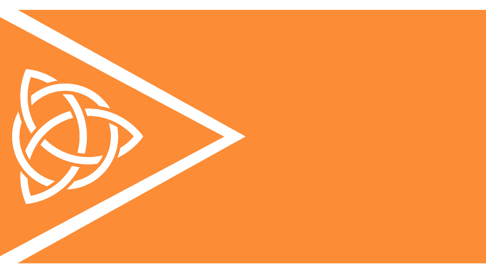
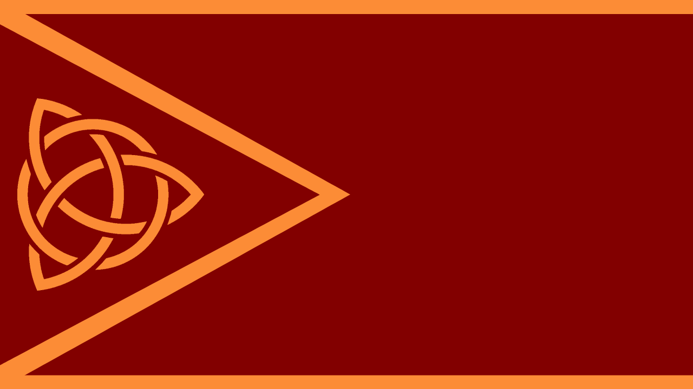

## MindTech Symbology

`📑 Term`

Officially adopted on eon 768 by the [Council of Minds](../refs/council_of_minds.md), these symbols are derived from the ancient [MindTech](../refs/mindtech_institute.md) symbols used in the times of the [First Capital](../refs/first_capital.md).

The following meanings are assigned to these symbols:

**The triquetra** the main symbol of the faction, symbolizes the tree [towers of MindTech Institute](../refs/institute_fortress_inner.md).

**The surrounding circle** - for the control _MindTech_ has over the towers, and a reference to the mystic 4th tower.

**The triangle** further emphasises the unity of the towers, as well as the movement forward and forms the letter "M" with the white side-bands.

**The orange color** is the main color of the faction, derived from the **sands of the [Timeless Desert](../refs/timeless_desert.md)** - sacred MT land.

**The black color** used exclusively on war flags and banners is the symbol of destruction and sacrifice the war brings, and a reference to [Corruption](../refs/corruption.md) that arose from MT lands.

> **Official MT flag**  
> (main version, used for diplomatic and ceremonial purposes)
> 
> 

> **War MT flag**  
> (used exclusively in wartime by MT army) 
> 
> 

<!---
keywords:  mt, flag, banner, triquetra
aliases: MindTech Triquetra, MindTech Flags, MindTech Banners
-->