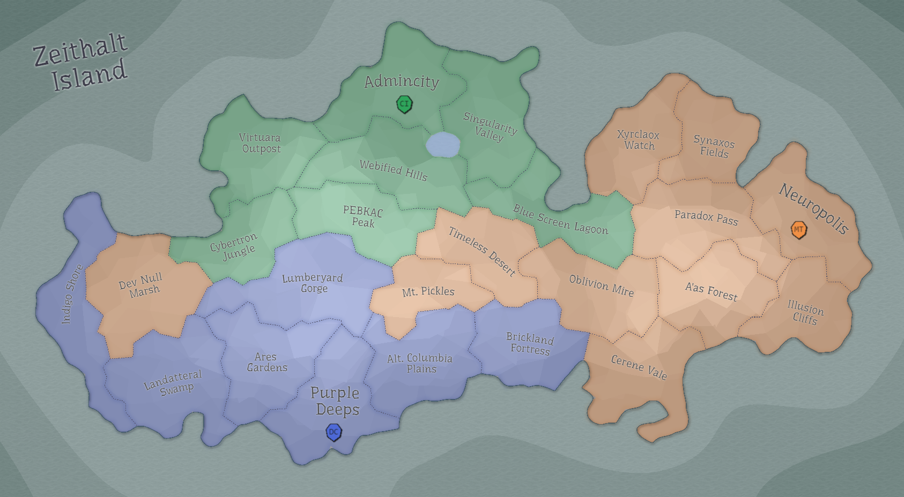

## Eon 266 - Battle of Dev Null Marsh

`⚔️ Battle` won by [MindTech Institute](../refs/mindtech_institute.md)

This battle starts as a [Deltan](../refs/deltans.md) attack on [Cybernetics Inc](../refs/cybernetics_inc.md)'s [Dev Null Marsh](../refs/dev_null_marsh.md). 

Unexpectedly the MindTech Institute joins the attack, which causes confusion in both Cybers ranks and the Institute itself.

During the battle Minds temporarily start helping Cybers defense, but eventually switch back to the attack and win the battle.

This battle is the starting point of the mutual hatred between Cybers and Minds, that would last for hundreds of Eons to come. 

