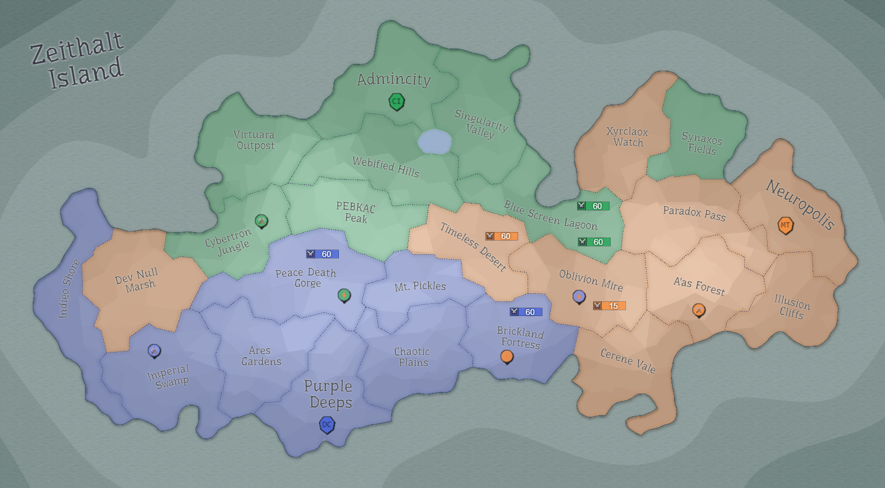

## Eon 314 - The Battle of Corrupted Desert

`⚔️ Battle` won by [MindTech Institute](../refs/mindtech_institute.md) (combined faction forces)

The factions were able to put aside their quarrels and differences to fight off the greater threat. 

Defense is successful and [Timeless Desert](../refs/timeless_desert.md) stays under MindTech Institute's control.

[HexAgon](../refs/hexagon.md), MT leader at the time and the greatest warrior of this battle, finds a unique artifact - [Corrupted gemstone](../refs/cr_gemstone.md).

