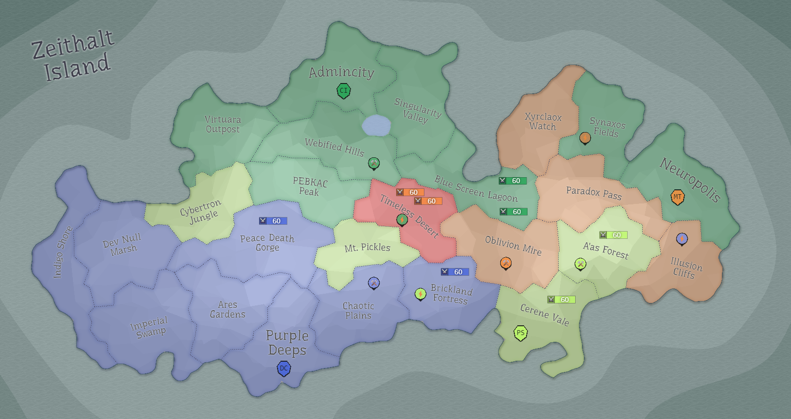

## Eon 391 - 2nd Battle of Corrupted Desert

`⚔️ Battle` won by [MindTech Institute](../refs/mindtech_institute.md) (combined faction forces)

The participation was high and battle ended rather quickly.

Due to various factors and the recent spike in activity and commitment, this battle against the [Corruption](../refs/corruption.md) was less intense than the last one and many think it was won much easier this time.

Does it mean that the next time the [Corruption](../refs/corruption.md) will strike harder?

