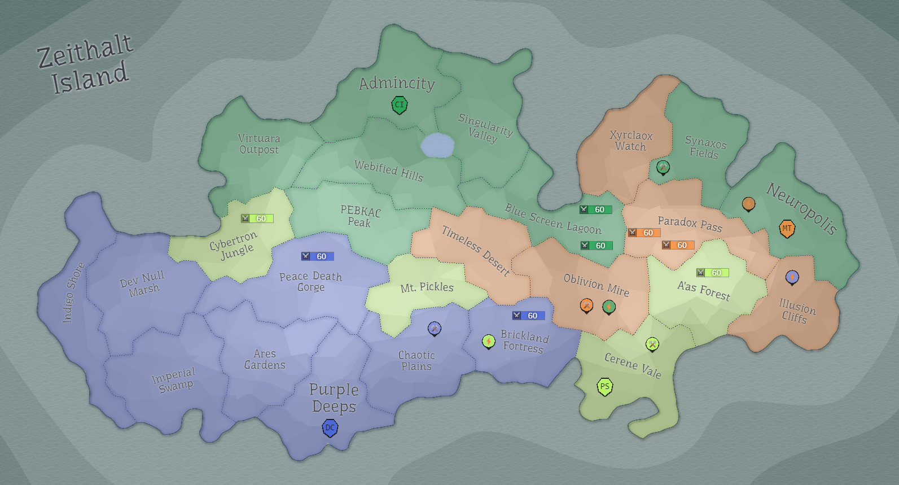

## Eon 402 - The Night Battle of Paradox Pass

`⚔️ Battle` won by [MindTech Institute](../refs/mindtech_institute.md)

[Minds](../refs/minds.md) were able to defend their lands in this battle, with the help of [Protectores Silva](../refs/protectores_silva.md) (and some [Deltan](../refs/deltans.md) involvement in the end of the battle).

Worth noting that both MT garrisons were located in the area, greatly helping with defences - as if Minds wildly gambled or been informed of the attack.

This battle happened at night time for most of the participants and took longer than usual to finish, granting its name - The Night Battle of [Paradox Pass](../refs/paradox_pass.md).

<!---
type: battle
number: 20
place: paradox_pass
-->