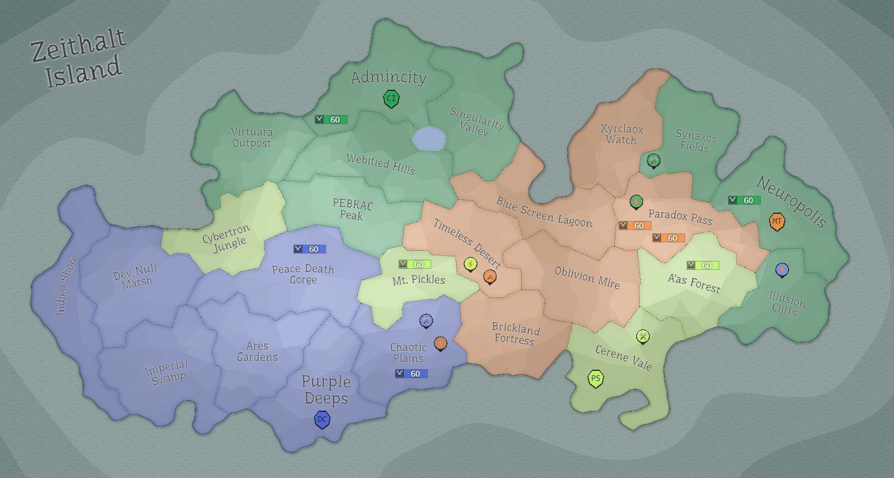

## Eon 413 - The Battle of Legoland Fortress

`⚔️ Battle` won by [MindTech Institute](../refs/mindtech_institute.md)

This battle is dubbed “of Legoland Fortress” my some MT members because after two failed attempts, on the third try the [fortress](../refs/brickland_fortress.md) finally crumbled.

This battle questionably marks the end of [Cybernetics Inc](../refs/cybernetics_inc.md) and [Delta Collective](../refs/delta_collective.md) partnership, as [Deltans](../refs/deltans.md) are left unsatisfied by [Cybers](../refs/cybers.md) underwhelming participation in battle.

On the other hand, only a fraction of Cybers supported MT in this battle, what probably left [Minds](../refs/minds.md) unimpressed too.

The tensions are rising, alliances are shaking. It seems only [Protectores Silva](../refs/protectores_silva.md) manages to not worsen it’s position in this battle, by keeping low profile - a position, understandable for a small and so far a peaceful faction.

<!---
type: battle
number: 21
place: brickland_fortress
-->