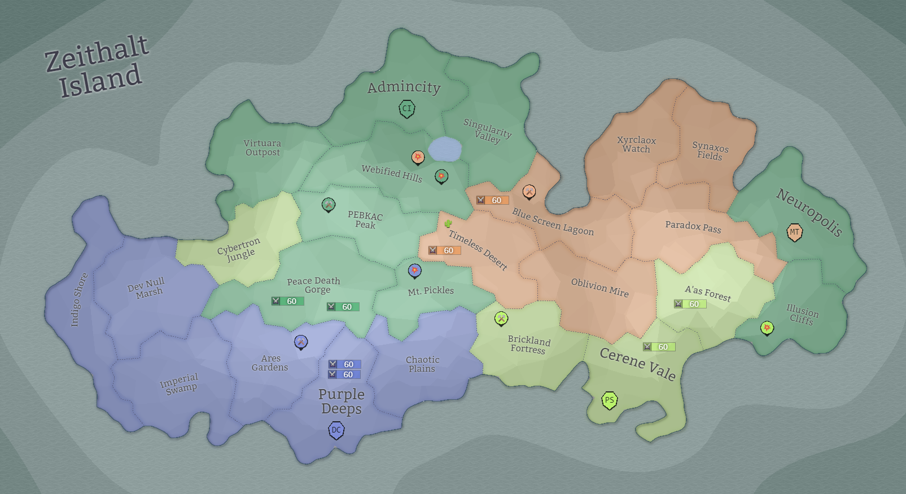

## Eon 441 - The Lakeside Battle of Webified Hills

`⚔️ Battle` won by [Cybernetics Inc](../refs/cybernetics_inc.md)

In a stunning and unexpected attack near the [Lake Corsair](../refs/lake_corsair.md), [Cybers](../refs/cybers.md) reclaim their lands in _The Lakeside Battle of [Webified Hills](../refs/webified_hills.md)_.

[Delta Collective](../refs/delta_collective.md) valiantly attempts to defend the territory but are ultimately unsuccessful due to bad preparation - they clearly were expecting an attack somewhere else, having almost no defense setup in the [Hills](../refs/webified_hills.md).

Notable that [MindTech Institute](../refs/mindtech_institute.md) strongly supported the Cybers’ attack, however some of their members and paid sell-swords did hits helping [Deltan](../refs/deltans.md) defenses too.

[Protectores Silva](../refs/protectores_silva.md) stayed true to their resolve of being a neutral force, hitting equally for both sides to earn some gold.

