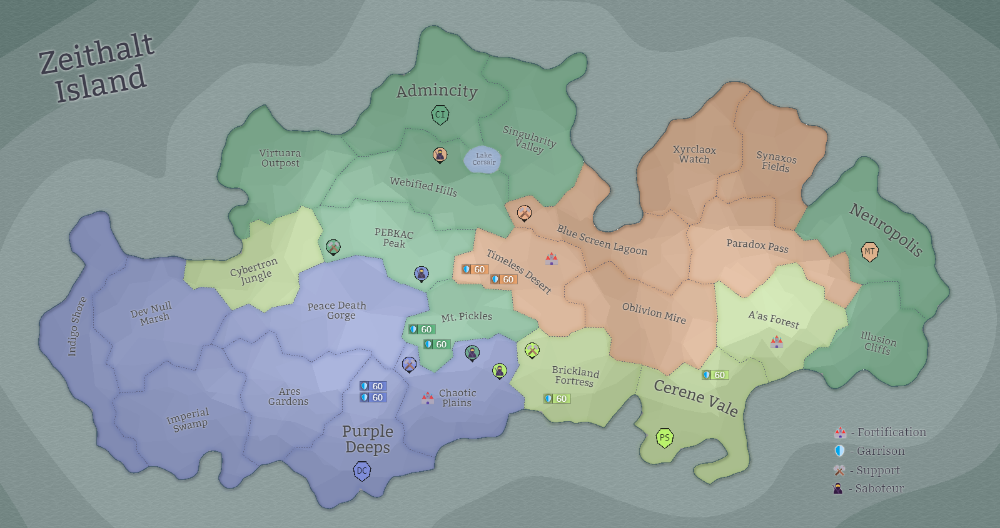

## Eon 451 - The Blitz Battle of Peace Death Gorge

`⚔️ Battle` won by [Delta Collective](../refs/delta_collective.md)

[Delta Collective](../refs/delta_collective.md) gather considerable power of own men and hired sellswords to organize a successful blitz attack on [Peace Death Gorge](../refs/peace_death_gorge.md), reclaiming this land back under control.

Both [Cybernetics Inc](../refs/cybernetics_inc.md) (defending side) and [Protectores Silva](../refs/protectores_silva.md) (staying neutral, as usual) keep very low profiles, having almost no effect on the outcome of the battle.

[MindTech Institute](../refs/mindtech_institute.md) quite unexpectedly joins the offensive. It’s unclear if their intervention was an effort to help the [Deltans](../refs/deltans.md), or an attempt of hijacking their attack. Either way, [Minds](../refs/minds.md) power was not enough to contest the confident win by [Delta Collective](../refs/delta_collective.md).

