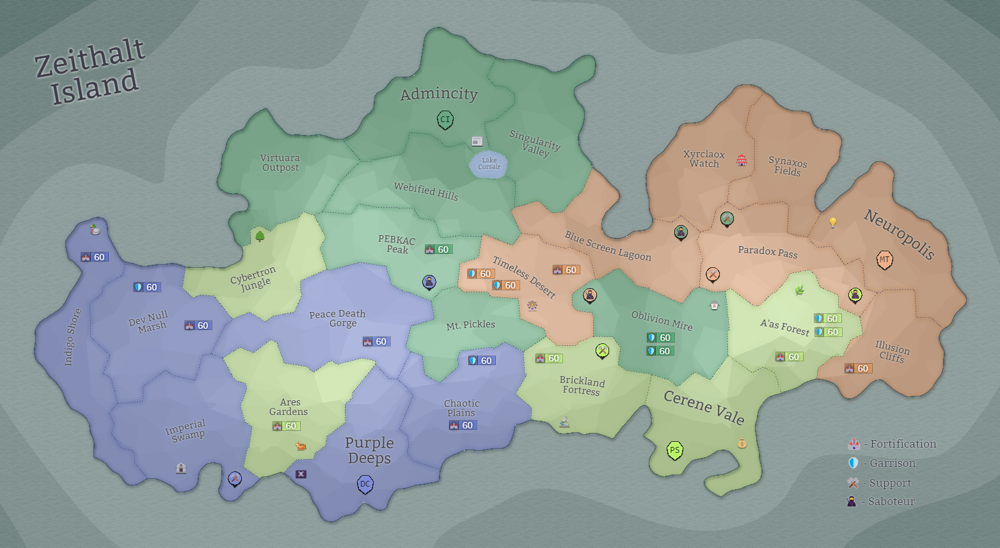

## Eon 491 - The Oblivious Battle on the Mire

`⚔️ Battle` won by [Cybernetics Inc](../refs/cybernetics_inc.md)

This battle turned out to be even longer and more unremarkable than the previous one.

[Cybernetics Inc](../refs/cybernetics_inc.md) and [MindTech Institute](../refs/mindtech_institute.md) once again conducted another military exercise;
[Delta Collective](../refs/delta_collective.md) and [Protectores Silva](../refs/protectores_silva.md) were mostly neutral, presumably once again been asked by two other faction to stay neutral.

All-in-all, nothing really special, except for the hilarious fact that members of MT’s government (presumably being intoxicated by the fumes of [Oblivion Mire](../refs/oblivion_mire.md)) forgot to issue an official message about place and time of the attack to their troops.

This resulted in some of their forces attacking in the middle of the night, while others embarrassingly overslept the first half of the battle.

Such forgetfulness of MT officials granted this battle its title - _The Oblivious Battle on the Mire_ 

