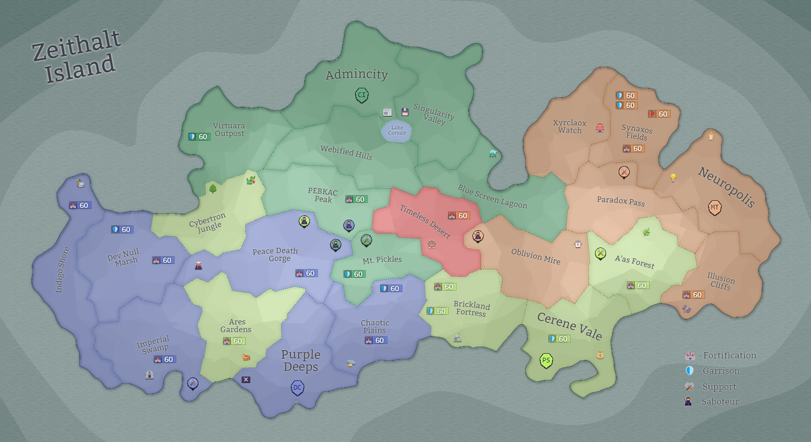

## Eon 505 - Rebels take over Timeless Desert

`⌛ Event`

[Rebels](../refs/rebels.md) take over [Timeless Desert](../refs/timeless_desert.md), battle ensues where [MindTech Institute](../refs/mindtech_institute.md) tries to recapture it!

Rebellion group lead by [Sellswords](../refs/sellswords.md): _Just No_name_, _TheDuckie_, _Eldar_ with the help of two inside men in [MindTech Institute](../refs/mindtech_institute.md) - [CuriousDino](../refs/curious_dino.md) and _timmyrueben_ capture several administrative buildings and attempt to take [Timeless Desert](../refs/timeless_desert.md) under their control.

Immediately the fighting starts, [Minds](../refs/minds.md) attack back and try to drive rebels away from their lands.

