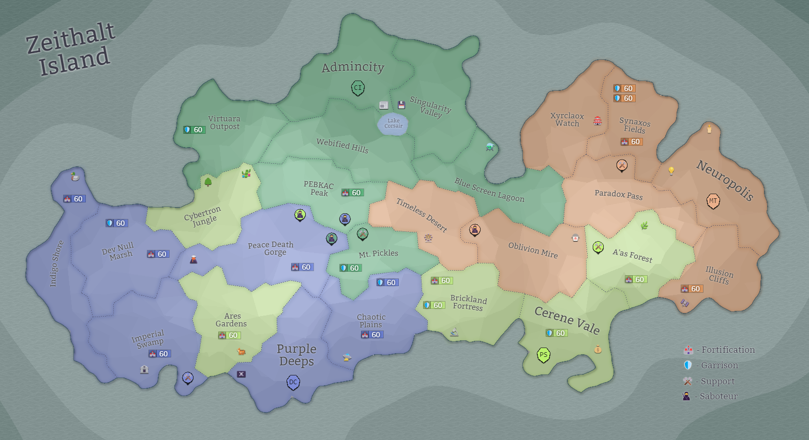

## Eon 506 - Rebellion in the Desert

`⚔️ Battle` won by [MindTech Institute](../refs/mindtech_institute.md)

[MindTech Institute](../refs/mindtech_institute.md) restore the order in the [Timeless Desert](../refs/timeless_desert.md)

The [Rebels](../refs/rebels.md) are driven away and into hideouts after the unsuccessful attempt to install themselves as a new governing power in the desert.

Unfortunately for [Rebels](../refs/rebels.md) they did not find the support of other factions to put up a good enough defence against [MindTech Institute](../refs/mindtech_institute.md).

[Delta Collective](../refs/delta_collective.md) and [Cybernetics Inc](../refs/cybernetics_inc.md) mostly stayed neutral, while [Protectores Silva](../refs/protectores_silva.md) joined the efforts to quell the rebellion. 

<!---
type: battle
number: 31
place: timeless_desert
-->
