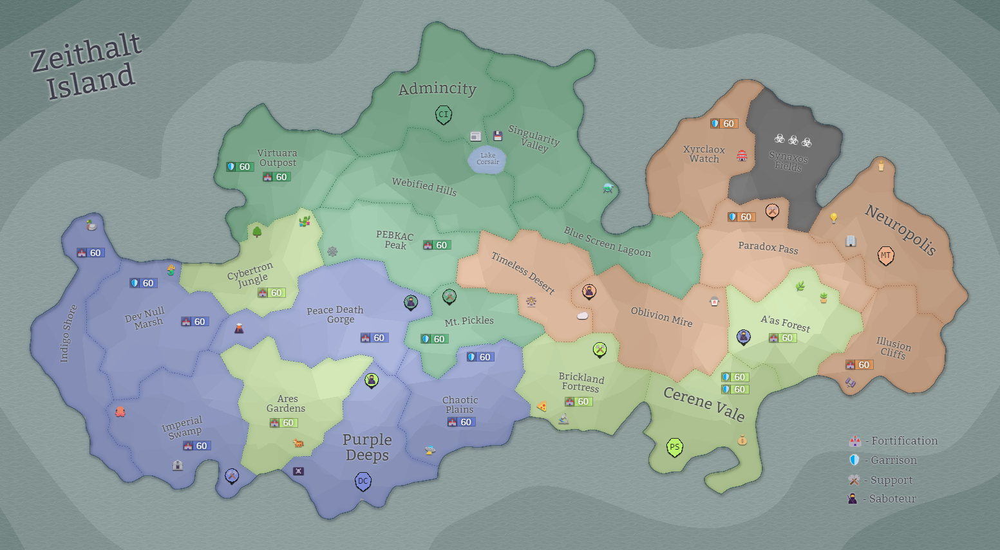

## Eon 515 - The Sleepy Siege of Cerene Vale

`⚔️ Battle` won by [Protectores Silva](../refs/protectores_silva.md)

It was quite an uneventful battle where [Protectores Silva](../refs/protectores_silva.md) were prepared and [Delta Collective](../refs/delta_collective.md) clearly did a bad job planning out this battle.

[Cybernetics Inc](../refs/cybernetics_inc.md) and [MindTech Institute](../refs/mindtech_institute.md) stayed neutral, while [Deltans](../refs/deltans.md) quickly realised that mistakes were made and that the battle cannot be won.

The slow and frankly quite boring nature of this unsuccessful siege has granted the battle its name - _The Sleepy Siege of Cerene Vale_.

