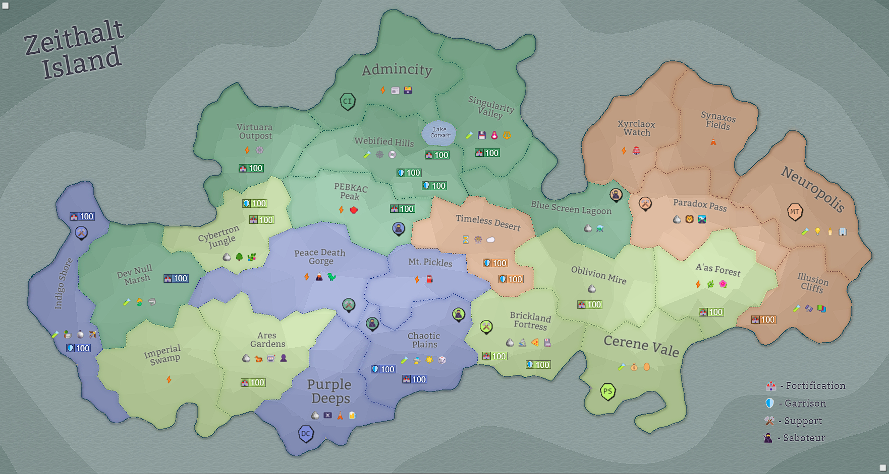

## Eon 636 - The Peculiar Battle of Mt. Pickles

`⚔️ Battle` won by [Delta Collective](../refs/delta_collective.md)

[Delta Collective](../refs/delta_collective.md) attacks and wins [Mt. Pickles](../refs/mt_pickles.md) in a battle known as _Peculiar Battle on Mt. Pickles_.

What gave the battle its name, is the fact that the battle seemingly stopped several times and changes into friendly conversations and even picnics between participants.

However, after some time, the fighters remembered their differences and the battle would resume.

In this battle [Cybernetics Inc](../refs/cybernetics_inc.md) were on the defensive side (helped by their allies [Protectores Silva](../refs/protectores_silva.md)), while [Deltans](../refs/deltans.md) lead the assault with help from the [MindTech Institute](../refs/mindtech_institute.md).

<!---
type: battle
number: 44
place: mt_pickles
-->
