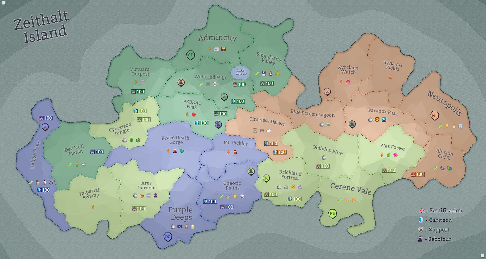

## Eon 646 - The Unstable Battle of Blue Screen Lagoon

`⚔️ Battle` won by [MindTech Institute](../refs/mindtech_institute.md)

[MindTech Institute](../refs/mindtech_institute.md) attacks and wins [Blue Screen Lagoon](../refs/blue_screen_lagoon.md) in a battle known as _Unstable Battle of Blue Screen Lagoon_.

A streak of unsuccessful battles for [Cybers](../refs/cybers.md) continues once again, with [Minds](../refs/minds.md) attacking and capturing the _Lagoon_. 

Despite the help from [Protectores Silva](../refs/protectores_silva.md) and having the upper hand for most of the battle, combined effort of _Deltans_ and _Minds_ prevailed in this battle.

<!---
type: battle
number: 45
place: blue_screen_lagoon
-->
