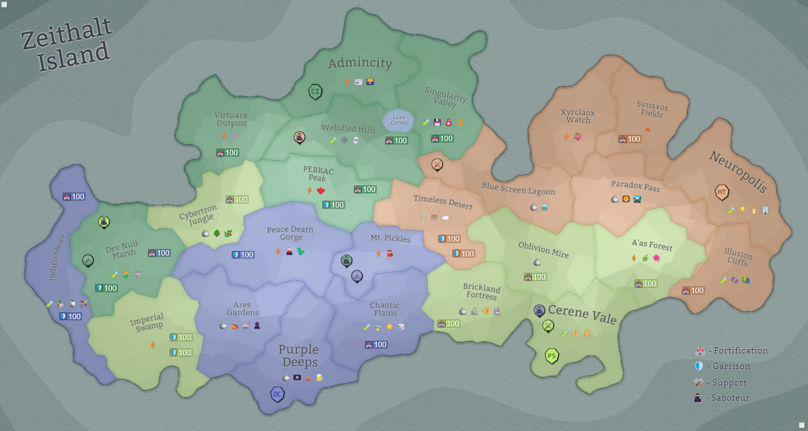

## Eon 706 - The Fall of Ares Garden

`⚔️ Battle` won by [Delta Collective](../refs/delta_collective.md)

_Delta Collective_ attacks [Protectores Silva](../refs/protectores_silva.md) to seize control over the [Ares Gardens](../refs/ares_gardens.md) in a battle known as _The Fall of Ares Garden_.

This battle has two remarkable traits:
- it’s the first ever direct attack by any faction on _Protectores Silva_;
- it’s the first appearance of [Fighters Guild](../refs/fighters_guild.md) in a cross-factional battle.

[Sellswords](../refs/sellswords.md) in this battle dealt more damage than both [Cybernetics Inc](../refs/cybernetics_inc.md) or [MindTech Institute](../refs/mindtech_institute.md), clearly establishing a new powerful player on the Zeithalt map.

However, their efforts were not enough to help _Silvans_ win this battle.

<!---
type: battle
number: 51
place: ares_gardens
-->