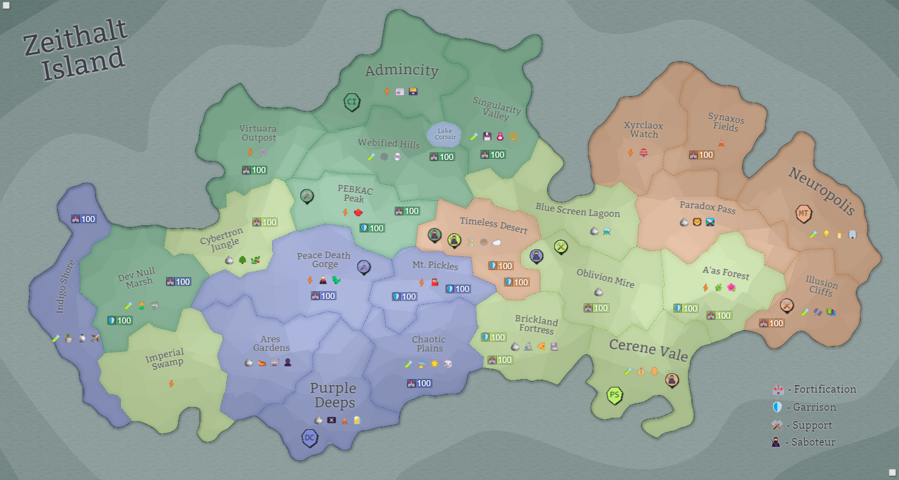

## Eon 733 - The Frantic Battle over A'as Forest

`⚔️ Battle` won by [Protectores Silva](../refs/protectores_silva.md)

This battle was long anticipated by both sides, but [Loki](../refs/loki.md) took his time to strike at an unexpected time and in an unexpected place... 

However, [Protectores Silva](../refs/protectores_silva.md) were ready for that: they had their defenses distributed equally over their lands, and [A'as Forest](../refs/aas_forest.md) had formidable defenses.

With [Cybers](../refs/cybers.md), [Silvan](../refs/silvans.md) and the [Fighters Guild](../refs/fighters_guild.md) on one side, and [Deltans](../refs/deltans.md) with [Minds](../refs/minds.md) on the other, this battle was going to be a close one.

Despite quickly losing the initiative and all the chaos that ensued, [Protectores Silva](../refs/protectores_silva.md) managed to keep their heads cool and with a considerable effort and unforeseen amount of resources were able to fend off the attack.

<!---
type: battle
number: 54
place: aas_forest
-->