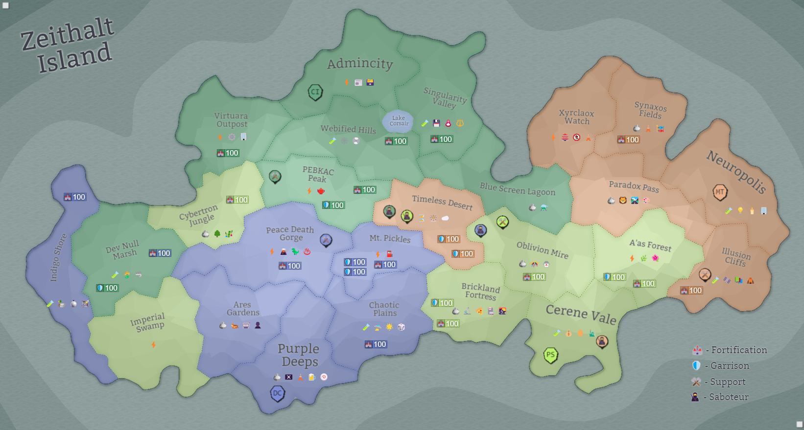

## Eon 740 - The Battle Of Corrupted Mountain

`⚔️ Battle` won by [Delta Collective](../refs/delta_collective.md) (combined faction forces)

As it happened many times previously, the existential threat of [Corruption](../refs/corruption.md) is able to unite factions - even if temporarily - to fend off the greater danger.

We see it happen again this time - despite an ongoing war between the [Minds](../refs/minds.md) and [Deltans](../refs/deltans) on one side and [Silvans](../refs/silvans.md) with [Cybers](../refs/cybers.md) on the other.

It was a long an enduring battle through the night, however the factions were able to hold their ground and push back the [Corruption](../refs/corruption.md).

Notably, [Delta Collective](../refs/delta_collective.md) had the strongest army on the battlefield, being almost equal to the combined forces of three other factions.

<!---
type: battle
number: 55
place: mt_pickles
-->

