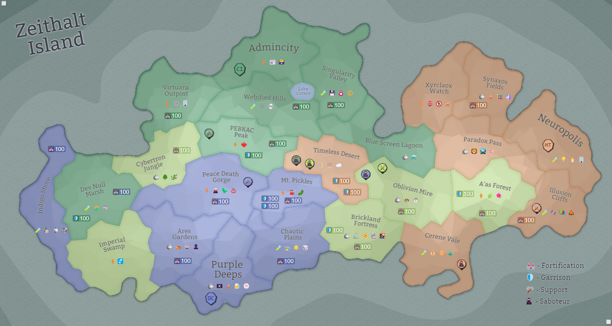

## Eon 749 - The Burning of Cerene Vale

`⚔️ Battle` won by [MindTech Institute](../refs/mindtech_institute.md)

A devastating loss for [Protectores Silva](../refs/protectores_silva.md) results in them losing and having to flee their own capital, as it goes up in flames from the approaching [Minds](../refs/minds.md) army attacks.

The MT dictator [Loki](../refs/loki.md) stops at nothing to get his revenge on the [Protectors](../refs/protectores_silva.md) for what he calls a betrayal.

It's a second ever successful siege of a capital, and the first one where the attacking army decides to burn the city to the ground. Historians will remember this event as the _Burning of Cerene Vale_, and estimate its significance for the whole island to be on par with the [Disaster of Synaxos Fields (eon 508)](../timeline/eon0508.md) and the [Siege of Neuropolis (eon 384)](../timeline/eon0384.md).

When the ash settles and the smoke clears, will the [Minds](../refs/minds.md) army march on to their next target? Or will the [Silvans](../refs/silvans.md) be able to regroup and fight back?

Whatever way it goes, at the moment it seems the only way forward is through even more bloodshed and destruction. 

