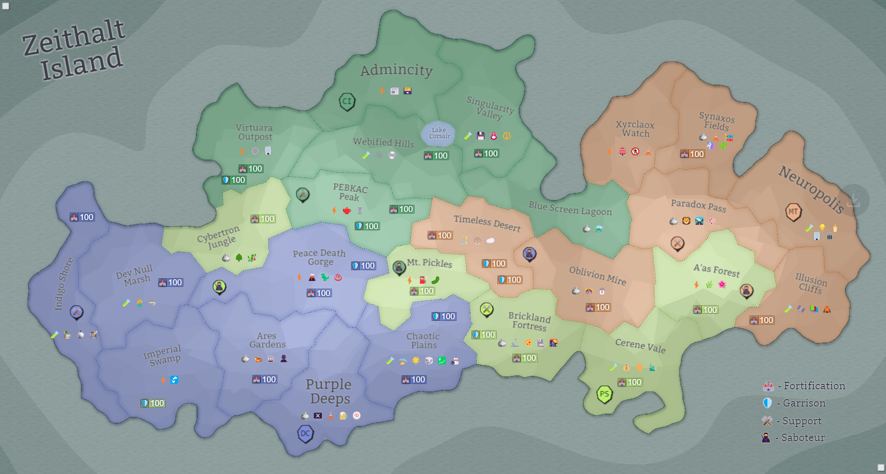

## Eon 766 - PS rebuilds capital in Cerene Vale

`⌛ Event`

Following the [Burning of Cerene Vale](../timeline/eon0749.md), the subsequent [changes](../timeline/eon0755.md) in [MindTech Institute](../refs/mindtech_institute.md) and the [exchange of lands](../timeline/eon0761.md), [Protectores Silva](../refs/protectores_silva.md) begin rebuilding their capital in Cerene Vale.

With that, comes a logical conclusion of the MT-PS war.

The result of this war seems to be [Protectores Silva](../refs/protectores_silva.md) losing a couple of their lands and having to rebuild their capital.

[MindTech Institute](../refs/mindtech_institute.md) were able to reclaim one of their lands, but at a high price of losing vast amounts of resources and putting themselves in a tough political situation; and ended up with a new government to navigate this situation.

/[Delta Collective](../refs/delta_collective.md) profitted from the war by reclaiming Ares Garden and squeezing out [Protectores Silva](../refs/protectores_silva.md) from the Imperial Swamp.

[Cybernetics Inc](../refs/cybernetics_inc.md), although being on a losing side, did not really have to pay any price for it.

And with that, the Island seems to have settled on a shaky peace.

But is it really the end of the war? Or is it just the beginning of a new chapter?

