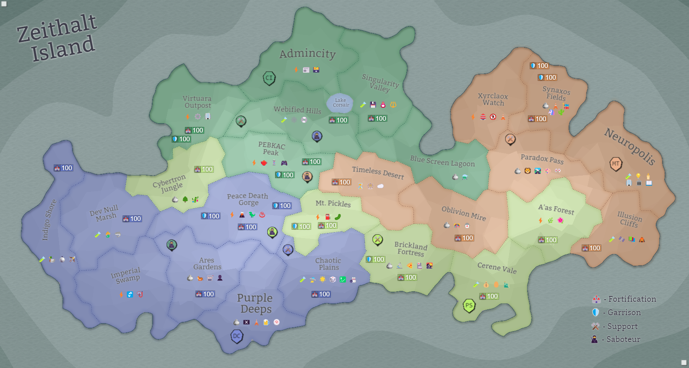

## Eon 778 - The 3rd Outbreak in Synaxos Fields

`⚔️ Battle` won by [MindTech Institute](../refs/mindtech_institute.md) (combined faction forces)

After the previous war and the tension it caused between the factions, the defense of [Synaxos Fields](../refs/synaxos_fields.md) promised to be hard. There even were rumours of intentional sabotage against MindTech Institute.

The fact that the faction had been suppressing [Corruption](../refs/corruption.md) for several battles in a row did not help either.

However, the factions were able to gather a united force to aid MindTech Institute in the defense and avoid the global disaster.

<!---
type: battle
number: 59
place: SYNAXOS_FIELDS
-->