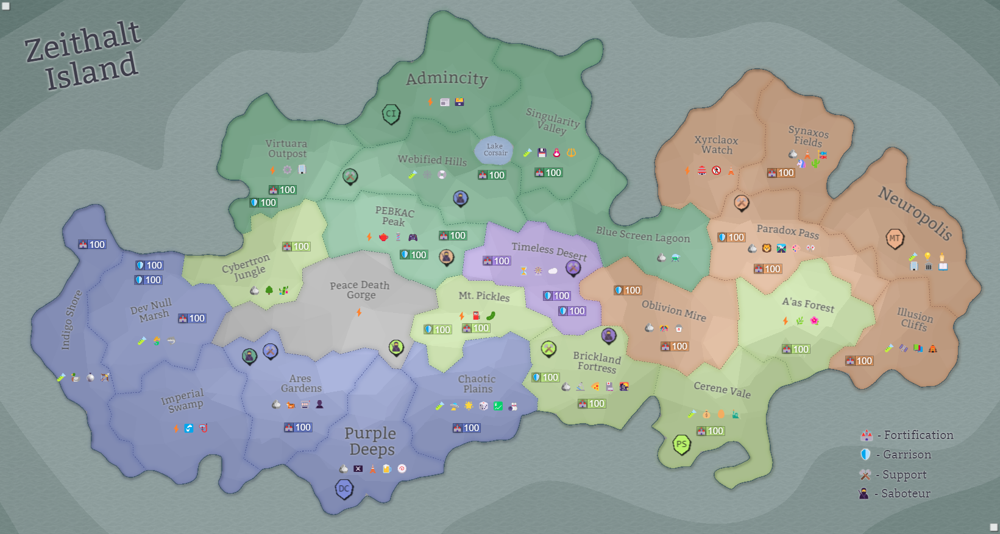

## Eon 802 - Military Exercise in the Dev Null Marsh

`⚔️ Battle` won by [Delta Collective](../refs/delta_collective.md)

Factions are conducting a military exercise in the [Dev Null Marsh](../refs/dev_null_marsh.md) in the wake of the upcoming [CR Restoration Project](../refs/cr_restoration_project.md) in nearby [Peace Death Gorge](../refs/peace_death_gorge.md) and to prepare for future Corruption outbreaks. 

The [Delta Collective](../refs/delta_collective.md) wins the exercise, showing the best coordination and tactics.

Shortly after the exercise, the factions complete back-to-back all three necessary _CR Restoration Project_ stages and the land is announced to be free from [corruption](../refs/corruption.md).

With that, the full restoration is far from over as such notable places as [Volcanic Jacuzzi](../refs/volcanic_jacuzzi.md) and [Jurassic Part](../refs/jurassic_park.md) were heavily damaged and still in need of attention.

<!---
type: battle
number: 61
place: DEV_NULL_MARSH
-->