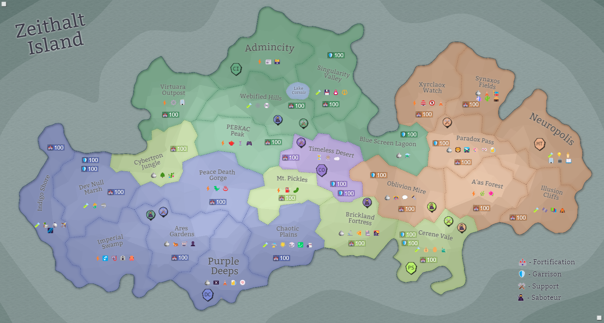

## Eon 818 - Blitz Battle of the A'as Forest

`⚔️ Battle` won by [MindTech Institute](../refs/mindtech_institute.md)

It was a quick and decisive battle in the [A'as Forest](../refs/aas_forest.md) where the [MindTech Institute](../refs/mindtech_institute.md) were ahead of their opposition by a colossal margin.

First of all, the Minds prepared greatly for this battle, and attacked A'as from three sides, almost trapping the opposing [PS](../refs/protectores_silva.md) and [CI](../refs/cybernetics_inc.md) troops.

Secondly, _Minds_ were able to secure contracts with both [Fighters' Guild](../refs/fighters_guild.md) and [Cloudy Operatives](../refs/cloudy_operatives.md).

Lastly, [Delta Collective](../refs/delta_collective.md) once again fought on the side of the _Minds_ and provided them with the necessary support.

As a result, the battle was decided in a matter of hours - the attackers had vastly superior force, and the battle was finished quickly.

<!---
type: battle
number: 63
place: AAS_FOREST
-->