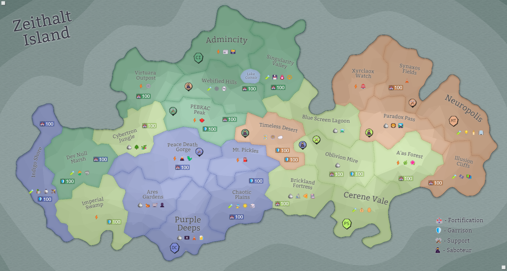

## Eon 723 - 2nd Sabotage in the Desert

> **⚔️ Battle** won by [MindTech Institute](/refs/mindtech_institute.md)

After failing to secure a contract with [Fighters Guild](/refs/fighters_guild.md), [Cybers](/refs/cybernetics_inc.md) return to their previous tactic of sabotaging the [Desert](/refs/timeless_desert.md).

This tactics proves useful again, as the CI are able to trigger [CR Mines](/refs/cr_mines.md) and interrupt Temporal Resource production in the region.

However, the battle itself was heavily dominated by [Deltan](/refs/delta_collective.md) forces, while Cybers and Silvans mostly conserved their forces for the upcoming MT retribution.

