## Eon 730 - PS give Blue Screen Lagoon to CI

`⌛ Event`

[Protectores Silva](../refs/protectores_silva.md) gives control over [Blue Screen Lagoon](../refs/blue_screen_lagoon.md) to [Cybernetics Inc](../refs/cybernetics_inc.md) upon their mutual agreement.

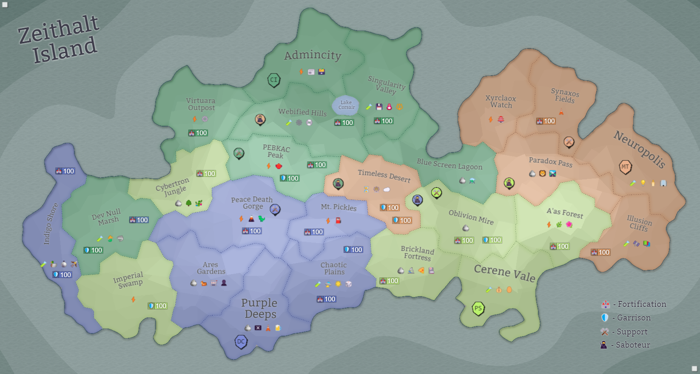 [map legend](../refs/map_legend.md)
## Eon 723 - 2nd Sabotage in the Desert

`⚔️ Battle` won by [MindTech Institute](../refs/mindtech_institute.md)

After failing to secure a contract with [Fighters Guild](../refs/fighters_guild.md), [Cybers](../refs/cybers.md) return to their previous tactic of sabotaging the [Timeless Desert](../refs/timeless_desert.md).

This tactic proves useful again, as the Cybers are able to trigger [CR Mines](../refs/cr_mines.md) and interrupt [Temporal Resource](../refs/temporal_resources.md) production in the region.

However, the battle itself was heavily dominated by [Deltan](../refs/deltans.md) forces helping MT defend, while Cybers and Silvans mostly conserved their forces for the upcoming MT retribution.

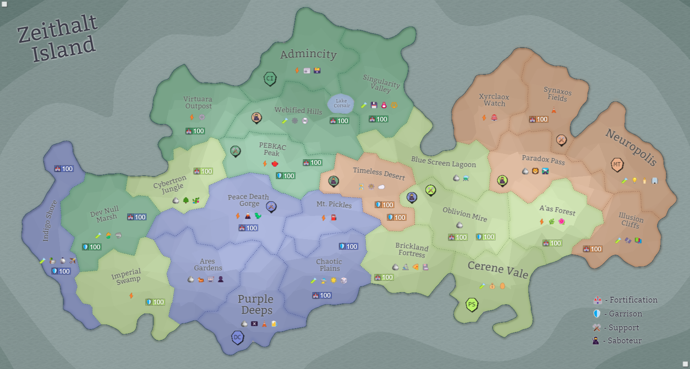 [map legend](../refs/map_legend.md)
## Eon 384 - The Siege of Neuropolis

`⚔️ Battle` won by [Delta Collective](../refs/delta_collective.md)

In a dramatic battle, alliance of [Deltans](../refs/deltans.md) with [Cybers](../refs/cybers.md) gathered together a great force both in battle and in financial effort, and successfully conquered the heart of [MindTech Institute](../refs/mindtech_institute.md) -  their capital city [Neuropolis](../refs/neuropolis.md).

Historians noticed that [Protectores Silva](../refs/protectores_silva.md) did not immediately rushed to the aid, but joined after a few attacks - either due to the surprising nature of the attack, or they were negotiating something the [Minds](../refs/minds.md)…

This epic battle will be remembered in chronicles as _The Siege of Neuropolis_, first ever attack and successful capture of a faction’s capital.

When faced with a choice whether to keep the city or let Neuropolis burn to the ground, Delta Collective decided to save the city.

All the fires remaining after battle were promptly put out, the immediate restoration of city walls began, Deltan officials started the effort to restore peaceful life in the city.

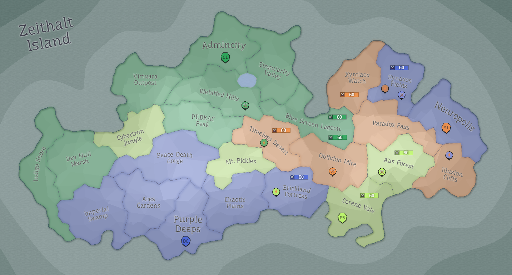
## Eon 375 - The 4h Battle of Mt. Pickles

`⚔️ Battle` won by [Protectores Silva](../refs/protectores_silva.md) (military exercise)

With the help of [Cybernetics Inc](../refs/cybernetics_inc.md) and [Delta Collective](../refs/delta_collective.md), the [Silvans](../refs/silvans.md) were able to defend their lands the MT attack.

However, [MindTech Institute](../refs/mindtech_institute.md) sent out message to let other factions know that this was a joint military exercise with [Protectores Silva](../refs/protectores_silva.md) and their faction is committed to their claimed goal of pursuing peace on the Zeithalt.

## Eon 370 - CI gives Cybertron Jungle to PS

`⌛ Event`

[Cybernetics Inc](../refs/cybernetics_inc.md) gives control over [Cybertron Jungle](../refs/cybertron_jungle.md) to [Protectores Silva](../refs/protectores_silva.md) upon their mutual agreement with a following public statement:

> *We are entrusting the restoration of these lands to PS after the damages from the corruption*

## Eon 369 - Protectores Silva is founded

`⌛ Event`

[Protectores Silva](../refs/protectores_silva.md) - a new faction emerges on Zeithalt Island.

Brave sellsword warriors [Mimb](../refs/mimb.md), [Ozimud](../refs/ozimud.md) and _Gabrio_, joined by CI member *Gabriel Santiago* and led by a prominent MT official [Ogrodnik](../refs/ogrodnik.md) formed a new faction.

They reached a peaceful agreement of lands gift from [MindTech Institute](../refs/mindtech_institute.md), and established their capital in [Cerene Vale](../refs/cerene_vale.md) - their newly found homeland.

The founding statement from this new faction to the people of Zeithalt is:

> *Zeithalt is changing, under threat from unnatural disturbances and behavior. We must protect her and live in balance with nature to thrive long-term.*

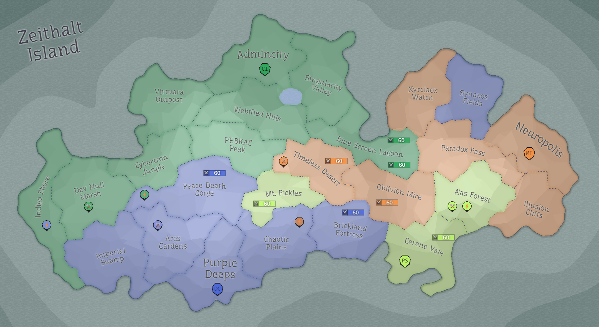
## Eon 368 - CI gives Imperial Swamp back to DC

`⌛ Event`

[Cybernetics Inc](../refs/cybernetics_inc.md) gives back [Imperial Swamp](../refs/imperial_swamp.md) to [Delta Collective](../refs/delta_collective.md) with the following message:

> *After the battle CI operatives spent the entire night combing through the swamp, removed all invasive species that had been over flourishing added some scientific research probes and now remove themselves.*

## Eon 367 - The Fishy Battle of Imperial Swamp

`⚔️ Battle` won by [Cybernetics Inc](../refs/cybernetics_inc.md)

Cybernetics Inc attacks the [Deltans](../refs/deltans.md) and wins The Fishy Battle Of [Imperial Swamp](../refs/imperial_swamp.md).

A notable achievement for Cybers - it is their first victory in a battle against factions, allowing them to repeat the MT’s record of holding 10 lands at the same time.

[MindTech Institute](../refs/mindtech_institute.md) mostly stayed out of it, adhering to their new policy of peacekeeping, although some MT players in pursuit of gold and fame were active during the battle.

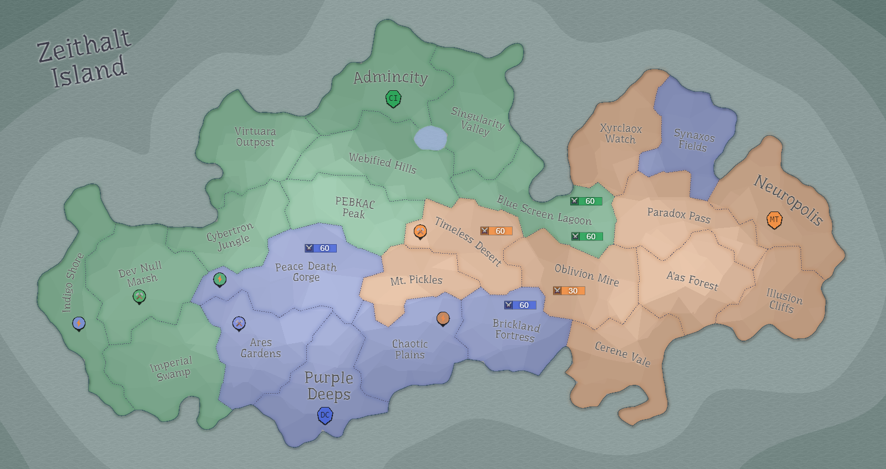
## Eon 359 - The Battle of Corrupted Forest

`⚔️ Battle` won by [MindTech Institute](../refs/mindtech_institute.md) (combined faction forces)

[A’as Forest](../refs/aas_forest.md) is successfully defended by the combined forces of three factions.

Honorable mention - MTs battle commander [Revalx](../refs/revalx.md), for doing impressive work in organising the people of all factions.

Other notable events include:
- Record low participation from [Delta Collective](../refs/delta_collective.md);
- MindTech Institute not using their [Garrisons](../refs/garrisons.md) nor [Corrupted Mines](../refs/cr_mines.md) to help the defence;
- it’s a _very_ close call again, the outcome of the battle decided in the very last moments.

Reports say that [Cybernetics Inc](../refs/cybernetics_inc.md) and  were able to gather enough corrupted matter and complete (separately) their own [CR Research](../refs/cr_artefacts.md) projects.

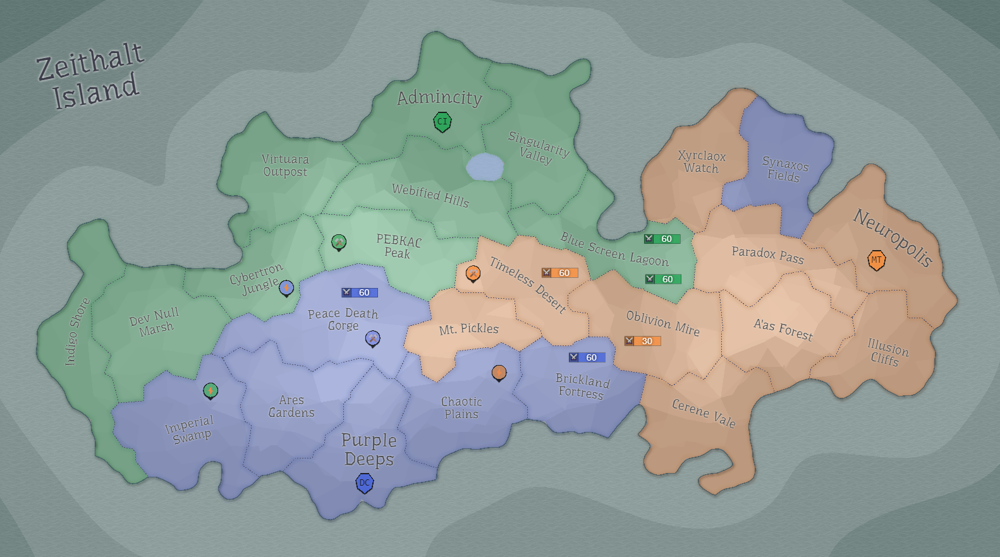
## Eon 353 - Corruption research in full swing

`⌛ Event`

Predictions about [Corruption](../refs/corruption.md) targets are no longer based on rumours and prophecies.

Due to ongoing peace, factions have set up an extensive network of control stations and research facilities all over the island.

Based on the observations done by [MindTech Institute](../refs/mindtech_institute.md) scientists, it is reported that the first signs of approaching [Corruption](../refs/corruption.md) are appearing in [A’as Forest](../refs/aas_forest.md).
## Eon 352 - DC calls off an attack

`⌛ Event`

After two other factions skipped their turns in hopes to preserve peace, [Delta Collective](../refs/delta_collective.md) decided to join this effort and too will not attack at this time.

## Eon 351 - CI and DC exchange lands

`⌛ Event`

Upon mutual agreement between [Cybernetics Inc](../refs/cybernetics_inc.md) and [Delta Collective](../refs/delta_collective.md) the following exchange of territories happens:
- Control over [Synaxos Fields](../refs/synaxos_fields.md) is transferred to [Deltans](../refs/deltans.md);
- Control over [Dev Null Marsh](../refs/dev_null_marsh.md) is transferred to [Cybers](../refs/cybers.md).
  

## Eon 349 - MT support the effort for peace

`⌛ Event`

⏳ The [MindTech Institute](../refs/mindtech_institute.md) passes their attack turn with the following message:

> The Institute's Minds welcome this idea of the Cybernetics brothers and answer to the call for peace in similar manner.
> 
> We wish to not participate in combat during this cycle and pass out turn as well. Instead, we use this time to help the restoration works of the damaged circuits in the Cybertron Jungle and to further improve and evolve our own lands and minds alike.
> 
> Let the island of Zeithalt enter a new era, let it prosper in peace and harmony!
## Eon 347 - CI calls for peace

`⌛ Event`

Still working on repairs and seeing so much destruction around them from the recent corruption strike, [Cybernetics Inc](../refs/cybernetics_inc.md) made a call for the idea of peace within the Island. 

CI have taken that first step themselves and chose not to engage in a new battle.
## Eon 345 - The Battle of Corrupted Jungle

`⚔️ Battle` won by [Cybernetics Inc](../refs/cybernetics_inc.md) (combined faction forces)

In this very close battle after several hours of fighting everyone was on edge till the very last minute. Though great cooperation the factions have once again defeated the [Corruption](../refs/corruption.md) threat.

It is believed, however, that some [Delta Collective](../refs/delta_collective.md) have intentionally not participated in the hope that [Cybertron Jungle](../refs/cybertron_jungle.md) would fall. It’s just a suspicion, but this idea can be poisonous for future politics on the island.

During the battle [MindTech Institute](../refs/mindtech_institute.md) members were able to gather enough corrupted matter to synthesize [Corrupted Mines](../refs/cr_mines.md) - powerful defensive weapon, first of its kind on Zeithalt.

 [map legend](../refs/map_legend.md)
## Eon 341 - MT gives Indigo Shore to CI

`⌛ Event`

[MindTech Institute](../refs/mindtech_institute.md) gives control over [Indigo Shore](../refs/indigo_shore.md)  to [Cybernetics Inc](../refs/cybernetics_inc.md) upon their mutual agreement.

## Eon 339 - CR Outburst is predicted to happen in Cybertron

`⌛ Event`

he preachers across Zeithalt once again speak of the dangers [Corruption](../refs/corruption.md) brings to the Island… this time [Cybertron Jungle](../refs/cybertron_jungle.md) is said to be affected.
## Eon 338 - The 3rd Battle of Mt. Pickles

`⚔️ Battle` won by [MindTech Institute](../refs/mindtech_institute.md)

The [Cybernetics Inc](../refs/cybernetics_inc.md) and MindTech Institute alliance stands strong, bringing more benefits to the mind faction. Notably, [Delta Collective](../refs/delta_collective.md) was able to put up the great fight, gathering more points than the [Minds](../refs/minds.md).

During this battle your fellow historian mostly slept and been busy with stuff, so this battle bears no special name. It’s just known as The 3rd Battle of Mt. Pickles.

Two times in a row [Cybers](../refs/cybers.md) help the Minds win new lands from [Deltans](../refs/deltans.md)… which brings us to the question - what’s in it for Cybernetics Inc?

With the upcoming [Corruption](../refs/corruption.md) battle, we will see if the factions are able to unite under new circumstances or if the political quarrels mean more to them than the fate of the Zeithalt Island…

## Eon 330 - The Confusing Battle of Indigo Shore

`⚔️ Battle` won by [MindTech Institute](../refs/mindtech_institute.md)

The most notable events are [Cybernetics Inc](../refs/cybernetics_inc.md) joining forces with MindTech Institute to attack [Delta Collective](../refs/delta_collective.md) after a long period of 6 battle when DC and CI where united. 

Quite confusing for DC who were quick to call it a betrayal.

Also, in the epic meme moment [Loki](../refs/loki.md) got confused and defended in the middle of his faction’s attack. This brought massive embarrassment to him as he was also a King of the Server at the time and everyone paid attention to his actions.

All this confusion granted the battle its name - The Confusing Battle of [Indigo Shore](../refs/indigo_shore.md).

## Eon 321 - The Long Battle of Dev Null Marsh

`⚔️ Battle` won by [Delta Collective](../refs/delta_collective.md)

The [Delta Collective](../refs/delta_collective.md) attacks [MindTech Institute](../refs/mindtech_institute.md)'s [Dev Null Marsh](../refs/dev_null_marsh.md) and wins the battle.

This battle lasts unexpectedly longer than usual, granting its name - The Long Battle Of Dev Null Marsh.

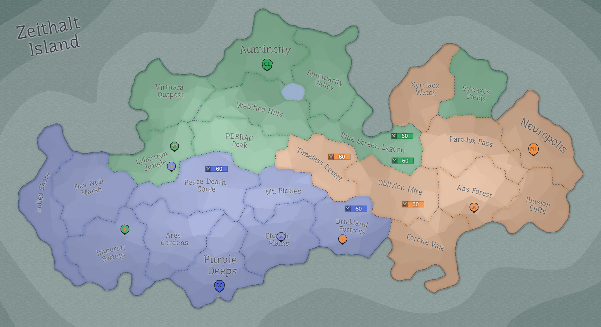
## Eon 314 - The Battle of Corrupted Desert

`⚔️ Battle` won by [MindTech Institute](../refs/mindtech_institute.md) (combined faction forces)

The factions were able to put aside their quarrels and differences to fight off the greater threat. 

Defense is successful and [Timeless Desert](../refs/timeless_desert.md) stays under MindTech Institute's control.

[HexAgon](../refs/hexagon.md), MT leader at the time and the greatest warrior of this battle, finds a unique artifact - [Corrupted gemstone](../refs/cr_gemstone.md).

## Eon 310 - Unknown treat appears on the Island

`⌛ Event`

Rumors of unknown threat start spreading across Zeithalt Island.

This date marks the begging of what would become the [Corruption](../refs/corruption.md) research.
## Eon 306 - The Boring Battle

`⚔️ Battle` won by [Delta Collective](../refs/delta_collective.md)

[MindTech Institute](../refs/mindtech_institute.md) attacks [Brickland Fortress](../refs/brickland_fortress.md), however the battle ends early as the Minds realise that they cannot win this battle.

All sides of the conflict just agree to cut it short it and give the victory to Delta Collective, who keep their lands.

Due to this unusual even the battle is known as The Boring Battle.

## Eon 301 - DC give Synaxos Fields to CI

`⌛ Event`

[Delta Collective](../refs/deltan_language.md) gives control over [Synaxos Fields](../refs/synaxos_fields.md) to [Cybernetics Inc](../refs/cybernetics_inc.md) upon their mutual agreement.

## Eon 298 - Battle of Synaxos Fields

`⚔️ Battle` won by [Delta Collective](../refs/delta_collective.md)

Deltans join [Cybernetics Inc](../refs/cybernetics_inc.md) attack on [MT](../refs/mindtech_institute.md)'s [Synaxos Fields](../refs/synaxos_fields.md), overtake them and win the battle.

## Eon 295 - Technological advancement - Support and Sabotage

`⌛ Event`

[Support](../refs/support.md) and [Saboteur](../refs/saboteur.md) units appear on the Zeithalt map.

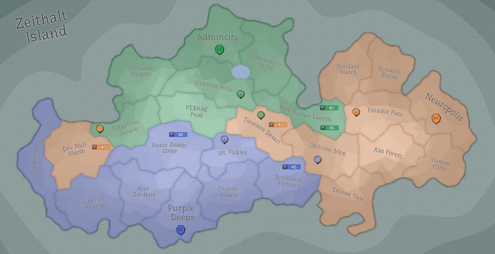
## Eon 291 - Delta Collective renames several of their lands

`⌛ Event`

The reformation of Delta Collective continues with the renaming of the following lands:

- Landatteral Swamp becomes [Imperial Swamp](../refs/imperial_swamp.md)
- Alt. Columbia Plains become [Chaotic Plains](../refs/chaotic_plains.md)
- Lumberyard Gorge becomes [Peace Death Gorge](../refs/peace_death_gorge.md) 

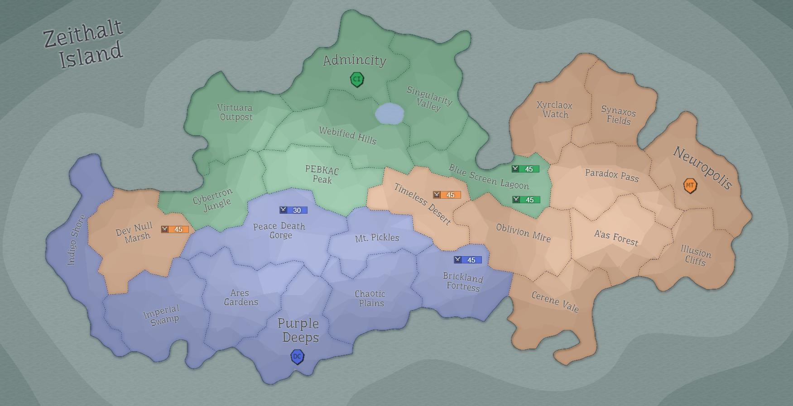
## Eon 290 - The 2nd Battle of Mt. Pickles

`⚔️ Battle` won by [Delta Collective](../refs/delta_collective.md)

With newfound strength, Delta Collective attacks [Mt. Pickles](../refs/mt_pickles.md) and reclaims it from [MindTech Institute](../refs/mindtech_institute.md)'s control.

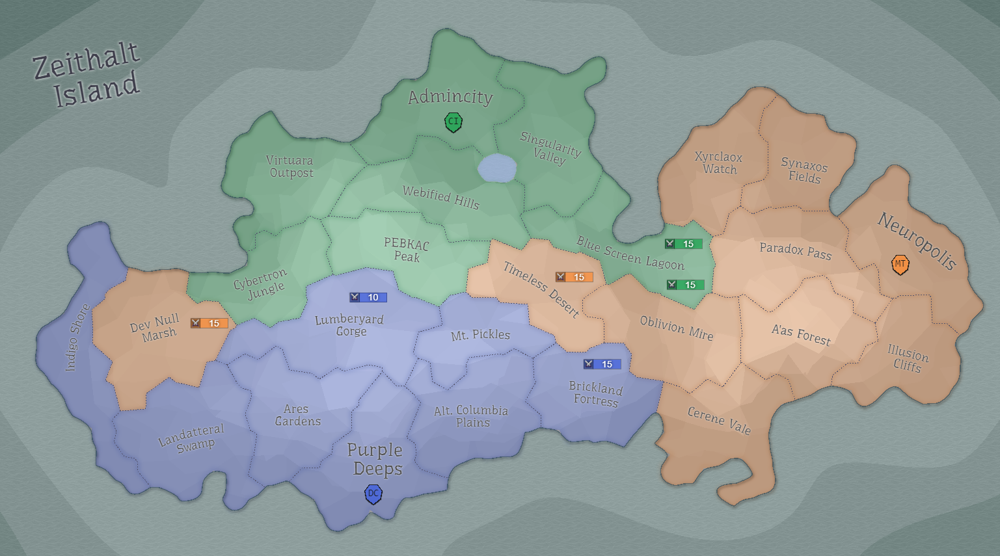
## Eon 280 - Battle of Brickland Fortress

`⚔️ Battle` won by [Delta Collective](../refs/delta_collective.md)

Having won all previous battles, [MindTech Institute](../refs/mindtech_institute.md) is now believed the most powerful faction on the Island. They attack [Delta Collective](../refs/delta_collective.md)'s [Brickland Fortress](../refs/brickland_fortress.md) hoping to catch DC in their weakest moment.

However, the influx of new warriors in Delta Collective and their ability to negotiate an alliance with [Cybernetics Inc](../refs/cybernetics_inc.md) despite recent Deltan attack helps to change the tides and win the battle.

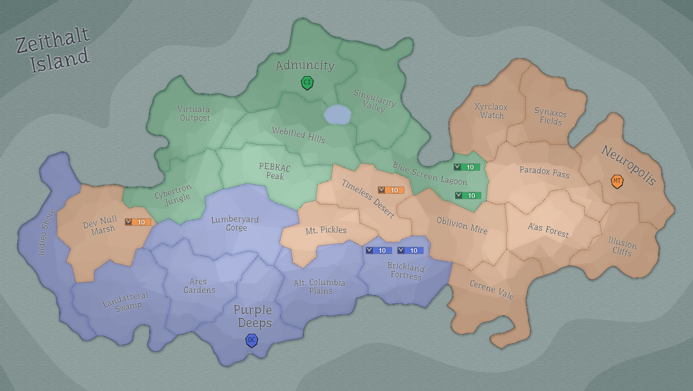
## Eon 275 - Uprising in the Delta Collective

`⌛ Event`

A bunch of people team up to seize control of the [Delta Collective](../refs/delta_collective.md).

The faction starts speaking [Deltan language](../refs/deltan_language.md) instead of the [Common language](../refs/common_language.md) spoken universally by the whole Zeithalt. 

[GreenOtter](../refs/greenotter.md) is deposed from being a leader of Delta Collective and is exiled from the faction.

## Eon 273 - Technological advancement

`⌛ Event`

[Garrisons](../refs/garrisons.md) appear on the Zeithalt map.

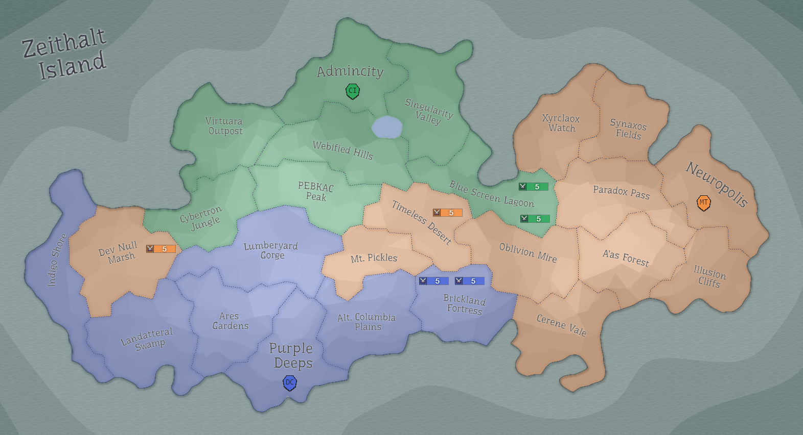

## Eon 272 - The 2nd Battle of Timeless Desert

`⚔️ Battle` won by [MindTech Institute](../refs/mindtech_institute.md)

In the retribution for previous MT actions, the [Cybers](../refs/cybers.md) attack [Timeless Desert](../refs/timeless_desert.md) and almost win the battle.

It all comes down to the very last minutes of the battle, and could've ended either way, but in the end the [Minds](../refs/minds.md) prevail and narrowly avoid losing their sacred land. 

## Eon 266 - Battle of Dev Null Marsh

`⚔️ Battle` won by [MindTech Institute](../refs/mindtech_institute.md)

This battle starts as a [Deltan](../refs/deltans.md) attack on [Cybernetics Inc](../refs/cybernetics_inc.md)'s [Dev Null Marsh](../refs/dev_null_marsh.md). 

Unexpectedly the MindTech Institute joins the attack, which causes confusion in both Cybers ranks and the Institute itself.

During the battle Minds temporarily start helping Cybers defense, but eventually switch back to the attack and win the battle.

This battle is the starting point of the mutual hatred between Cybers and Minds, that would last for hundreds of Eons to come. 

## Eon 257 - Battle of Mt. Pickles

`⚔️ Battle` won by [MindTech Institute](../refs/mindtech_institute.md)

MindTech Institute attacks [Delta Collective](../refs/delta_collective.md)'s [Mt. Pickles](../refs/mt_pickles.md) and wins the battle.

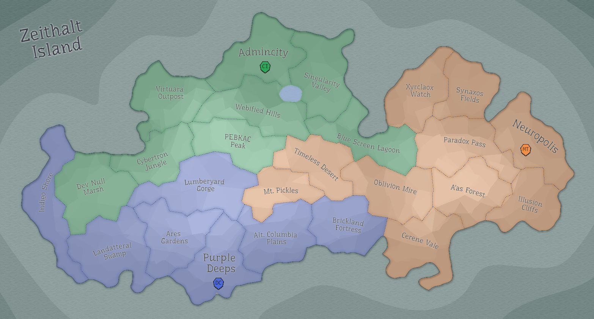
## Eon 253 - Start of the Age of Battles

`⌛ Event`

With no more free lands available, the factions will soon be forced to fight each other, starting the [Age of Battles](../refs/age_of_battles.md).
## Eon 252 - Battle of Timeless Desert

`⚔️ Battle` won by [MindTech Institute](../refs/mindtech_institute.md)

All three factions attack [Timeless Desert](../refs/timeless_desert.md) - the last free territory on the island.

MindTech institute wins this battle and claims Timeless Desert as their homeland.

This battle marks the end of the [Age of Conquest](../refs/age_of_conquest.md) and the start of the [Age of Battles](../refs/age_of_battles.md).

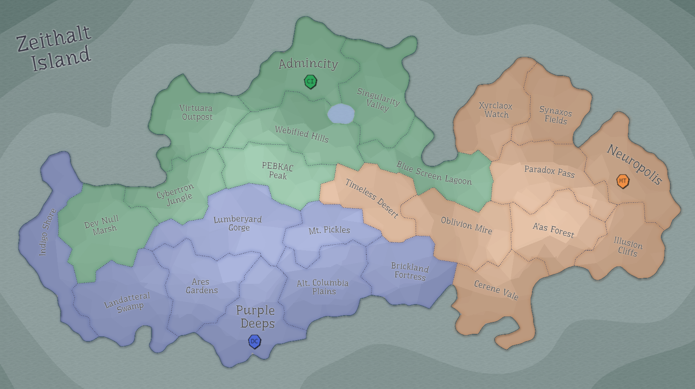
## Eon 247 - The Forgotten Battle

`⚔️ Battle` won by [Delta Collective](../refs/delta_collective.md)

The place of the battle has been lost in history, therefore the name of the battle.

At this point in time, one last free land remains - [Timeless Desert](../refs/timeless_desert.md).

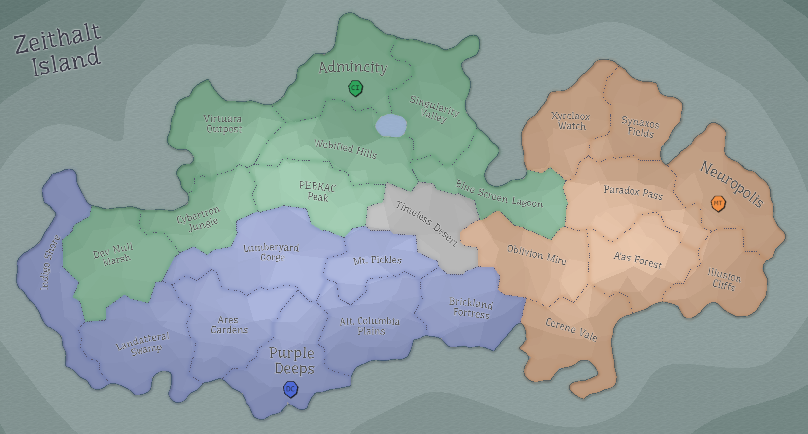
## Eon 246 - Start of the recorded history

`⌛ Event`

This is where the earliest written source of this timeline comes from.
## Eon 1 - Start of the Age of Conquest

`⌛ Event`

Marks the start of the [Age of Conquest](../refs/age_of_conquest.md).
## Eon 0 - End of the Age of Darkness

`⌛ Event`

Marks the end of the [Age of Darkness](../refs/age_of_darkness.md).